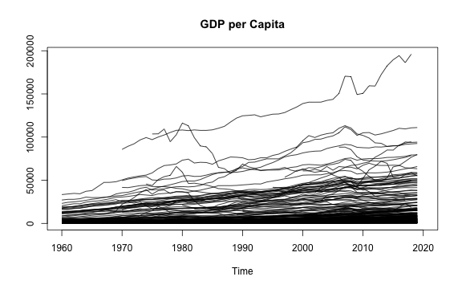
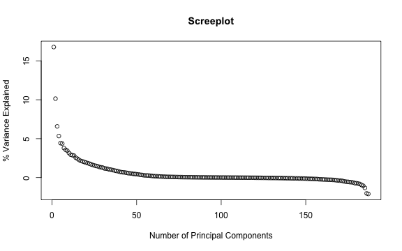
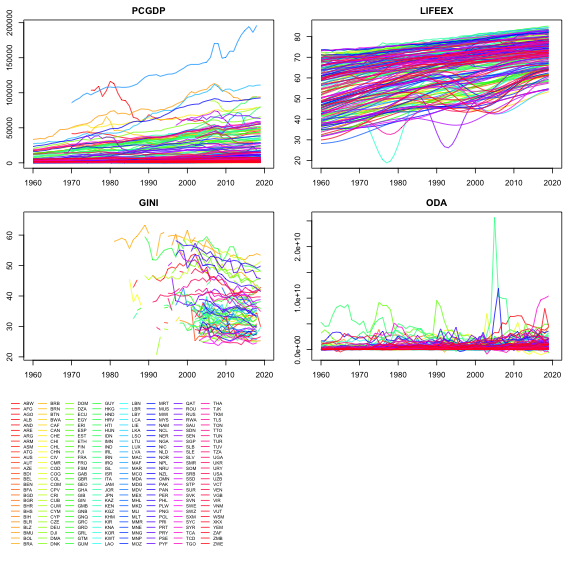
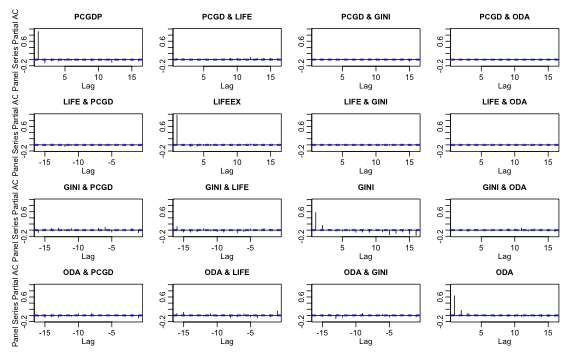

<style type="text/css">
pre {
  max-height: 600px;
  overflow-y: auto;
}

pre[class] {
  max-height: 600px;
}
</style>


<!--
*collapse* is a C/C++ based package for data transformation and statistical computing in R. It's aims are:

1. To facilitate complex data transformation, exploration and computing tasks in R.
2. To help make R code fast, flexible, parsimonious and programmer friendly.
-->
This vignette focuses on the integration of *collapse* and the popular *plm* ('Linear Models for Panel Data') package by Yves Croissant, Giovanni Millo and Kevin Tappe. It will demonstrate the utility of the *pseries* and *pdata.frame* classes introduced in *plm* together with the corresponding methods for fast *collapse* functions (implemented in C or C++), to extend and facilitate extremely fast computations on panel-vectors and panel data frames (20-100 times faster than native *plm*). The *collapse* package should enable R programmers to - with very little effort - write high-performance code in the domain of panel data exploration and panel data econometrics.

<!-- The computations considered are between and within transformations (grouped averaging and centering), higher-dimensional between and within transformations (i.e. averaging and centering over multiple groups), standardizing (i.e. scaling and centering), weighted versions of all of the above, sequences of panel- lags / leads and lagged / leaded and iterated differences and growth rates / log-differences, panel- auto-, partial-auto and cross-correlation functions, panel data to (ts-) matrix / array conversions, and summary statistics for panel data. Not really covered in this vignette is the whole suite of *Fast Statistical Functions* in the *collapse* package, which may of course also be used for grouped and weighted operations on panel data, but currently do not have methods for *plm* classes.  -->

***
**Notes:**

- To learn more about *collapse*, see the 'Introduction to *collapse*' vignette or the built-in structured documentation available under `help("collapse-documentation")` after installing the package. In addition `help("collapse-package")` provides a compact set of examples for quick-start.

- Documentation and vignettes can also be viewed [online](<https://fastverse.github.io/collapse/>).

***

The vignette is structured as follows:

* **Part 1** introduces *collapse*'s fast functions and associated *transformation operators* to compute various transformations on panel data, and delivers some benchmarks.

* **Part 2** uses these functions to explore panel data a bit and introduce additional functions for summary statistics, panel-autocorrelations and testing fixed effects.

* **Part 3** finally provides an example programming application by coding a slightly extended and very efficient Hausman and Taylor (1981) estimator.

For this vignette we will use a dataset (`wlddev`) supplied with *collapse* containing a panel of 5 key development indicators taken from the World Bank Development Indicators Database:


```r
library(collapse)

head(wlddev)
#       country iso3c       date year decade     region     income  OECD PCGDP LIFEEX GINI       ODA
# 1 Afghanistan   AFG 1961-01-01 1960   1960 South Asia Low income FALSE    NA 32.446   NA 116769997
# 2 Afghanistan   AFG 1962-01-01 1961   1960 South Asia Low income FALSE    NA 32.962   NA 232080002
# 3 Afghanistan   AFG 1963-01-01 1962   1960 South Asia Low income FALSE    NA 33.471   NA 112839996
# 4 Afghanistan   AFG 1964-01-01 1963   1960 South Asia Low income FALSE    NA 33.971   NA 237720001
# 5 Afghanistan   AFG 1965-01-01 1964   1960 South Asia Low income FALSE    NA 34.463   NA 295920013
# 6 Afghanistan   AFG 1966-01-01 1965   1960 South Asia Low income FALSE    NA 34.948   NA 341839996
#       POP
# 1 8996973
# 2 9169410
# 3 9351441
# 4 9543205
# 5 9744781
# 6 9956320

fnobs(wlddev)      # This column-wise counts the number of observations
# country   iso3c    date    year  decade  region  income    OECD   PCGDP  LIFEEX    GINI     ODA 
#   13176   13176   13176   13176   13176   13176   13176   13176    9470   11670    1744    8608 
#     POP 
#   12919

fndistinct(wlddev) # This counts the number of distinct values
# country   iso3c    date    year  decade  region  income    OECD   PCGDP  LIFEEX    GINI     ODA 
#     216     216      61      61       7       7       4       2    9470   10548     368    7832 
#     POP 
#   12877
```

## Part 1: Fast Transformation of Panel Data

First let us convert this data to a *plm* panel data.frame (class *pdata.frame*):


```r
library(plm)

# This creates a panel data frame
pwlddev <- pdata.frame(wlddev, index = c("iso3c", "year"))

str(pwlddev, give.attr = FALSE)
# Classes 'pdata.frame' and 'data.frame':	13176 obs. of  13 variables:
#  $ country: 'pseries' Named chr  "Aruba" "Aruba" "Aruba" "Aruba" ...
#  $ iso3c  : Factor w/ 216 levels "ABW","AFG","AGO",..: 1 1 1 1 1 1 1 1 1 1 ...
#  $ date   : pseries, format: "1961-01-01" "1962-01-01" "1963-01-01" ...
#  $ year   : Factor w/ 61 levels "1960","1961",..: 1 2 3 4 5 6 7 8 9 10 ...
#  $ decade : 'pseries' Named int  1960 1960 1960 1960 1960 1960 1960 1960 1960 1960 ...
#  $ region : Factor w/ 7 levels "East Asia & Pacific",..: 3 3 3 3 3 3 3 3 3 3 ...
#  $ income : Factor w/ 4 levels "High income",..: 1 1 1 1 1 1 1 1 1 1 ...
#  $ OECD   : 'pseries' Named logi  FALSE FALSE FALSE FALSE FALSE FALSE ...
#  $ PCGDP  : 'pseries' Named num  NA NA NA NA NA NA NA NA NA NA ...
#  $ LIFEEX : 'pseries' Named num  65.7 66.1 66.4 66.8 67.1 ...
#  $ GINI   : 'pseries' Named num  NA NA NA NA NA NA NA NA NA NA ...
#  $ ODA    : 'pseries' Named num  NA NA NA NA NA NA NA NA NA NA ...
#  $ POP    : 'pseries' Named num  54211 55438 56225 56695 57032 ...

# A pdata.frame has an index attribute attached [retrieved using index(pwlddev) or attr(pwlddev, "index")]
str(index(pwlddev))
# Classes 'pindex' and 'data.frame':	13176 obs. of  2 variables:
#  $ iso3c: Factor w/ 216 levels "ABW","AFG","AGO",..: 1 1 1 1 1 1 1 1 1 1 ...
#  $ year : Factor w/ 61 levels "1960","1961",..: 1 2 3 4 5 6 7 8 9 10 ...

# This shows the individual and time dimensions
pdim(pwlddev)
# Balanced Panel: n = 216, T = 61, N = 13176
```
<!-- # This shows which variables vary across which dimensions -->
<!-- pvar(pwlddev) -->

A `plm::pdata.frame` is a data.frame with panel identifiers attached as a list of factors in an *index* attribute (non-factor index variables are converted to factor). Each column in that data.frame is a Panel Series (`plm::pseries`), which also has the panel identifiers attached:


```r
# Panel Series of GDP per Capita and Life-Expectancy at Birth
PCGDP <- pwlddev$PCGDP
LIFEEX <- pwlddev$LIFEEX
str(LIFEEX)
#  'pseries' Named num [1:13176] 65.7 66.1 66.4 66.8 67.1 ...
#  - attr(*, "names")= chr [1:13176] "ABW-1960" "ABW-1961" "ABW-1962" "ABW-1963" ...
#  - attr(*, "index")=Classes 'pindex' and 'data.frame':	13176 obs. of  2 variables:
#   ..$ iso3c: Factor w/ 216 levels "ABW","AFG","AGO",..: 1 1 1 1 1 1 1 1 1 1 ...
#   ..$ year : Factor w/ 61 levels "1960","1961",..: 1 2 3 4 5 6 7 8 9 10 ...
```

Now that we have explored the basic data structures provided in the *plm* package, let's compute some transformations on them:

### 1.1 Between and Within Transformations

The functions `fbetween` and `fbetween` can be used to compute efficient between and within transformations on panel vectors and panel data.frames:


```r
# Between-Transformations
head(fbetween(LIFEEX))                        # Between individual (default)
# ABW-1960 ABW-1961 ABW-1962 ABW-1963 ABW-1964 ABW-1965 
# 72.40653 72.40653 72.40653 72.40653 72.40653 72.40653

head(fbetween(LIFEEX, effect = "year"))       # Between time
# ABW-1960 ABW-1961 ABW-1962 ABW-1963 ABW-1964 ABW-1965 
# 53.91206 54.47441 54.85718 55.20272 55.66802 56.12963

# Within-Transformations
head(fwithin(LIFEEX))                         # Within individuals (default)
#  ABW-1960  ABW-1961  ABW-1962  ABW-1963  ABW-1964  ABW-1965 
# -6.744533 -6.332533 -5.962533 -5.619533 -5.293533 -4.971533

head(fwithin(LIFEEX, effect = "year"))        # Within time
# ABW-1960 ABW-1961 ABW-1962 ABW-1963 ABW-1964 ABW-1965 
# 11.74994 11.59959 11.58682 11.58428 11.44498 11.30537
```

by default `na.rm = TRUE` thus both functions skip (preserve) missing values in the data (which is the default for all *collapse* functions). For `fbetween` the output behavior can be altered with the option `fill`: Setting `fill = TRUE` will compute the group-means on the complete cases in each group (as long as `na.rm = TRUE`), but replace all values in each group with the group mean (hence overwriting or 'filling up' missing values):


```r
# This preserves missing values in the output
head(fbetween(PCGDP), 30)
# ABW-1960 ABW-1961 ABW-1962 ABW-1963 ABW-1964 ABW-1965 ABW-1966 ABW-1967 ABW-1968 ABW-1969 ABW-1970 
#       NA       NA       NA       NA       NA       NA       NA       NA       NA       NA       NA 
# ABW-1971 ABW-1972 ABW-1973 ABW-1974 ABW-1975 ABW-1976 ABW-1977 ABW-1978 ABW-1979 ABW-1980 ABW-1981 
#       NA       NA       NA       NA       NA       NA       NA       NA       NA       NA       NA 
# ABW-1982 ABW-1983 ABW-1984 ABW-1985 ABW-1986 ABW-1987 ABW-1988 ABW-1989 
#       NA       NA       NA       NA 25413.84 25413.84 25413.84 25413.84

# This replaces all individuals with the group mean
head(fbetween(PCGDP, fill = TRUE), 30)
# ABW-1960 ABW-1961 ABW-1962 ABW-1963 ABW-1964 ABW-1965 ABW-1966 ABW-1967 ABW-1968 ABW-1969 ABW-1970 
# 25413.84 25413.84 25413.84 25413.84 25413.84 25413.84 25413.84 25413.84 25413.84 25413.84 25413.84 
# ABW-1971 ABW-1972 ABW-1973 ABW-1974 ABW-1975 ABW-1976 ABW-1977 ABW-1978 ABW-1979 ABW-1980 ABW-1981 
# 25413.84 25413.84 25413.84 25413.84 25413.84 25413.84 25413.84 25413.84 25413.84 25413.84 25413.84 
# ABW-1982 ABW-1983 ABW-1984 ABW-1985 ABW-1986 ABW-1987 ABW-1988 ABW-1989 
# 25413.84 25413.84 25413.84 25413.84 25413.84 25413.84 25413.84 25413.84
```

In `fwithin` the `mean` argument allows to set an arbitrary data mean (different from 0) after the data is centered. In grouped centering task, as sensible choice for such an added mean would be the overall mean of the data series, enabled by the option `mean = "overall.mean"`. This will add the overall mean of the series back to the data after subtracting out group means, and thus preserve the level of the data (and will only change the intercept when employed in a regression):


```r
# This performed standard grouped centering
head(fwithin(LIFEEX))
#  ABW-1960  ABW-1961  ABW-1962  ABW-1963  ABW-1964  ABW-1965 
# -6.744533 -6.332533 -5.962533 -5.619533 -5.293533 -4.971533

# This adds the overall average Life-Expectancy (across countries) to the country-demeaned series
head(fwithin(LIFEEX, mean = "overall.mean"))
# ABW-1960 ABW-1961 ABW-1962 ABW-1963 ABW-1964 ABW-1965 
# 57.55177 57.96377 58.33377 58.67677 59.00277 59.32477
```

`fbetween` and `fwithin` can also be applied to *pdata.frame*'s where they will perform these computations variable by variable:


```r
head(fbetween(num_vars(pwlddev)), 3)
#            decade PCGDP   LIFEEX GINI ODA      POP
# ABW-1960 1985.574    NA 72.40653   NA  NA 76268.63
# ABW-1961 1985.574    NA 72.40653   NA  NA 76268.63
# ABW-1962 1985.574    NA 72.40653   NA  NA 76268.63

head(fbetween(num_vars(pwlddev), fill = TRUE), 3)
#            decade    PCGDP   LIFEEX GINI      ODA      POP
# ABW-1960 1985.574 25413.84 72.40653   NA 33245000 76268.63
# ABW-1961 1985.574 25413.84 72.40653   NA 33245000 76268.63
# ABW-1962 1985.574 25413.84 72.40653   NA 33245000 76268.63

head(fwithin(num_vars(pwlddev)), 3)
#             decade PCGDP    LIFEEX GINI ODA       POP
# ABW-1960 -25.57377    NA -6.744533   NA  NA -22057.63
# ABW-1961 -25.57377    NA -6.332533   NA  NA -20830.63
# ABW-1962 -25.57377    NA -5.962533   NA  NA -20043.63

head(fwithin(num_vars(pwlddev), mean = "overall.mean"), 3)
#          decade PCGDP   LIFEEX GINI ODA      POP
# ABW-1960   1960    NA 57.55177   NA  NA 24223914
# ABW-1961   1960    NA 57.96377   NA  NA 24225141
# ABW-1962   1960    NA 58.33377   NA  NA 24225928
```

Now next to `fbetween` and `fwithin` there also exist short versions `B` and `W`, which are referred to as *transformation operators*. These are essentially wrappers around `fbetween` and `fwithin` and provide the same functionality, but are more parsimonious to employ in regression formulas and also offer additional features when applied to panel data.frames. For panel series, `B` and `W` are exact analogues to `fbetween` and `fwithin`, just under a shorter name:


```r
identical(fbetween(PCGDP), B(PCGDP))
# [1] TRUE
identical(fbetween(PCGDP, fill = TRUE), B(PCGDP, fill = TRUE))
# [1] TRUE
identical(fwithin(PCGDP), W(PCGDP))
# [1] TRUE
identical(fwithin(PCGDP, mean = "overall.mean"), W(PCGDP, mean = "overall.mean"))
# [1] TRUE
```

When applied to panel data.frames, `B` and `W` offer some additional utility by (a) allowing you to select columns to transform using the `cols` argument (default is `cols = is.numeric`, so by default all numeric columns will be selected for transformation), (b) allowing you to add a prefix to the transformed columns with the `stub` argument (default is `stub = "B."` for `B` and `stub = "W."` for `W`) and (c) preserving the panel-id's with the `keep.ids` argument (default `keep.ids = TRUE`):


```r
head(B(pwlddev), 3)
#          iso3c year B.decade B.PCGDP B.LIFEEX B.GINI B.ODA    B.POP
# ABW-1960   ABW 1960 1985.574      NA 72.40653     NA    NA 76268.63
# ABW-1961   ABW 1961 1985.574      NA 72.40653     NA    NA 76268.63
# ABW-1962   ABW 1962 1985.574      NA 72.40653     NA    NA 76268.63

head(W(pwlddev, cols = 9:12), 3) # Here using the cols argument
#          iso3c year W.PCGDP  W.LIFEEX W.GINI W.ODA
# ABW-1960   ABW 1960      NA -6.744533     NA    NA
# ABW-1961   ABW 1961      NA -6.332533     NA    NA
# ABW-1962   ABW 1962      NA -5.962533     NA    NA
```

<!-- The main philosophy behind having transformation operators like `B` and `W` is that they are more parsimonious to use ad-hoc (i.e. to demean a variable in a regression formula), and also offer more convenient output for ad-hoc computations on data.frames, whereas the corresponding functions `fbetween` and `fwithin` are a bit simpler in terms of R-code (and thus a tiny bit faster) and also more convenient for programming since they require all inputs to be provided in terms of data.  -->

`fbetween` / `B` and `fwithin` / `W` also support weighted computations. This of course applies more to panel-survey settings, but for the sake of illustration suppose we wanted to weight our between and within transformations by the population of these countries:


```r
# This replaces values by the POP-weighted group mean and also preserves the weight variable (POP, argument keep.w = TRUE)
head(B(pwlddev, w = ~ POP), 3)
#          iso3c year   POP B.decade B.PCGDP B.LIFEEX B.GINI B.ODA
# ABW-1960   ABW 1960 54211 1988.976      NA 72.96257     NA    NA
# ABW-1961   ABW 1961 55438 1988.976      NA 72.96257     NA    NA
# ABW-1962   ABW 1962 56225 1988.976      NA 72.96257     NA    NA

# This centers values on the POP-weighted group mean
head(W(pwlddev, w = ~ POP, cols = c("PCGDP","LIFEEX","GINI")), 3)
#          iso3c year   POP W.PCGDP  W.LIFEEX W.GINI
# ABW-1960   ABW 1960 54211      NA -7.300566     NA
# ABW-1961   ABW 1961 55438      NA -6.888566     NA
# ABW-1962   ABW 1962 56225      NA -6.518566     NA

# This centers values on the POP-weighted group mean and also adds the overall POP-weighted mean of the data
head(W(pwlddev, w = ~ POP, cols = c("PCGDP","LIFEEX","GINI"), mean = "overall.mean"), 3)
#          iso3c year   POP W.PCGDP W.LIFEEX W.GINI
# ABW-1960   ABW 1960 54211      NA 58.58012     NA
# ABW-1961   ABW 1961 55438      NA 58.99212     NA
# ABW-1962   ABW 1962 56225      NA 59.36212     NA
```

As shown above, with `B` and `W` the weight column can also be passed as a formula or character string, whereas `fbetween` and `fwithin` require the all inputs to be passed directly in terms of data (i.e. `fbetween(get_vars(pwlddev, 9:11), w = pwlddev$POP)`), and the weight vector or id columns are never preserved in the output. Therefore in most applications `B` and `W` are probably more convenient for quick use, whereas `fbetween` and `fwithin` are the preferred programmers choice, also because they have a little less R-overhead which makes them a tiny bit faster.

### 1.2 Higher-Dimensional Between and Within Transformations

Analogous to `fbetween` / `B` and `fwithin` / `W`, *collapse* provides a duo of functions and operators `fhdbetween` / `HDB` and `fhdwithin` / `HDW` to efficiently average and center data on multiple groups. The credit herefore goes to Laurent Berge, the author of the *fixest* package who wrote an efficient C-implementation of the alternating-projections algorithm to perform this task. `fhdbetween` / `HDB` and `fhdwithin` / `HDW` enrich this implementation (available in the function `fixest::demean`) by providing more options regarding missing values, and also allowing continuous covariates and (full) interactions to be projected out alongside factors. The methods for *pseries* and *pdata.frame*'s are however rather simple, as they simply simultaneously center panel-vectors on various panel-identifiers in the index (which can be more than 2, the default is to center on all identifiers):


```r
# This simultaneously averages Life-Expectancy across countries and years
head(HDB(LIFEEX)) # (same as running a regression on country and year dummies and taking the fitted values)
# ABW-1960 ABW-1961 ABW-1962 ABW-1963 ABW-1964 ABW-1965 
# 62.36179 62.85981 63.24258 63.65245 64.11774 64.52503

# This simultaneously centers Life-Expectenacy on countries and years
head(HDW(LIFEEX)) # (same as running a regression on country and year dummies and taking the residuals)
# ABW-1960 ABW-1961 ABW-1962 ABW-1963 ABW-1964 ABW-1965 
# 3.300210 3.214193 3.201424 3.134554 2.995255 2.909975
```

The architecture of `fhdbetween` / `HDB` and `fhdwithin` / `HDW` differs a bit from `fbetween` / `B` and `fwithin` / `W`. This is essentially a consequence of the underlying C++-implementation (accessed through `fixest::demean`), which was not built to accommodate missing values. `fhdbetween` / `HDB` and `fhdwithin` / `HDW` therefore both have an argument `fill = TRUE` (the default), which stipulates that missing values in the data are preserved in the output. The *collapse* default `na.rm = TRUE` again ensures that only complete cases are used for the computation:


```r
# Missing values are preserved in the output when fill = TRUE (the default)
head(HDB(PCGDP), 30)
# ABW-1960 ABW-1961 ABW-1962 ABW-1963 ABW-1964 ABW-1965 ABW-1966 ABW-1967 ABW-1968 ABW-1969 ABW-1970 
#       NA       NA       NA       NA       NA       NA       NA       NA       NA       NA       NA 
# ABW-1971 ABW-1972 ABW-1973 ABW-1974 ABW-1975 ABW-1976 ABW-1977 ABW-1978 ABW-1979 ABW-1980 ABW-1981 
#       NA       NA       NA       NA       NA       NA       NA       NA       NA       NA       NA 
# ABW-1982 ABW-1983 ABW-1984 ABW-1985 ABW-1986 ABW-1987 ABW-1988 ABW-1989 
#       NA       NA       NA       NA 21833.32 22132.25 22479.20 22772.31

# When fill = FALSE, only the complete cases are returned
nofill <- HDB(PCGDP, fill = FALSE)
head(nofill, 30)
# ABW-1986 ABW-1987 ABW-1988 ABW-1989 ABW-1990 ABW-1991 ABW-1992 ABW-1993 ABW-1994 ABW-1995 ABW-1996 
# 21833.32 22132.25 22479.20 22772.31 23064.29 23060.00 23089.75 23115.36 23343.25 23595.16 23823.11 
# ABW-1997 ABW-1998 ABW-1999 ABW-2000 ABW-2001 ABW-2002 ABW-2003 ABW-2004 ABW-2005 ABW-2006 ABW-2007 
# 24149.44 24424.69 24727.46 25205.98 25399.16 25603.11 25851.29 26349.64 26665.54 27224.58 27772.82 
# ABW-2008 ABW-2009 ABW-2010 ABW-2011 ABW-2012 ABW-2013 ABW-2014 ABW-2015 
# 27769.52 27002.95 27218.84 27424.18 27471.49 27660.92 27889.34 28107.78

# This results in a shorter panel-vector
length(nofill)
# [1] 9470
length(PCGDP)
# [1] 13176

# The cases that were missing and removed from the output are available as an attribute
head(attr(nofill, "na.rm"), 30)
#  [1]  1  2  3  4  5  6  7  8  9 10 11 12 13 14 15 16 17 18 19 20 21 22 23 24 25 26 59 60 61 62
```

In the *pdata.frame* methods there are 3 different choices how to deal with missing values. The default for the *plm* classes in `variable.wise = TRUE`, which will essentially sequentially apply `fhdbetween.pseries` and `fhdwithin.pseries` (with the default `fill = TRUE`) to all columns. This is the same behavior as in `fbetween` / `B` and `fwithin` / `W`, which also consider the column-wise complete obs:


```r
# This column-wise centers the data on countries and years
tail(HDW(pwlddev), 10)
#          HDW.decade HDW.PCGDP HDW.LIFEEX  HDW.GINI   HDW.ODA  HDW.POP
# ZWE-2011          0 -4632.971  -8.080748 -3.663217 118306300 -4547122
# ZWE-2012          0 -4523.505  -6.271385        NA 385526419 -4749368
# ZWE-2013          0 -4710.576  -4.753056        NA 149910333 -4903132
# ZWE-2014          0 -4931.693  -3.568136        NA  93295114 -5059317
# ZWE-2015          0 -5148.895  -2.685053        NA 150833589 -5224484
# ZWE-2016          0 -5433.809  -2.203219        NA -27844184 -5404667
# ZWE-2017          0 -5645.022  -1.920365 -1.964138  10266318 -5591762
# ZWE-2018          0 -5938.794  -1.759333        NA  59646823 -5774326
# ZWE-2019          0 -5710.646  -1.669415  5.627356 223473855 -5946725
# ZWE-2020          0        NA         NA        NA        NA       NA
```

If `variable.wise = FALSE`, `fhdbetween` / `HDB` and `fhdwithin` / `HDW` will only consider the complete cases in the dataset, but still return a dataset of the same dimensions (as long as `fill = TRUE`), resulting in some rows all-missing:


```r
# This centers the complete cases of the data data on countries and years and keeps missing cases
tail(HDW(pwlddev, variable.wise = FALSE), 10)
#          HDW.decade HDW.PCGDP HDW.LIFEEX  HDW.GINI    HDW.ODA  HDW.POP
# ZWE-2011          0  517.6924  -4.379840 -3.839653 -176176494 -3042247
# ZWE-2012         NA        NA         NA        NA         NA       NA
# ZWE-2013         NA        NA         NA        NA         NA       NA
# ZWE-2014         NA        NA         NA        NA         NA       NA
# ZWE-2015         NA        NA         NA        NA         NA       NA
# ZWE-2016         NA        NA         NA        NA         NA       NA
# ZWE-2017          0 -128.5240   1.971143 -1.314869  -67497466  1936716
# ZWE-2018         NA        NA         NA        NA         NA       NA
# ZWE-2019          0 -389.1684   2.408697  5.154522  243673961  1105530
# ZWE-2020         NA        NA         NA        NA         NA       NA
```

Finally, if also `fill = FALSE`, the behavior is the same as in the *pseries* method: Missing cases are removed from the data:


```r
# This centers the complete cases of the data data on countries and years, and removes missing cases
res <- HDW(pwlddev, fill = FALSE)
tail(res, 10)
#          HDW.decade   HDW.PCGDP HDW.LIFEEX   HDW.GINI    HDW.ODA    HDW.POP
# ZMB-1996          0   534.39373 -3.6445256  -4.744748 -174237036  4911230.7
# ZMB-1998          0   201.58094 -4.1708951  -5.085621 -492258601   644947.7
# ZMB-2002          0   250.78234 -2.9085522 -10.912265   81848768 -1027712.3
# ZMB-2004          0   -72.94954 -1.9629513   1.494340  396830282 -3774596.6
# ZMB-2006          0  -308.55937 -0.4975872   2.407226  485998870 -2255101.6
# ZMB-2010          0  -428.16949  3.9600416   4.497547 -148714637 -4174306.2
# ZMB-2015          0 -1106.52213  8.4099983   7.553052 -335529320 -4962997.8
# ZWE-2011          0   517.69244 -4.3798401  -3.839653 -176176494 -3042246.9
# ZWE-2017          0  -128.52402  1.9711431  -1.314869  -67497466  1936716.5
# ZWE-2019          0  -389.16842  2.4086971   5.154522  243673961  1105530.5

tail(attr(res, "na.rm"))
# [1] 13169 13170 13171 13172 13174 13176
```

<!-- Again it is possible to perform weighted higher-order transformations, but the weight vector is not preserved and this -->
<!-- ```{r, eval = NCRAN} -->
<!-- # This centers the complete cases of the data data on countries and years, and removes missing cases -->
<!-- HDW(pwlddev, w = pwlddev$POP, cols = 9:11, fill = FALSE, variable.wise = FALSE) -->
<!-- ``` -->

*Notes: * (1) Because of the different missing case options and associated challenges, panel-identifiers are not preserved in `HDB` and `HDW`. (2) The default `variable.wise = TRUE` and `fill = TRUE` was only set for the *pseries* and *pdata.frame* methods, to harmonize the default implementations with `fbetween` / `B` and `fwithin` / `W` for these classes. In the standard *default*, *matrix* and *data.frame* methods, the defaults are `variable.wise = FALSE` and `fill = FALSE` (i.e. missing cases are removed beforehand), which is generally more efficient.


### 1.3 Scaling and Centering

Next to the above functions for grouped centering and averaging, the function / operator pair `fscale` / `STD` can be used to efficiently standardize (i.e. scale and center) panel data along an arbitrary dimension. The architecture is identical to that of `fwithin` / `W` or `fbetween` / `B`.


```r
# This standardizes GDP per capita in each country
STD_PCGDP <- STD(PCGDP)

# Checks:
head(fmean(STD_PCGDP, index(STD_PCGDP, 1)))
#           ABW           AFG           AGO           ALB           AND           ARE 
# -1.422473e-15  2.528841e-16 -6.189493e-16 -2.275957e-16 -9.281464e-16 -6.661338e-17
head(fsd(STD_PCGDP, index(STD_PCGDP, 1)))
# ABW AFG AGO ALB AND ARE 
#   1   1   1   1   1   1

# This standardizes GDP per capita in each year
STD_PCGDP_T <- STD(PCGDP, effect = "year")

# Checks:
head(fmean(STD_PCGDP_T, index(STD_PCGDP_T, 2)))
#          1960          1961          1962          1963          1964          1965 
#  9.882205e-17  3.496021e-16  1.889741e-17 -2.185013e-16 -1.724389e-16  2.616954e-16
head(fsd(STD_PCGDP_T, index(STD_PCGDP_T, 2)))
# 1960 1961 1962 1963 1964 1965 
#    1    1    1    1    1    1
```

And similarly for *pdata.frame*'s:


```r
head(STD(pwlddev, cols = 9:12))
#          iso3c year STD.PCGDP STD.LIFEEX STD.GINI STD.ODA
# ABW-1960   ABW 1960        NA  -2.372636       NA      NA
# ABW-1961   ABW 1961        NA  -2.227700       NA      NA
# ABW-1962   ABW 1962        NA  -2.097539       NA      NA
# ABW-1963   ABW 1963        NA  -1.976876       NA      NA
# ABW-1964   ABW 1964        NA  -1.862193       NA      NA
# ABW-1965   ABW 1965        NA  -1.748918       NA      NA

head(STD(pwlddev, cols = 9:12, effect = "year"))
#          iso3c year STD.PCGDP STD.LIFEEX STD.GINI STD.ODA
# ABW-1960   ABW 1960        NA  0.9609854       NA      NA
# ABW-1961   ABW 1961        NA  0.9485730       NA      NA
# ABW-1962   ABW 1962        NA  0.9585105       NA      NA
# ABW-1963   ABW 1963        NA  0.9669638       NA      NA
# ABW-1964   ABW 1964        NA  0.9579477       NA      NA
# ABW-1965   ABW 1965        NA  0.9556529       NA      NA
```

More customized scaling can be done with the help of the `mean` and `sd` arguments to `fscale` / `STD`. By default `mean = 0` and `sd = 1`, but these could be assigned any numeric values:


```r
# This will scale the data such that mean mean within each country is 5 and the standard deviation is 3
qsu(fscale(pwlddev$PCGDP, mean = 5, sd = 3))
#              N/T  Mean     SD      Min     Max
# Overall     9466     5  2.968  -6.1908  16.257
# Between      202     5      0        5       5
# Within   46.8614     5  2.968  -6.1908  16.257
```
Even further customization (i.e. setting means and standard deviations for each group and / or each column) can of course be achieved by calling `collapse::TRA` on the result of `fscale` to sweep out an appropriate set of means and standard deviations.

Scaling without centering can be done with the option `mean = FALSE`. This will also preserve the mean of the data overall and within each group:

```r
# Scaling without centering: Mean preserving with fscale / STD
qsu(fscale(pwlddev$PCGDP, mean = FALSE, sd = 3))
#              N/T        Mean          SD         Min         Max
# Overall     9466  12031.4627  17803.3537    247.7598   131349.27
# Between      202  12169.2793  18055.6626    253.1886  131342.669
# Within   46.8614  12031.4627       2.968  12020.2718  12042.7196

# Scaling without centering can also be done using fsd, but this does not preserve the mean
qsu(fsd(pwlddev$PCGDP, index(pwlddev, 1), TRA = "/"))
#              N/T    Mean      SD     Min      Max
# Overall     9466   4.247   3.192  0.0579   26.647
# Between      202  4.6036  3.5846  0.8207  24.8111
# Within   46.8614   4.247  0.9893  0.5167   7.9993
```

<!-- # Again, the *Fast Statistical Functions* in *collapse* do not have methods for *pseries* or *pdata.frame*'s (yet). -->

Finally a special kind of data harmonization in the first two moments can be done by setting `mean = "overall.mean"` and `sd = "within.sd"` in a grouped scaling task. This will harmonize the data across groups such that the mean of each group is equal to the overall data mean and the standard deviation equal to the within standard deviation (= the standard deviation calculated on the group-centered series):


```r
fmean(pwlddev$PCGDP)  # Overall mean
# [1] 12048.78
fsd(W(pwlddev$PCGDP)) # Within sd
# [1] 6723.681

# Scaling and centerin such that the mean of each country is the overall mean, and the sd of each country is the within sd
qsu(fscale(pwlddev$PCGDP, mean = "overall.mean", sd = "within.sd"))
#              N/T       Mean         SD          Min         Max
# Overall     9466  12048.778  6651.9052  -13032.4333  37278.2175
# Between      202  12048.778          0    12048.778   12048.778
# Within   46.8614  12048.778  6651.9052  -13032.4333  37278.2175
```

All of this seamlessly generalizes to weighted scaling an centering, using the `w` argument to add a weight vector.

### 1.4 Panel Lags / Leads, Differences and Growth Rates
<!-- A proper *and* fast implementation of panel- lags, differences and growth rates has been missing in R so far. -->

With `flag` / `L` / `F`, `fdiff` / `D` and `fgrowth` / `G`, *collapse* provides a fast and comprehensive C++ based solution to the computation of (sequences of) lags / leads and (sequences of) lagged / leaded and suitably iterated (quasi-, log-) differences and growth rates on panel data. The *pseries* and *pdata.frame* methods to these functions and associated *transformation operators* use the panel-identifiers in the 'index' attached to these objects (where the last variable in the 'index' is taken as the time-variable and the variables before that are taken as individual identifiers) to perform fast fully-identified time-dependent operations on panel data, without the need of sorting the data.

<!-- With 'proper' I mean an implementation that does not require panel-vectors to be sorted (amounting i.e. to a grouped-lag on sorted data), but that takes into account both individual an time-identifiers in the computation. `plm::lag` and `dplyr::lag` (with the `order_by` argument) provide proper implementations but rely on base-R (split-apply-combine logic) which makes them slow. `data.table::shift` allows for pretty fast grouped lags on sorted data, but without taking into account the time-identifiers (you can do something like `DT[oder(time), shift(col1), by = pid]` in *data.table* but that sorts the data and is definitely more computationally expensive than the implementation introduced here).  -->


With `flag` / `L` / `F`, it is easy to lag or lead *pseries*:


```r
# A panel-lag
head(flag(LIFEEX))
# ABW-1960 ABW-1961 ABW-1962 ABW-1963 ABW-1964 ABW-1965 
#       NA   65.662   66.074   66.444   66.787   67.113

# A panel-lead
head(flag(LIFEEX, -1))
# ABW-1960 ABW-1961 ABW-1962 ABW-1963 ABW-1964 ABW-1965 
#   66.074   66.444   66.787   67.113   67.435   67.762

# The lag and lead operators are even more parsimonious to employ:
all_identical(L(LIFEEX), flag(LIFEEX), lag(LIFEEX))
# [1] TRUE
all_identical(F(LIFEEX), flag(LIFEEX, -1), lead(LIFEEX))
# [1] TRUE
```

It is also possible to compute a sequence of lags / leads using `flag` or one of the operators:


```r
# sequence of panel- lags and leads
head(flag(LIFEEX, -1:3))
#              F1     --     L1     L2     L3
# ABW-1960 66.074 65.662     NA     NA     NA
# ABW-1961 66.444 66.074 65.662     NA     NA
# ABW-1962 66.787 66.444 66.074 65.662     NA
# ABW-1963 67.113 66.787 66.444 66.074 65.662
# ABW-1964 67.435 67.113 66.787 66.444 66.074
# ABW-1965 67.762 67.435 67.113 66.787 66.444

all_identical(L(LIFEEX, -1:3), F(LIFEEX, 1:-3), flag(LIFEEX, -1:3))
# [1] TRUE

# The native plm implementation also returns a matrix of lags but with different column names
head(lag(LIFEEX, -1:3), 4)
#              -1      0      1      2      3
# ABW-1960 66.074 65.662     NA     NA     NA
# ABW-1961 66.444 66.074 65.662     NA     NA
# ABW-1962 66.787 66.444 66.074 65.662     NA
# ABW-1963 67.113 66.787 66.444 66.074 65.662
```

<!-- # Just the meaning is a bit ambiguous... -->
<!-- head(lead(LIFEEX, 1:-3), 4) -->

Of course the lag orders may be unevenly spaced, i.e. `L(x, -1:3*12)` would compute seasonal lags on monthly data. On *pdata.frame*'s, the effects of `flag` and `L` / `F` differ insofar that `flag` will just lag the entire dataset without preserving identifiers (although the index attribute is always preserved), whereas `L` / `F` by default (`cols = is.numeric`) select the numeric variables and add the panel-id's on the left (default `keep.ids = TRUE`):


```r
# This lags the entire data
head(flag(pwlddev))
#          country iso3c       date year decade                    region      income  OECD PCGDP
# ABW-1960    <NA>  <NA>       <NA> <NA>     NA                      <NA>        <NA>    NA    NA
# ABW-1961   Aruba   ABW 1961-01-01 1960   1960 Latin America & Caribbean High income FALSE    NA
# ABW-1962   Aruba   ABW 1962-01-01 1961   1960 Latin America & Caribbean High income FALSE    NA
# ABW-1963   Aruba   ABW 1963-01-01 1962   1960 Latin America & Caribbean High income FALSE    NA
# ABW-1964   Aruba   ABW 1964-01-01 1963   1960 Latin America & Caribbean High income FALSE    NA
# ABW-1965   Aruba   ABW 1965-01-01 1964   1960 Latin America & Caribbean High income FALSE    NA
#          LIFEEX GINI ODA   POP
# ABW-1960     NA   NA  NA    NA
# ABW-1961 65.662   NA  NA 54211
# ABW-1962 66.074   NA  NA 55438
# ABW-1963 66.444   NA  NA 56225
# ABW-1964 66.787   NA  NA 56695
# ABW-1965 67.113   NA  NA 57032

# This lags only numeric columns and preserves panel-id's
head(L(pwlddev))
#          iso3c year L1.decade L1.PCGDP L1.LIFEEX L1.GINI L1.ODA L1.POP
# ABW-1960   ABW 1960        NA       NA        NA      NA     NA     NA
# ABW-1961   ABW 1961      1960       NA    65.662      NA     NA  54211
# ABW-1962   ABW 1962      1960       NA    66.074      NA     NA  55438
# ABW-1963   ABW 1963      1960       NA    66.444      NA     NA  56225
# ABW-1964   ABW 1964      1960       NA    66.787      NA     NA  56695
# ABW-1965   ABW 1965      1960       NA    67.113      NA     NA  57032

# This lags only columns 9 through 12 and preserves panel-id's
head(L(pwlddev, cols = 9:12))
#          iso3c year L1.PCGDP L1.LIFEEX L1.GINI L1.ODA
# ABW-1960   ABW 1960       NA        NA      NA     NA
# ABW-1961   ABW 1961       NA    65.662      NA     NA
# ABW-1962   ABW 1962       NA    66.074      NA     NA
# ABW-1963   ABW 1963       NA    66.444      NA     NA
# ABW-1964   ABW 1964       NA    66.787      NA     NA
# ABW-1965   ABW 1965       NA    67.113      NA     NA
```

We can also easily compute a sequence of lags / leads on a panel data.frame:


```r
# This lags only columns 9 through 12 and preserves panel-id's
head(L(pwlddev, -1:3, cols = 9:12))
#          iso3c year F1.PCGDP PCGDP L1.PCGDP L2.PCGDP L3.PCGDP F1.LIFEEX LIFEEX L1.LIFEEX L2.LIFEEX
# ABW-1960   ABW 1960       NA    NA       NA       NA       NA    66.074 65.662        NA        NA
# ABW-1961   ABW 1961       NA    NA       NA       NA       NA    66.444 66.074    65.662        NA
# ABW-1962   ABW 1962       NA    NA       NA       NA       NA    66.787 66.444    66.074    65.662
# ABW-1963   ABW 1963       NA    NA       NA       NA       NA    67.113 66.787    66.444    66.074
# ABW-1964   ABW 1964       NA    NA       NA       NA       NA    67.435 67.113    66.787    66.444
# ABW-1965   ABW 1965       NA    NA       NA       NA       NA    67.762 67.435    67.113    66.787
#          L3.LIFEEX F1.GINI GINI L1.GINI L2.GINI L3.GINI F1.ODA ODA L1.ODA L2.ODA L3.ODA
# ABW-1960        NA      NA   NA      NA      NA      NA     NA  NA     NA     NA     NA
# ABW-1961        NA      NA   NA      NA      NA      NA     NA  NA     NA     NA     NA
# ABW-1962        NA      NA   NA      NA      NA      NA     NA  NA     NA     NA     NA
# ABW-1963    65.662      NA   NA      NA      NA      NA     NA  NA     NA     NA     NA
# ABW-1964    66.074      NA   NA      NA      NA      NA     NA  NA     NA     NA     NA
# ABW-1965    66.444      NA   NA      NA      NA      NA     NA  NA     NA     NA     NA
```

Essentially the same functionality applies to `fdiff` / `D` and `fgrowth` / `G`, with the main differences that these functions also have a `diff` argument to determine the number of iterations:


```r
# Panel-difference of Life Expectancy
head(fdiff(LIFEEX))
# ABW-1960 ABW-1961 ABW-1962 ABW-1963 ABW-1964 ABW-1965 
#       NA    0.412    0.370    0.343    0.326    0.322

# Second panel-difference
head(fdiff(LIFEEX, diff = 2))
# ABW-1960 ABW-1961 ABW-1962 ABW-1963 ABW-1964 ABW-1965 
#       NA       NA   -0.042   -0.027   -0.017   -0.004

# Panel-growth rate of Life Expectancy
head(fgrowth(LIFEEX))
#  ABW-1960  ABW-1961  ABW-1962  ABW-1963  ABW-1964  ABW-1965 
#        NA 0.6274558 0.5599782 0.5162242 0.4881189 0.4797878

# Growth rate of growth rate of Life Expectancy
head(fgrowth(LIFEEX, diff = 2))
#   ABW-1960   ABW-1961   ABW-1962   ABW-1963   ABW-1964   ABW-1965 
#         NA         NA -10.754153  -7.813521  -5.444387  -1.706782

identical(D(LIFEEX), fdiff(LIFEEX))
# [1] TRUE
identical(G(LIFEEX), fgrowth(LIFEEX))
# [1] TRUE
identical(fdiff(LIFEEX), diff(LIFEEX)) # Same as plm::diff.pseries (which does not compute iterated panel-differences)
# [1] TRUE
```

By default, growth rates are calculated in percentage terms  which is set by the default argument `scale = 100`. It is also possible to compute log-differences with `fdiff(.., log = TRUE)` or the `Dlog` operator, and growth rates in percentage terms based on log-differences using `fgrowth(.., logdiff = TRUE)`.

<!-- It is also possible to compute growth rates based on log-differences which are often used in economics for various reasons (i.e. symmetry, exponential trends on macro-series, heteroskedasticity, properties of the log etc..). In that case the formula is `(log(x) - lag(log(x))) * 100` or `log(x/lag(x)) * 100`: -->


```r
# Panel log-difference of Life Expectancy
head(Dlog(LIFEEX))
#    ABW-1960    ABW-1961    ABW-1962    ABW-1963    ABW-1964    ABW-1965 
#          NA 0.006254955 0.005584162 0.005148963 0.004869315 0.004786405

# Panel log-difference growth rate (in percentage terms) of Life Expectancy
head(G(LIFEEX, logdiff = TRUE))
#  ABW-1960  ABW-1961  ABW-1962  ABW-1963  ABW-1964  ABW-1965 
#        NA 0.6254955 0.5584162 0.5148963 0.4869315 0.4786405
```

It is also possible to compute sequences of lagged / leaded and iterated differences, log-differences and growth rates:


```r
# first and second forward-difference and first and second difference of lags 1-3 of Life-Expectancy
head(D(LIFEEX, -1:3, 1:2))
#             FD1    FD2     --    D1     D2  L2D1   L2D2  L3D1 L3D2
# ABW-1960 -0.412 -0.042 65.662    NA     NA    NA     NA    NA   NA
# ABW-1961 -0.370 -0.027 66.074 0.412     NA    NA     NA    NA   NA
# ABW-1962 -0.343 -0.017 66.444 0.370 -0.042 0.782     NA    NA   NA
# ABW-1963 -0.326 -0.004 66.787 0.343 -0.027 0.713     NA 1.125   NA
# ABW-1964 -0.322  0.005 67.113 0.326 -0.017 0.669 -0.113 1.039   NA
# ABW-1965 -0.327  0.006 67.435 0.322 -0.004 0.648 -0.065 0.991   NA

# Same with Log-differences
head(Dlog(LIFEEX, -1:3, 1:2))
#                FDlog1        FDlog2       --       Dlog1         Dlog2    L2Dlog1      L2Dlog2
# ABW-1960 -0.006254955 -6.707929e-04 4.184520          NA            NA         NA           NA
# ABW-1961 -0.005584162 -4.351984e-04 4.190775 0.006254955            NA         NA           NA
# ABW-1962 -0.005148963 -2.796481e-04 4.196359 0.005584162 -0.0006707929 0.01183912           NA
# ABW-1963 -0.004869315 -8.291000e-05 4.201508 0.005148963 -0.0004351984 0.01073312           NA
# ABW-1964 -0.004786405  5.098981e-05 4.206378 0.004869315 -0.0002796481 0.01001828 -0.001820838
# ABW-1965 -0.004837395  6.482830e-05 4.211164 0.004786405 -0.0000829100 0.00965572 -0.001077405
#             L3Dlog1 L3Dlog2
# ABW-1960         NA      NA
# ABW-1961         NA      NA
# ABW-1962         NA      NA
# ABW-1963 0.01698808      NA
# ABW-1964 0.01560244      NA
# ABW-1965 0.01480468      NA

# Same with (exact) growth rates
head(G(LIFEEX, -1:3, 1:2))
#                 FG1       FG2     --        G1         G2      L2G1      L2G2     L3G1 L3G2
# ABW-1960 -0.6235433 11.974895 65.662        NA         NA        NA        NA       NA   NA
# ABW-1961 -0.5568599  8.428580 66.074 0.6274558         NA        NA        NA       NA   NA
# ABW-1962 -0.5135730  5.728297 66.444 0.5599782 -10.754153 1.1909476        NA       NA   NA
# ABW-1963 -0.4857479  1.727984 66.787 0.5162242  -7.813521 1.0790931        NA 1.713320   NA
# ABW-1964 -0.4774968 -1.051555 67.113 0.4881189  -5.444387 1.0068629 -15.45699 1.572479   NA
# ABW-1965 -0.4825714 -1.319230 67.435 0.4797878  -1.706782 0.9702487 -10.08666 1.491482   NA
```

A further possibility is to compute quasi-differences and quasi-log-differences of the form $x_t - \rho x_{t-s}$ or $log(x_t) - \rho log(x_{t-s})$. These are useful for panel-regressions suffering from serial-correlation, following Cochrane & Orcutt (1949), and can be specified with the `rho` argument to `fdiff`, `D` and `Dlog`.


```r
# Regression of GDP on Life Expectance with country and time FE
mod <- lm(PCGDP ~ LIFEEX, data = fhdwithin(fselect(pwlddev, PCGDP, LIFEEX), fill = FALSE))
mod
# 
# Call:
# lm(formula = PCGDP ~ LIFEEX, data = fhdwithin(fselect(pwlddev, 
#     PCGDP, LIFEEX), fill = FALSE))
# 
# Coefficients:
# (Intercept)       LIFEEX  
#  -2.442e-12   -3.330e+02

# Computing autocorrelation of residuals
r <- residuals(mod)
r <- pwcor(r, L(r, 1, substr(names(r), 1, 3)))  # Need this to compute a panel-lag
r
# [1] .98

# Running the regression again quasi-differencing the transformed data
modCO <- lm(PCGDP ~ LIFEEX, data = fdiff(fhdwithin(fselect(pwlddev, PCGDP, LIFEEX), variable.wise = FALSE), rho = r, stubs = FALSE))
modCO
# 
# Call:
# lm(formula = PCGDP ~ LIFEEX, data = fdiff(fhdwithin(fselect(pwlddev, 
#     PCGDP, LIFEEX), variable.wise = FALSE), rho = r, stubs = FALSE))
# 
# Coefficients:
# (Intercept)       LIFEEX  
#      -12.93       -91.97

# In this case rho is almost 1, so we might as well just difference the untransformed data and go with that
# We also need to bootstrap this for proper standard errors.
```

<!-- compared to `plm::lag` or `plm::diff`  -->
A final important advantage of the *collapse* functions is that the panel-identifiers are preserved, even if a matrix of lags / leads / differences or growth rates is returned. This allows for nested panel-computations, for example we can compute shifted sequences of lagged / leaded and iterated panel differences:


```r
# Sequence of differneces (same as above), adding one extra lag of the whole sequence
head(L(D(LIFEEX, -1:3, 1:2), 0:1))
#             FD1 L1.FD1    FD2 L1.FD2     --  L1.--    D1 L1.D1     D2  L1.D2  L2D1 L1.L2D1   L2D2
# ABW-1960 -0.412     NA -0.042     NA 65.662     NA    NA    NA     NA     NA    NA      NA     NA
# ABW-1961 -0.370 -0.412 -0.027 -0.042 66.074 65.662 0.412    NA     NA     NA    NA      NA     NA
# ABW-1962 -0.343 -0.370 -0.017 -0.027 66.444 66.074 0.370 0.412 -0.042     NA 0.782      NA     NA
# ABW-1963 -0.326 -0.343 -0.004 -0.017 66.787 66.444 0.343 0.370 -0.027 -0.042 0.713   0.782     NA
# ABW-1964 -0.322 -0.326  0.005 -0.004 67.113 66.787 0.326 0.343 -0.017 -0.027 0.669   0.713 -0.113
# ABW-1965 -0.327 -0.322  0.006  0.005 67.435 67.113 0.322 0.326 -0.004 -0.017 0.648   0.669 -0.065
#          L1.L2D2  L3D1 L1.L3D1 L3D2 L1.L3D2
# ABW-1960      NA    NA      NA   NA      NA
# ABW-1961      NA    NA      NA   NA      NA
# ABW-1962      NA    NA      NA   NA      NA
# ABW-1963      NA 1.125      NA   NA      NA
# ABW-1964      NA 1.039   1.125   NA      NA
# ABW-1965  -0.113 0.991   1.039   NA      NA
```

All of this naturally generalized to computations on *pdata.frames*:


```r
head(D(pwlddev, -1:3, 1:2, cols = 9:10), 3)
#          iso3c year FD1.PCGDP FD2.PCGDP PCGDP D1.PCGDP D2.PCGDP L2D1.PCGDP L2D2.PCGDP L3D1.PCGDP
# ABW-1960   ABW 1960        NA        NA    NA       NA       NA         NA         NA         NA
# ABW-1961   ABW 1961        NA        NA    NA       NA       NA         NA         NA         NA
# ABW-1962   ABW 1962        NA        NA    NA       NA       NA         NA         NA         NA
#          L3D2.PCGDP FD1.LIFEEX FD2.LIFEEX LIFEEX D1.LIFEEX D2.LIFEEX L2D1.LIFEEX L2D2.LIFEEX
# ABW-1960         NA     -0.412     -0.042 65.662        NA        NA          NA          NA
# ABW-1961         NA     -0.370     -0.027 66.074     0.412        NA          NA          NA
# ABW-1962         NA     -0.343     -0.017 66.444     0.370    -0.042       0.782          NA
#          L3D1.LIFEEX L3D2.LIFEEX
# ABW-1960          NA          NA
# ABW-1961          NA          NA
# ABW-1962          NA          NA

head(L(D(pwlddev, -1:3, 1:2, cols = 9:10), 0:1), 3)
#          iso3c year FD1.PCGDP L1.FD1.PCGDP FD2.PCGDP L1.FD2.PCGDP PCGDP L1.PCGDP D1.PCGDP
# ABW-1960   ABW 1960        NA           NA        NA           NA    NA       NA       NA
# ABW-1961   ABW 1961        NA           NA        NA           NA    NA       NA       NA
# ABW-1962   ABW 1962        NA           NA        NA           NA    NA       NA       NA
#          L1.D1.PCGDP D2.PCGDP L1.D2.PCGDP L2D1.PCGDP L1.L2D1.PCGDP L2D2.PCGDP L1.L2D2.PCGDP
# ABW-1960          NA       NA          NA         NA            NA         NA            NA
# ABW-1961          NA       NA          NA         NA            NA         NA            NA
# ABW-1962          NA       NA          NA         NA            NA         NA            NA
#          L3D1.PCGDP L1.L3D1.PCGDP L3D2.PCGDP L1.L3D2.PCGDP FD1.LIFEEX L1.FD1.LIFEEX FD2.LIFEEX
# ABW-1960         NA            NA         NA            NA     -0.412            NA     -0.042
# ABW-1961         NA            NA         NA            NA     -0.370        -0.412     -0.027
# ABW-1962         NA            NA         NA            NA     -0.343        -0.370     -0.017
#          L1.FD2.LIFEEX LIFEEX L1.LIFEEX D1.LIFEEX L1.D1.LIFEEX D2.LIFEEX L1.D2.LIFEEX L2D1.LIFEEX
# ABW-1960            NA 65.662        NA        NA           NA        NA           NA          NA
# ABW-1961        -0.042 66.074    65.662     0.412           NA        NA           NA          NA
# ABW-1962        -0.027 66.444    66.074     0.370        0.412    -0.042           NA       0.782
#          L1.L2D1.LIFEEX L2D2.LIFEEX L1.L2D2.LIFEEX L3D1.LIFEEX L1.L3D1.LIFEEX L3D2.LIFEEX
# ABW-1960             NA          NA             NA          NA             NA          NA
# ABW-1961             NA          NA             NA          NA             NA          NA
# ABW-1962             NA          NA             NA          NA             NA          NA
#          L1.L3D2.LIFEEX
# ABW-1960             NA
# ABW-1961             NA
# ABW-1962             NA
```

### 1.5 Panel Data to Array Conversions

Viewing and transforming panel data stored in an array can be a powerful strategy, especially as it provides much more direct access to the different dimensions of the data. The function `psmat` can be used to efficiently transform *pseries* to a 2D matrix, and *pdata.frame*'s to a 3D array:


```r
# Converting the panel series to array, individual rows (default)
str(psmat(LIFEEX))
#  'psmat' num [1:216, 1:61] 65.7 32.4 37.5 62.3 NA ...
#  - attr(*, "dimnames")=List of 2
#   ..$ : chr [1:216] "ABW" "AFG" "AGO" "ALB" ...
#   ..$ : chr [1:61] "1960" "1961" "1962" "1963" ...
#  - attr(*, "transpose")= logi FALSE

# Converting the panel series to array, individual columns
str(psmat(LIFEEX, transpose = TRUE))
#  'psmat' num [1:61, 1:216] 65.7 66.1 66.4 66.8 67.1 ...
#  - attr(*, "dimnames")=List of 2
#   ..$ : chr [1:61] "1960" "1961" "1962" "1963" ...
#   ..$ : chr [1:216] "ABW" "AFG" "AGO" "ALB" ...
#  - attr(*, "transpose")= logi TRUE

# Same as plm::as.matrix.pseries, apart from attributes
identical(unattrib(psmat(LIFEEX)),
          unattrib(as.matrix(LIFEEX)))
# [1] TRUE
identical(unattrib(psmat(LIFEEX, transpose = TRUE)),
          unattrib(as.matrix(LIFEEX, idbyrow = FALSE)))
# [1] TRUE
```

Applying `psmat` to a *pdata.frame* yields a 3D array:


```r
psar <- psmat(pwlddev, cols = 9:12)
str(psar)
#  'psmat' num [1:216, 1:61, 1:4] NA NA NA NA NA ...
#  - attr(*, "dimnames")=List of 3
#   ..$ : chr [1:216] "ABW" "AFG" "AGO" "ALB" ...
#   ..$ : chr [1:61] "1960" "1961" "1962" "1963" ...
#   ..$ : chr [1:4] "PCGDP" "LIFEEX" "GINI" "ODA"
#  - attr(*, "transpose")= logi FALSE

str(psmat(pwlddev, cols = 9:12, transpose = TRUE))
#  'psmat' num [1:61, 1:216, 1:4] NA NA NA NA NA NA NA NA NA NA ...
#  - attr(*, "dimnames")=List of 3
#   ..$ : chr [1:61] "1960" "1961" "1962" "1963" ...
#   ..$ : chr [1:216] "ABW" "AFG" "AGO" "ALB" ...
#   ..$ : chr [1:4] "PCGDP" "LIFEEX" "GINI" "ODA"
#  - attr(*, "transpose")= logi TRUE
```

This format can be very convenient to quickly and freely access data for different countries, variables and time-periods:


```r
# Looking at wealth, health and inequality in Brazil and Argentinia, 1990-1999
aperm(psar[c("BRA","ARG"), as.character(1990:1999), c("PCGDP", "LIFEEX", "GINI")])
# , , BRA
# 
#          1990   1991   1992   1993   1994   1995   1996   1997   1998   1999
# PCGDP  7983.7 7963.1 7791.8 8020.6 8311.6 8540.1 8591.0 8744.8 8641.3 8554.1
# LIFEEX   66.3   66.7   67.1   67.5   67.9   68.3   68.7   69.1   69.4   69.8
# GINI     60.5     NA   53.2   60.1     NA   59.6   59.9   59.8   59.6   59.0
# 
# , , ARG
# 
#          1990   1991   1992   1993   1994   1995   1996   1997   1998   1999
# PCGDP  6245.7 6721.3 7157.3 7644.2 7988.6 7666.5 7994.2 8543.0 8772.1 8381.3
# LIFEEX   71.6   71.8   72.0   72.2   72.5   72.7   72.8   73.0   73.2   73.4
# GINI       NA   46.8   45.5   44.9   45.9   48.9   49.5   49.1   50.7   49.8
```

`psmat` can also return the output as a list of panel series matrices:


```r
pslist <- psmat(pwlddev, cols = 9:12, array = FALSE)
str(pslist)
# List of 4
#  $ PCGDP : 'psmat' num [1:216, 1:61] NA NA NA NA NA ...
#   ..- attr(*, "dimnames")=List of 2
#   .. ..$ : chr [1:216] "ABW" "AFG" "AGO" "ALB" ...
#   .. ..$ : chr [1:61] "1960" "1961" "1962" "1963" ...
#   ..- attr(*, "transpose")= logi FALSE
#  $ LIFEEX: 'psmat' num [1:216, 1:61] 65.7 32.4 37.5 62.3 NA ...
#   ..- attr(*, "dimnames")=List of 2
#   .. ..$ : chr [1:216] "ABW" "AFG" "AGO" "ALB" ...
#   .. ..$ : chr [1:61] "1960" "1961" "1962" "1963" ...
#   ..- attr(*, "transpose")= logi FALSE
#  $ GINI  : 'psmat' num [1:216, 1:61] NA NA NA NA NA NA NA NA NA NA ...
#   ..- attr(*, "dimnames")=List of 2
#   .. ..$ : chr [1:216] "ABW" "AFG" "AGO" "ALB" ...
#   .. ..$ : chr [1:61] "1960" "1961" "1962" "1963" ...
#   ..- attr(*, "transpose")= logi FALSE
#  $ ODA   : 'psmat' num [1:216, 1:61] NA 116769997 -390000 NA NA ...
#   ..- attr(*, "dimnames")=List of 2
#   .. ..$ : chr [1:216] "ABW" "AFG" "AGO" "ALB" ...
#   .. ..$ : chr [1:61] "1960" "1961" "1962" "1963" ...
#   ..- attr(*, "transpose")= logi FALSE
```

This list can then be unlisted using the function `unlist2d` (for unlisting in 2-dimensions), to yield a reshaped data.frame:

```r
head(unlist2d(pslist, idcols = "Variable", row.names = "Country Code"), 3)
#   Variable Country Code 1960 1961 1962 1963 1964 1965 1966 1967 1968 1969 1970 1971 1972 1973 1974
# 1    PCGDP          ABW   NA   NA   NA   NA   NA   NA   NA   NA   NA   NA   NA   NA   NA   NA   NA
# 2    PCGDP          AFG   NA   NA   NA   NA   NA   NA   NA   NA   NA   NA   NA   NA   NA   NA   NA
# 3    PCGDP          AGO   NA   NA   NA   NA   NA   NA   NA   NA   NA   NA   NA   NA   NA   NA   NA
#   1975 1976 1977 1978 1979     1980     1981     1982     1983     1984     1985      1986
# 1   NA   NA   NA   NA   NA       NA       NA       NA       NA       NA       NA 15669.616
# 2   NA   NA   NA   NA   NA       NA       NA       NA       NA       NA       NA        NA
# 3   NA   NA   NA   NA   NA 3193.404 2947.194 2844.322 2859.919 2925.367 2922.217  2902.618
#        1987      1988      1989      1990      1991      1992      1993      1994     1995
# 1 18427.612 22134.017 24837.951 25357.787 26329.313 26401.969 26663.208 27272.310 26705.18
# 2        NA        NA        NA        NA        NA        NA        NA        NA       NA
# 3  2916.794  2989.617  2889.886  2697.491  2635.156  2401.234  1767.025  1733.844  1930.80
#        1996      1997     1998     1999      2000      2001       2002       2003       2004
# 1 26087.776 27190.501 27151.92 26954.40 28417.384 26966.055 25508.3027 25469.2876 27005.5294
# 2        NA        NA       NA       NA        NA        NA   330.3036   343.0809   333.2167
# 3  2122.968  2205.294  2235.39  2211.13  2205.205  2223.335  2444.4178  2433.8616  2608.7840
#         2005       2006      2007       2008       2009      2010       2011       2012       2013
# 1 26979.8854 27046.2242 27427.579 27365.9312 24463.6922 23512.603 24233.0011 23781.2573 24635.7649
# 2   357.2347   365.2845   405.549   412.0143   488.3003   543.303   528.7366   576.1901   587.5651
# 3  2896.5547  3116.1810  3424.372  3668.0799  3565.0569  3587.884  3579.9599  3748.4507  3796.8822
#         2014       2015       2016       2017     2018      2019 2020
# 1 24563.2343 25822.2514 26231.0267 26630.2053       NA        NA   NA
# 2   583.6562   574.1841   571.0738   571.4407  564.610  573.2876   NA
# 3  3843.1979  3748.3201  3530.3107  3409.9303 3233.906 3111.1577   NA
```

Of course we could also have applied some transformation (like computing pairwise correlations) to each matrix before unlisting. In any case this kind of programming provides lots of possibilities to explore and manipulate panel data (as we will see in Part 2).

### Benchmarks

Below benchmarks are provided of the *collapse* implementation against native *plm*. To do this the dataset used so far is extended to have approx 1 million observations:


```r
wlddevsmall <- get_vars(wlddev, c("iso3c","year","OECD","PCGDP","LIFEEX","GINI","ODA"))
wlddevsmall$iso3c <- as.character(wlddevsmall$iso3c)
data <- replicate(100, wlddevsmall, simplify = FALSE)
rm(wlddevsmall)
uniquify <- function(x, i) {
  x$iso3c <- paste0(x$iso3c, i)
  x
}
data <- unlist2d(Map(uniquify, data, as.list(1:100)), idcols = FALSE)
data <- pdata.frame(data, index = c("iso3c", "year"))
pdim(data)
# Balanced Panel: n = 21600, T = 61, N = 1317600
```

The data has 21600 individuals (countries) observed for up to 61 years (1960-2020), the total number of rows is 1317600. We can pull out a series of life expectancy and run some benchmarks. The Windows laptop on which these benchmarks were run has a 2x 2.2 GHZ Intel i5 processor, 8GB DDR3 RAM and a Samsung SSD hard drive.


```r
library(microbenchmark)
# Creating the extended panel series for Life Expectancy (l for large)
LIFEEX_l <- data$LIFEEX
str(LIFEEX_l)
#  'pseries' Named num [1:1317600] 65.7 66.1 66.4 66.8 67.1 ...
#  - attr(*, "names")= chr [1:1317600] "ABW1-1960" "ABW1-1961" "ABW1-1962" "ABW1-1963" ...
#  - attr(*, "index")=Classes 'pindex' and 'data.frame':	1317600 obs. of  2 variables:
#   ..$ iso3c: Factor w/ 21600 levels "ABW1","ABW10",..: 1 1 1 1 1 1 1 1 1 1 ...
#   ..$ year : Factor w/ 61 levels "1960","1961",..: 1 2 3 4 5 6 7 8 9 10 ...

# Between Transformations
microbenchmark(Between(LIFEEX_l, na.rm = TRUE), times = 10)
# Unit: milliseconds
#                             expr      min       lq     mean   median       uq      max neval
#  Between(LIFEEX_l, na.rm = TRUE) 17.73594 18.71248 21.84342 20.13574 22.35853 37.94689    10
microbenchmark(fbetween(LIFEEX_l), times = 10)
# Unit: milliseconds
#                expr      min       lq     mean   median       uq      max neval
#  fbetween(LIFEEX_l) 4.408771 4.639519 4.705529 4.718424 4.771498 4.908684    10

# Within Transformations
microbenchmark(Within(LIFEEX_l, na.rm = TRUE), times = 10)
# Unit: milliseconds
#                            expr      min       lq     mean  median       uq      max neval
#  Within(LIFEEX_l, na.rm = TRUE) 10.17887 10.74663 10.91092 10.8766 11.24224 11.37664    10
microbenchmark(fwithin(LIFEEX_l), times = 10)
# Unit: milliseconds
#               expr      min       lq     mean   median       uq      max neval
#  fwithin(LIFEEX_l) 4.522218 4.550303 4.735344 4.644296 4.696017 5.297036    10

# Higher-Dimenional Between and Within Transformations
microbenchmark(fhdbetween(LIFEEX_l), times = 10)
# Unit: milliseconds
#                  expr    min       lq    mean   median       uq      max neval
#  fhdbetween(LIFEEX_l) 56.916 57.29971 66.0179 58.13864 76.50108 84.10625    10
microbenchmark(fhdwithin(LIFEEX_l), times = 10)
# Unit: milliseconds
#                 expr      min      lq     mean   median       uq      max neval
#  fhdwithin(LIFEEX_l) 55.55906 56.2372 62.31852 56.56555 75.78784 77.20657    10

# Single Lag
microbenchmark(lag(LIFEEX_l), times = 10)
# Unit: milliseconds
#           expr      min       lq     mean   median       uq      max neval
#  lag(LIFEEX_l) 7.967776 8.144896 8.542879 8.632468 8.840092 8.949357    10
microbenchmark(flag(LIFEEX_l), times = 10)
# Unit: milliseconds
#            expr      min       lq     mean   median       uq     max neval
#  flag(LIFEEX_l) 7.994057 8.038747 8.337862 8.180484 8.603481 9.12086    10

# Sequence of Lags / Leads
microbenchmark(lag(LIFEEX_l, -1:3), times = 10)
# Unit: milliseconds
#                 expr     min       lq     mean   median       uq     max neval
#  lag(LIFEEX_l, -1:3) 18.7525 19.29476 28.61876 27.95813 38.11081 39.5329    10
microbenchmark(flag(LIFEEX_l, -1:3), times = 10)
# Unit: milliseconds
#                  expr     min       lq     mean   median       uq      max neval
#  flag(LIFEEX_l, -1:3) 15.5415 15.64335 21.10042 15.83998 33.37699 34.10265    10

# Single difference
microbenchmark(diff(LIFEEX_l), times = 10)
# Unit: milliseconds
#            expr     min      lq     mean   median       uq      max neval
#  diff(LIFEEX_l) 8.00525 8.16884 8.370421 8.368776 8.554404 8.733697    10
microbenchmark(fdiff(LIFEEX_l), times = 10)
# Unit: milliseconds
#             expr      min       lq   mean median       uq     max neval
#  fdiff(LIFEEX_l) 7.937805 8.020502 8.3458 8.2451 8.426238 9.34923    10

# Iterated Difference
microbenchmark(fdiff(LIFEEX_l, diff = 2), times = 10)
# Unit: milliseconds
#                       expr      min       lq     mean   median       uq      max neval
#  fdiff(LIFEEX_l, diff = 2) 10.20129 10.62786 10.72184 10.77488 10.82326 11.21805    10

# Sequence of Lagged / Leaded and iterated differences
microbenchmark(fdiff(LIFEEX_l, -1:3, 1:2), times = 10)
# Unit: milliseconds
#                        expr      min       lq     mean   median       uq      max neval
#  fdiff(LIFEEX_l, -1:3, 1:2) 45.90159 52.22494 66.83236 53.21347 57.53222 187.8582    10

# Single Growth Rate
microbenchmark(fgrowth(LIFEEX_l), times = 10)
# Unit: milliseconds
#               expr      min       lq    mean   median       uq      max neval
#  fgrowth(LIFEEX_l) 8.222304 8.357153 8.69059 8.727158 8.884167 9.436683    10

# Single Log-Difference
microbenchmark(fdiff(LIFEEX_l, log = TRUE), times = 10)
# Unit: milliseconds
#                         expr      min      lq     mean   median       uq      max neval
#  fdiff(LIFEEX_l, log = TRUE) 12.41394 12.8583 15.06961 13.17156 13.61659 32.51989    10

# Panel Series to Matrix Conversion
# system.time(as.matrix(LIFEEX_l))  This takes about 3 minutes to compute
microbenchmark(psmat(LIFEEX_l), times = 10)
# Unit: milliseconds
#             expr      min       lq     mean   median       uq      max neval
#  psmat(LIFEEX_l) 1.482478 1.500149 1.628028 1.520813 1.553941 2.438639    10
```

<!-- The results show that I did not promise too much in the introduction. A speed gain of 20-40x is the norm, and for certain operations such as the sequence of lags and leads the speed gain is about 100x, and for the panel series to matrix conversion a 300x speed gain by using *collapse* vs. native *plm*.  -->

This shows a comparison between flag and *data.table*'s shift:


```r
microbenchmark(L(data, cols = 3:6), times = 10)
# Unit: milliseconds
#                 expr      min       lq     mean median       uq      max neval
#  L(data, cols = 3:6) 14.13692 14.43877 20.88276 18.865 19.73141 37.06244    10
library(data.table)
setDT(data)
# 'Improper' panel-lag
microbenchmark(data[, shift(.SD), by = iso3c, .SDcols = 3:6], times = 10)
# Unit: milliseconds
#                                           expr      min       lq     mean   median      uq      max
#  data[, shift(.SD), by = iso3c, .SDcols = 3:6] 176.5308 199.9415 215.6897 204.0719 230.089 268.9992
#  neval
#     10

# This does what L is actually doing (without sorting the data)
microbenchmark(data[order(year), shift(.SD), by = iso3c, .SDcols = 3:6], times = 10)
# Unit: milliseconds
#                                                      expr      min       lq     mean   median
#  data[order(year), shift(.SD), by = iso3c, .SDcols = 3:6] 193.9684 210.7025 213.7664 213.0727
#        uq      max neval
#  221.9783 226.3685    10
```

The above dataset has 1 million obs in 20 thousand groups, but what about 10 million obs and 1 million groups? Do *collapse* functions scale efficiently as data and the number of groups grows large? Here is a simple benchmark:


```r
x <- rnorm(1e7)                                     # 10 million obs
g <- qF(rep(1:1e6, each = 10), na.exclude = FALSE)  # 1 million individuals
t <- qF(rep(1:10, 1e6), na.exclude = FALSE)         # 10 time-periods per individual

microbenchmark(fbetween(x, g), times = 10)
# Unit: milliseconds
#            expr      min       lq     mean   median       uq      max neval
#  fbetween(x, g) 51.66189 53.60693 91.00168 62.54655 73.87835 233.3696    10
microbenchmark(fwithin(x, g), times = 10)
# Unit: milliseconds
#           expr      min       lq    mean   median       uq      max neval
#  fwithin(x, g) 43.46291 44.03954 77.0216 45.33919 58.65132 196.7248    10
microbenchmark(flag(x, 1, g, t), times = 10)
# Unit: milliseconds
#              expr      min       lq     mean   median       uq      max neval
#  flag(x, 1, g, t) 42.65382 55.05332 87.72527 59.55935 80.86143 210.8074    10
microbenchmark(flag(x, -1:1, g, t), times = 10)
# Unit: milliseconds
#                 expr      min      lq     mean  median       uq      max neval
#  flag(x, -1:1, g, t) 92.19842 92.5559 162.8994 166.736 228.6354 239.6953    10
microbenchmark(fdiff(x, 1, 1, g, t), times = 10)
# Unit: milliseconds
#                  expr      min       lq     mean   median       uq      max neval
#  fdiff(x, 1, 1, g, t) 42.51778 46.29306 82.27838 53.85735 67.54295 205.0114    10
microbenchmark(fdiff(x, 1, 2, g, t), times = 10)
# Unit: milliseconds
#                  expr     min       lq     mean   median       uq      max neval
#  fdiff(x, 1, 2, g, t) 59.9363 62.11689 84.42818 69.85072 75.38506 217.1431    10
microbenchmark(fdiff(x, -1:1, 1:2, g, t), times = 10)
# Unit: milliseconds
#                       expr      min       lq     mean  median       uq      max neval
#  fdiff(x, -1:1, 1:2, g, t) 163.5046 182.9127 246.2855 250.664 301.4046 339.1415    10
```

The results show that *collapse* functions perform very well even as the number of groups grows large.

<!-- in fact tests show that the large sample performance for aggregations with *collapse* is similar to *data.table*, and *collapse* grouped transformations like the ones shown here are generally faster than what can be done with *data.table*.  -->

The conclusion of this benchmark analysis is that *collapse*'s fast functions, with or without the help of *plm* classes, allow for very fast transformations of panel data, and should enable R programmers and econometricians to implement high-performance panel data estimators without having to dive into C/C++ themselves or resorting to *data.table* metaprogramming.

## Part 2: Fast Exploration of Panel Data

*collapse* also provides some essential functions to summarize and explore panel data, such as a fast check of variation over different dimensions, fast summary-statistics for panel data, panel-auto, partial-auto and cross-correlation functions, and a fast F-test to test fixed effects and other exclusion restrictions on (large) panel data models. Panel data to matrix conversion further allows the application of some correlational and unsupervised learning tools such as PCA, clustering or dynamic factor analysis.

### 2.1 Variation Check for Panel Data

The function `varying` can be used to check over which panel-dimensions different variable have variation. When passed a *pdata.frame*, `varying` by default takes the first identifier and checks for variation *within* that dimension.


```r
# This checks for any variation within "iso3c", the first index variable: TRUE means data vary within country i.e. over time.
varying(pwlddev)
# country    date    year  decade  region  income    OECD   PCGDP  LIFEEX    GINI     ODA     POP 
#   FALSE    TRUE    TRUE    TRUE   FALSE   FALSE   FALSE    TRUE    TRUE    TRUE    TRUE    TRUE
```
Alternatively any index variable or combination of index variables can be specified:


```r
# This checks any variation within time variable, i.e. cross-sectional variation.
varying(pwlddev, effect = "year")
# country   iso3c    date  decade  region  income    OECD   PCGDP  LIFEEX    GINI     ODA     POP 
#    TRUE    TRUE   FALSE   FALSE    TRUE    TRUE    TRUE    TRUE    TRUE    TRUE    TRUE    TRUE
```
Another possibility is checking for variation within each group:


```r
# This checks cross-sectional variation within each year for 4 indicators.
head(varying(pwlddev, effect = "year", cols = 9:12, any_group = FALSE))
#      PCGDP LIFEEX GINI  ODA
# 1960  TRUE   TRUE   NA TRUE
# 1961  TRUE   TRUE   NA TRUE
# 1962  TRUE   TRUE   NA TRUE
# 1963  TRUE   TRUE   NA TRUE
# 1964  TRUE   TRUE   NA TRUE
# 1965  TRUE   TRUE   NA TRUE
```

`varying` also has a pseries method. The code below checks for time-variation of the GINI index within each country. A `NA` is returned when there are no observations within a particular country.


```r
head(varying(pwlddev$GINI, any_group = FALSE), 20)
#  ABW  AFG  AGO  ALB  AND  ARE  ARG  ARM  ASM  ATG  AUS  AUT  AZE  BDI  BEL  BEN  BFA  BGD  BGR  BHR 
#   NA   NA TRUE TRUE   NA TRUE TRUE TRUE   NA   NA TRUE TRUE TRUE TRUE TRUE TRUE TRUE TRUE TRUE   NA
```

If we would like to gave more information about this variation, we could also invoke the functions `fndistinct` and `fsd`, which do not have *pseries* methods:


```r
head(fndistinct(pwlddev$GINI, index(pwlddev, "iso3c")), 20)
# ABW AFG AGO ALB AND ARE ARG ARM ASM ATG AUS AUT AZE BDI BEL BEN BFA BGD BGR BHR 
#   0   0   3   9   0   2  29  20   0   0   9  16   5   4  16   3   5   9  12   0

head(round(fsd(pwlddev$GINI, index(pwlddev, "iso3c")), 2), 20)
#  ABW  AFG  AGO  ALB  AND  ARE  ARG  ARM  ASM  ATG  AUS  AUT  AZE  BDI  BEL  BEN  BFA  BGD  BGR  BHR 
#   NA   NA 5.18 2.47   NA 4.60 3.84 2.76   NA   NA 1.19 1.76 4.85 4.37 1.71 4.60 5.98 3.02 2.58   NA
```

### 2.2 Summary Statistics for Panel Data

Efficient summary statistics for panel data have long been implemented in other statistical softwares. The command `qsu`, shorthand for 'quick-summary', is a very efficient summary statistics command inspired by the *xtsummarize* command in the Stata statistical software. It computes a default set of 5 statistics (N, mean, sd, min and max) and can also computed higher moments (skewness and kurtosis) in a single pass through the data (using a numerically stable online algorithm generalized from Welford's Algorithm for variance computations). With panel data, `qsu` computes these statistics not just on the raw data, but also on the between-transformed and within-transformed data:


```r
qsu(pwlddev, cols = 9:12, higher = TRUE)
# , , PCGDP
# 
#              N/T        Mean          SD          Min         Max    Skew     Kurt
# Overall     9470   12048.778  19077.6416     132.0776  196061.417  3.1276  17.1154
# Between      206  12962.6054  20189.9007     253.1886   141200.38  3.1263  16.2299
# Within   45.9709   12048.778   6723.6808  -33504.8721  76767.5254  0.6576  17.2003
# 
# , , LIFEEX
# 
#              N/T     Mean       SD      Min      Max     Skew    Kurt
# Overall    11670  64.2963  11.4764   18.907  85.4171  -0.6748  2.6718
# Between      207  64.9537   9.8936  40.9663  85.4171  -0.5012  2.1693
# Within   56.3768  64.2963   6.0842  32.9068  84.4198  -0.2643  3.7027
# 
# , , GINI
# 
#              N/T     Mean      SD      Min      Max    Skew    Kurt
# Overall     1744  38.5341  9.2006     20.7     65.8   0.596  2.5329
# Between      167  39.4233  8.1356  24.8667  61.7143  0.5832  2.8256
# Within   10.4431  38.5341  2.9277  25.3917  55.3591  0.3263  5.3389
# 
# , , ODA
# 
#              N/T        Mean          SD              Min             Max    Skew      Kurt
# Overall     8608  454'720131  868'712654      -997'679993  2.56715605e+10  6.9832   114.889
# Between      178  439'168412  569'049959       468717.916  3.62337432e+09   2.355    9.9487
# Within   48.3596  454'720131  650'709624  -2.44379420e+09  2.45610972e+10  9.6047  263.3716
```

Key statistics to look at in this summary are the sample size and the standard-deviation decomposed into the between-individuals and the within-individuals standard-deviation: For GDP per Capita we have 8995 observations in the panel series for 203 countries, with on average 44.31 observations (time-periods T) per country. The between-country standard deviation is 19600 USD, around 3-times larger than the within-country (over-time) standard deviation of 6300 USD. Regarding the mean, the between-mean, computed as a cross-sectional average of country averages, usually differs slightly from the overall average taken across all data points. The within-transformed data is computed and summarized with the overall mean added back (i.e. as in `fwithin(PCGDP, mean = "overall.mean")`).

We can also do groupwise panel-statistics and `qsu` also supports weights (not shown):


```r
qsu(pwlddev, ~ income, cols = 9:12, higher = TRUE)
# , , Overall, PCGDP
# 
#                       N/T        Mean          SD       Min         Max    Skew     Kurt
# High income          3179  30280.7283  23847.0483  932.0417  196061.417  2.1702  10.3425
# Low income           1311    597.4053    288.4392  164.3366   1864.7925  1.2385   4.7115
# Lower middle income  2246   1574.2535    858.7183  144.9863   4818.1922  0.9093   3.7153
# Upper middle income  2734   4945.3258   2979.5609  132.0776  20532.9523  1.2286   4.9391
# 
# , , Between, PCGDP
# 
#                      N/T        Mean          SD        Min         Max    Skew    Kurt
# High income           71  30280.7283  20908.5323  5413.4495   141200.38  2.1347  9.9673
# Low income            28    597.4053    243.8219   253.1886   1357.3326  1.4171  5.3137
# Lower middle income   47   1574.2535    676.3157   444.2899   2896.8682  0.3562  2.2358
# Upper middle income   60   4945.3258   2327.3834   1604.595  13344.5423    1.24  4.7803
# 
# , , Within, PCGDP
# 
#                          N/T       Mean          SD          Min         Max    Skew    Kurt
# High income          44.7746  12048.778  11467.9987  -33504.8721  76767.5254  0.3924  6.0523
# Low income           46.8214  12048.778    154.1039   11606.2382   12698.296  0.5098  4.0676
# Lower middle income  47.7872  12048.778    529.1449   10377.7234  14603.1055  0.7658  5.4272
# Upper middle income  45.5667  12048.778    1860.395    4846.3834  24883.1246  0.6858  7.8469
# 
# , , Overall, LIFEEX
# 
#                       N/T     Mean      SD     Min      Max     Skew    Kurt
# High income          3831  73.6246  5.6693  42.672  85.4171  -1.0067  5.5553
# Low income           1800  49.7301  9.0944  26.172    74.43   0.2748  2.6721
# Lower middle income  2790  58.1481  9.3115  18.907   76.699  -0.3406  2.6845
# Upper middle income  3249  66.6466   7.537  36.535   80.279  -1.0988  4.2262
# 
# , , Between, LIFEEX
# 
#                      N/T     Mean      SD      Min      Max     Skew    Kurt
# High income           73  73.6246  3.3499  64.0302  85.4171  -0.6537  2.9946
# Low income            30  49.7301  4.8321  40.9663   66.945   1.5195  6.6802
# Lower middle income   47  58.1481  5.9945  45.7687  71.6078   0.0352  2.2126
# Upper middle income   57  66.6466  4.9955   48.057  74.0504  -1.3647   5.303
# 
# , , Within, LIFEEX
# 
#                          N/T     Mean      SD      Min      Max     Skew    Kurt
# High income          52.4795  64.2963  4.5738  42.9381  78.1271  -0.4838  3.8923
# Low income                60  64.2963  7.7045  41.5678  84.4198   0.0402  2.6086
# Lower middle income  59.3617  64.2963  7.1253  32.9068  83.9918  -0.2522   3.181
# Upper middle income       57  64.2963  5.6437  41.4342  83.0122   -0.507  4.0355
# 
# , , Overall, GINI
# 
#                      N/T     Mean      SD   Min   Max    Skew    Kurt
# High income          680  33.3037  6.7885  20.7  58.9  1.4864  5.6772
# Low income           107  41.1327  6.5767  29.5  65.8  0.7523   4.236
# Lower middle income  369  40.0504  9.3032    24  63.2  0.4388  2.2218
# Upper middle income  588  43.1585  8.9549  25.2  64.8  0.0814  2.3517
# 
# , , Between, GINI
# 
#                      N/T     Mean      SD      Min      Max    Skew    Kurt
# High income           41  33.3037  6.5238  24.8667  53.6296  1.5091  5.3913
# Low income            28  41.1327  5.1706  32.1333    58.75  0.6042  4.0473
# Lower middle income   46  40.0504  8.4622  27.6955   54.925   0.334   1.797
# Upper middle income   52  43.1585  8.4359  27.9545  61.7143  0.0336  2.2441
# 
# , , Within, GINI
# 
#                          N/T     Mean      SD      Min      Max     Skew    Kurt
# High income          16.5854  38.5341  1.8771  31.1841  45.8841  -0.0818   4.902
# Low income            3.8214  38.5341  4.0643  29.4591  55.3591   0.6766  5.1025
# Lower middle income   8.0217  38.5341  3.8654  27.9452  55.1008   0.4093  4.0058
# Upper middle income  11.3077  38.5341  3.0043  25.3917  48.0131   0.0728  3.5115
# 
# , , Overall, ODA
# 
#                       N/T        Mean              SD          Min             Max     Skew
# High income          1575  153'663194      425'918409  -464'709991  4.34612988e+09   5.2505
# Low income           1692  631'660165      941'498380      -500000  1.04032100e+10   4.4628
# Lower middle income  2544  692'072692  1.02452490e+09  -605'969971  1.18790801e+10   3.7913
# Upper middle income  2797  301'326218      765'116131  -997'679993  2.56715605e+10  16.3123
#                          Kurt
# High income           36.2748
# Low income            32.1305
# Lower middle income   25.2442
# Upper middle income  464.8625
# 
# , , Between, ODA
# 
#                      N/T        Mean          SD          Min             Max    Skew     Kurt
# High income           42  153'663194  339'972909   468717.916  2.05456932e+09  3.9522  19.0792
# Low income            30  631'660165  466'265486    91'536334  1.67220583e+09  0.9769   2.6602
# Lower middle income   47  692'072692  765'003585  28'919000.2  3.62337432e+09  2.0429   7.2664
# Upper middle income   59  301'326218  382'148153    13'160000  1.91297800e+09  2.1072   7.0291
# 
# , , Within, ODA
# 
#                          N/T        Mean          SD              Min             Max     Skew
# High income             37.5  454'720131  256'563661      -920'977647  2.87632242e+09   2.2074
# Low income              56.4  454'720131  817'933797  -1.19519570e+09  9.18572426e+09   3.8872
# Lower middle income  54.1277  454'720131  681'484247  -2.44379420e+09  1.12814455e+10   3.8965
# Upper middle income  47.4068  454'720131  662'846500  -2.04042108e+09  2.45610972e+10  19.6351
#                          Kurt
# High income           28.8682
# Low income            33.5194
# Lower middle income   47.7246
# Upper middle income  657.3041
```

Here it should be noted that any grouping is applied independently from the data-transformation, i.e. the data is first transformed, and then grouped statistics are calculated on the transformed data. The computation of statistics is very efficient:


```r
qsu(LIFEEX_l)
#               N/T     Mean       SD      Min      Max
# Overall  1'167000  64.2963  11.4759   18.907  85.4171
# Between     20700  64.9537     9.87  40.9663  85.4171
# Within    56.3768  64.2963   6.0839  32.9068  84.4198

microbenchmark(qsu(LIFEEX_l))
# Unit: milliseconds
#           expr     min       lq     mean   median       uq      max neval
#  qsu(LIFEEX_l) 9.49355 10.25679 11.07317 10.37214 10.78839 50.22574   100
```

Using the transformation functions and the functions `pwcor` and `pwcov`, we can also easily explore the correlation structure of the data:


```r
# Overall pairwise correlations with pairwise observation count and significance testing (* = significant at 5% level)
pwcor(get_vars(pwlddev, 9:12), N = TRUE, P = TRUE)
#               PCGDP        LIFEEX         GINI          ODA
# PCGDP    1   (9470)   .57* (9022) -.44* (1735) -.16* (7128)
# LIFEEX  .57* (9022)   1   (11670) -.35* (1742) -.02  (8142)
# GINI   -.44* (1735)  -.35* (1742)   1   (1744) -.20* (1109)
# ODA    -.16* (7128)  -.02  (8142) -.20* (1109)   1   (8608)

# Between correlations
pwcor(fmean(get_vars(pwlddev, 9:12), pwlddev$iso3c), N = TRUE, P = TRUE)
#              PCGDP      LIFEEX        GINI         ODA
# PCGDP    1   (206)  .60* (199) -.42* (165) -.25* (172)
# LIFEEX  .60* (199)   1   (207) -.40* (165) -.21* (172)
# GINI   -.42* (165) -.40* (165)   1   (167) -.19* (145)
# ODA    -.25* (172) -.21* (172) -.19* (145)   1   (178)

# Within correlations
pwcor(W(pwlddev, cols = 9:12, keep.ids = FALSE), N = TRUE, P = TRUE)
#               W.PCGDP      W.LIFEEX       W.GINI        W.ODA
# W.PCGDP    1   (9470)   .31* (9022) -.01  (1735) -.01  (7128)
# W.LIFEEX  .31* (9022)   1   (11670) -.16* (1742)  .17* (8142)
# W.GINI   -.01  (1735)  -.16* (1742)   1   (1744) -.08* (1109)
# W.ODA    -.01  (7128)   .17* (8142) -.08* (1109)   1   (8608)
```

The correlations show that the between (cross-country) relationships of these macro-variables are quite strong, but within countries the relationships are much weaker, for example there seems to be no significant relationship between GDP per Capita and either inequality or ODA received within countries over time.

### 2.3 Exploring Panel Data in Matrix / Array Form

We can take a single panel series such as GDP per Capita and explore it further:
<!-- The function `psmat` very efficiently generates a matrix from the series: -->
<!-- , fig.width=15 -->

```r
# Generating a (transposed) matrix of country GDPs per capita
tGDPmat <- psmat(PCGDP, transpose = TRUE)
tGDPmat[1:10, 1:10]
#      ABW AFG AGO ALB AND ARE  ARG ARM ASM ATG
# 1960  NA  NA  NA  NA  NA  NA 5643  NA  NA  NA
# 1961  NA  NA  NA  NA  NA  NA 5853  NA  NA  NA
# 1962  NA  NA  NA  NA  NA  NA 5711  NA  NA  NA
# 1963  NA  NA  NA  NA  NA  NA 5323  NA  NA  NA
# 1964  NA  NA  NA  NA  NA  NA 5773  NA  NA  NA
# 1965  NA  NA  NA  NA  NA  NA 6286  NA  NA  NA
# 1966  NA  NA  NA  NA  NA  NA 6152  NA  NA  NA
# 1967  NA  NA  NA  NA  NA  NA 6255  NA  NA  NA
# 1968  NA  NA  NA  NA  NA  NA 6461  NA  NA  NA
# 1969  NA  NA  NA  NA  NA  NA 6981  NA  NA  NA

# plot the matrix (it will plot correctly no matter how the matrix is transposed)
plot(tGDPmat, main = "GDP per Capita")
```

<div class="figure">

<p class="caption">plot of chunk PLMGDPmat</p>
</div>

```r

# Taking series with more than 20 observation
suffsamp <- tGDPmat[, fnobs(tGDPmat) > 20]

# Minimum pairwise observations between any two series:
min(pwnobs(suffsamp))
# [1] 16

# We can use the pairwise-correlations of the annual growth rates to hierarchically cluster the economies:
plot(hclust(as.dist(1-pwcor(G(suffsamp)))))
```

<div class="figure">

<p class="caption">plot of chunk PLMGDPmat</p>
</div>

```r

# Finally we could do PCA on the growth rates:
eig <- eigen(pwcor(G(suffsamp)))
plot(seq_col(suffsamp), eig$values/sum(eig$values)*100, xlab = "Number of Principal Components", ylab = "% Variance Explained", main = "Screeplot")
```

<div class="figure">

<p class="caption">plot of chunk PLMGDPmat</p>
</div>

There is also a nice plot-method applied to panel series arrays returned when `psmat` is applied to a panel data.frame:


```r
plot(psmat(pwlddev, cols = 9:12), legend = TRUE)
```

<div class="figure">

<p class="caption">plot of chunk pwlddev_plot</p>
</div>

<!-- Returning a list of panel series matrices allows efficient unlisting to data.frame, although of course there are other ways to reshape data in this way (i.e. `reshape2`, `tidyr`): -->

<!-- ```{r, eval = NCRAN} -->
<!-- # head(unlist2d(psmat(pwlddev, cols = 9:12, array = FALSE), idcols = "Variable", row.names = "Country Code")) -->
<!-- ``` -->

Above we have explored the cross-sectional relationship between the different national GDP series. Now we explore the time-dependence of the panel-vectors as a whole:

### 2.4 Panel- Auto-, Partial-Auto and Cross-Correlation Functions

The functions `psacf`, `pspacf` and `psccf` mimic `stats::acf`, `stats::pacf` and `stats::ccf` for panel-vectors and panel data.frames. Below we compute the panel series autocorrelation function of the data:


```r
psacf(pwlddev, cols = 9:12)
```

<div class="figure">

<p class="caption">plot of chunk plm_psacf</p>
</div>

The computation is conducted by first scaling and centering (i.e. standardizing) the panel-vectors by groups (using `fscale`, default argument `gscale = TRUE`), and then taking the covariance of each series with a matrix of properly computed panel-lags of itself (using `flag`), and dividing that by the variance of the overall series (using `fvar`).

In a similar way we can compute the Partial-ACF (using a multivariate Yule-Walker decomposition on the ACF, as in `stats::pacf`),


```r
pspacf(pwlddev, cols = 9:12)
```

<div class="figure">

<p class="caption">plot of chunk plm_pspacf</p>
</div>

and the panel-cross-correlation function between GDP per capita and life expectancy (which is already contained in the ACF plot above):


```r
psccf(PCGDP, LIFEEX)
```

<div class="figure">

<p class="caption">plot of chunk plm_psccf</p>
</div>

### 2.5 Testing for Individual Specific and Time-Effects

As a final step of exploration, we could analyze our series and simple models for the significance and explanatory power of individual or time-fixed effects, without going all the way to running a Hausman Test of fixed vs. random effects on a fully specified model. The main function here is `fFtest` which efficiently computes a fast R-Squared based F-test of exclusion restrictions on models potentially involving many factors. By default (argument `full.df = TRUE`) the degrees of freedom of the test are adjusted to make it identical to the F-statistic from regressing the series on a set of country and time dummies^[In fact factors are projected out using `fixest::demean` and no regression is run at all].


```r
# Testing GDP per Capita
fFtest(PCGDP, index(PCGDP))    # Testing individual and time-fixed effects
#    R-Sq.      DF1      DF2  F-Stat.  P-value 
#    0.905      264     9205  330.349    0.000
fFtest(PCGDP, index(PCGDP, 1)) # Testing individual effects
#    R-Sq.      DF1      DF2  F-Stat.  P-value 
#    0.876      215     9254  303.476    0.000
fFtest(PCGDP, index(PCGDP, 2)) # Testing time effects
#    R-Sq.      DF1      DF2  F-Stat.  P-value 
#    0.027       60     9409    4.276    0.000

# Same for Life-Expectancy
fFtest(LIFEEX, index(LIFEEX))    # Testing individual and time-fixed effects
#     R-Sq.       DF1       DF2   F-Stat.   P-value 
#     0.924       265     11404   519.762     0.000
fFtest(LIFEEX, index(LIFEEX, 1)) # Testing individual effects
#     R-Sq.       DF1       DF2   F-Stat.   P-value 
#     0.719       215     11454   136.276     0.000
fFtest(LIFEEX, index(LIFEEX, 2)) # Testing time effects
#     R-Sq.       DF1       DF2   F-Stat.   P-value 
#     0.218        60     11609    54.075     0.000
```
Below we test the correlation between the country and time-means of GDP and Life-Expectancy:

```r
cor.test(B(PCGDP), B(LIFEEX)) # Testing correlation of country means
# 
# 	Pearson's product-moment correlation
# 
# data:  B(PCGDP) and B(LIFEEX)
# t = 78.752, df = 9020, p-value < 2.2e-16
# alternative hypothesis: true correlation is not equal to 0
# 95 percent confidence interval:
#  0.6259141 0.6503737
# sample estimates:
#      cor 
# 0.638305

cor.test(B(PCGDP, effect = 2), B(LIFEEX, effect = 2)) # Same for time-means
# 
# 	Pearson's product-moment correlation
# 
# data:  B(PCGDP, effect = 2) and B(LIFEEX, effect = 2)
# t = 325.6, df = 9020, p-value < 2.2e-16
# alternative hypothesis: true correlation is not equal to 0
# 95 percent confidence interval:
#  0.9583431 0.9615804
# sample estimates:
#       cor 
# 0.9599938
```

We can also test for the significance of individual and time-fixed effects (or both) in the regression of GDP on life expectancy and ODA received:


```r
fFtest(PCGDP, index(PCGDP), get_vars(pwlddev, c("LIFEEX","ODA")))    # Testing individual and time-fixed effects
#                     R-Sq.  DF1  DF2  F-Stat.  P-Value
# Full Model          0.915  227 6682  316.551    0.000
# Restricted Model    0.162    2 6907  668.816    0.000
# Exclusion Rest.     0.753  225 6682  262.732    0.000
fFtest(PCGDP, index(PCGDP, 2), get_vars(pwlddev, c("iso3c","LIFEEX","ODA")))    # Testing time-fixed effects
#                     R-Sq.  DF1  DF2  F-Stat.  P-Value
# Full Model          0.915  227 6682  316.551    0.000
# Restricted Model    0.909  168 6741  403.168    0.000
# Exclusion Rest.     0.005   59 6682    7.238    0.000
```

As can be expected in this cross-country data, individual and time-fixed effects play a large role in explaining the data, and these effects are correlated across series, suggesting that a fixed-effects model with both types of fixed-effects would be appropriate. To round things off, below we compute the Hausman test of Fixed vs. Random effects, which confirms this conclusion:


```r
phtest(PCGDP ~ LIFEEX, data = pwlddev)
# 
# 	Hausman Test
# 
# data:  PCGDP ~ LIFEEX
# chisq = 397.04, df = 1, p-value < 2.2e-16
# alternative hypothesis: one model is inconsistent
```


<!-- ## Part 1: Fast Transformation of Panel Data -->

<!-- ## 1. Between and Within Transformations -->

<!-- ```{r, eval = NCRAN} -->
<!-- # This creates a panel data frame -->
<!-- pwlddev <- pdata.frame(wlddev, index = c("iso3c", "year")) -->
<!-- # Panel Series of GDP per capita -->
<!-- PCGDP <- pwlddev$PCGDP -->
<!-- # Between-Transformations -->
<!-- head(fbetween(PCGDP), 100) -->
<!-- head(fbetween(PCGDP, effect = "year"), 100) -->
<!-- # Within-Transformations -->
<!-- head(fwithin(PCGDP), 100) -->
<!-- head(fwithin(PCGDP, effect = "year"), 100) -->
<!-- ``` -->

<!-- These transformations can easily be applied to multiple columns..  -->

<!-- ```{r, eval = NCRAN} -->
<!-- summary(plm(PCGDP ~ LIFEEX, data = pwlddev, model = "within")) -->

<!-- summary(plm(W(PCGDP) ~ W(LIFEEX), data = pwlddev, model = "pooling", na.action = na.exclude)) -->

<!-- summary(lm(PCGDP ~ LIFEEX, data = fwithin(nv(pwlddev)))) -->
<!-- ``` -->


<!-- ```{r, eval = NCRAN} -->
<!-- summary(plm(PCGDP ~ L(LIFEEX, 0:3), data = pwlddev, model = "within")) -->
<!-- summary(plm(PCGDP ~ lag(LIFEEX, 0:3), data = pwlddev, model = "within")) -->
<!-- ``` -->

## Part 3: Programming Panel Data Estimators

A central goal of the *collapse* package is to facilitate advanced and fast programming with data. A primary field of application for the fast functions introduced above is to program efficient panel data estimators. In this section we walk through a short example of how this can be done. The application will be an implementation of the Hausman and Taylor (1981) estimator, considering a more general case than currently implemented in the *plm* package.

In Hausman and Taylor (1981), in a more general scenario, we have a linear panel-model of the form $$y_{it} = \beta_1X_{1it} + \beta_2X_{2it} + \beta_3Z_{1i} + \beta_4Z_{2i} + \alpha_i + \gamma_t + \epsilon$$ where $\alpha_i$ denotes unobserved individual specific effects and $\gamma_t$ denotes unobserved global events. This model has up to 4 kinds of covariates:

* Time-Varying covariates $X_{1it}$ that are uncorrelated with the individual specific effect $\alpha_i$, such that $E[X_{1it}\alpha_i] = 0$. It may be the case that $E[X_{1it}\gamma_t] \neq 0$

* Time-Varying covariates $X_{2it}$ with $E[X_{2it}\alpha_i] \neq 0$ and possibly $E[X_{2it}\gamma_t] \neq 0$

* Time-Invariant covariates $Z_{1i}$ with $E[Z_{1i}\alpha_i] = 0$

* Time-Invariant covariates $Z_{2i}$ with $E[Z_{2i}\alpha_i] \neq 0$

The main estimation problem arises from $E[Z_{2i}\alpha_i] \neq 0$, which would usually prevent us from estimating $\beta_4$ since taking a within-transformation (fixed effects) would remove $Z_{2i}$ from the equation. Hausman and Taylor (1981) stipulated that since $E[X_{1it}\alpha_i] = 0$, once could use $X_{1i.}$ i.e. the between-transformed $X_{1it}$ to instrument for $Z_{2i}$. They propose an IV/2SLS estimation of the whole equation where the within-transformed covariates $\tilde{X}_{1it}$ and $\tilde{X}_{2it}$ are used to instrument $X_{1it}$ and $X_{2it}$, and $X_{1i.}$ instruments $Z_{2i}$. Assuming that missing values have been removed beforehand, and also taking into account the possibility that $E[X_{1it}\gamma_t] \neq 0$ and $E[X_{2it}\gamma_t] \neq 0$ (i.e. accounting for time fixed-effects), this estimator can be coded as follows:


  <!-- # This function converts atomic vectors passed to named lists -->
  <!-- ln <- function(x, nam) if(!is.null(x) && is.atomic(x)) `names<-`(list(x), nam) else x  -->

  <!-- # Create instrument matrix: if time.FE, higher-order demean X1 and X2, else normal demeaning -->
  <!-- IVS <- do.call(cbind, c(ln(if(time.FE) fhdwithin(X1, na.rm = FALSE) else fwithin(X1, na.rm = FALSE), "W.X1"),  -->
  <!--             ln(fbetween(X1, na.rm = FALSE), "B.X1"), ln(Z1, "Z1"), -->
  <!--             ln(if(is.null(X2)) X2 else if(time.FE) fhdwithin(X2, na.rm = FALSE) else fwithin(X2, na.rm = FALSE), "W.X2"))) -->

  <!-- # Create matrix of independent variables -->
  <!-- X <- do.call(cbind, c(ln(X1, "X1"), ln(X2, "X2"), ln(Z1, "Z1"), ln(Z2, "Z2")))  -->


```r
HT_est <- function(y, X1, Z2, X2 = NULL, Z1 = NULL, time.FE = FALSE) {

  # Create matrix of independent variables
  X <- cbind(Intercept = 1, do.call(cbind, c(X1, X2, Z1, Z2)))

  # Create instrument matrix: if time.FE, higher-order demean X1 and X2, else normal demeaning
  IVS <- cbind(Intercept = 1, do.call(cbind,
               c(if(time.FE) fhdwithin(X1, na.rm = FALSE) else fwithin(X1, na.rm = FALSE),
                 if(is.null(X2)) X2 else if(time.FE) fhdwithin(X2, na.rm = FALSE) else fwithin(X2, na.rm = FALSE),
                 Z1, fbetween(X1, na.rm = FALSE))))

  if(length(IVS) == length(X)) { # The IV estimator case
    return(drop(solve(crossprod(IVS, X), crossprod(IVS, y))))
  } else { # The 2SLS case
    Xhat <- qr.fitted(qr(IVS), X)  # First stage
    return(drop(qr.coef(qr(Xhat), y)))   # Second stage
  }
}
```

The estimator is written in such a way that variables of the type $X_{2it}$ and $Z_{1i}$ are optional, and it also includes an option to also project out time-FE or not. The expected inputs for $X_{1it}$ (`X1`), and $X_{2it}$ (`X2`) are column-subsets of a *pdata.frame*.

Having coded the estimator, it would be good to have an example to run it on. I have tried to squeeze an example out of the `wlddev` data used so far in this vignette. It is quite crappy and suffers from a weak-IV problem, but for there sake of illustration lets do it:

We want to estimate the panel-regression of life-expectancy on GDP per Capita, ODA received, the GINI index and a time-invariant dummy indicating whether the country is an OECD member. All variables except the dummy enter in logs, so this is an elasticity regression.
<!-- dat <- fdroplevels(na_omit(get_vars(wlddev, c("iso3c","year","OECD","PCGDP","GINI","LIFEEX","ODA")))) -->
<!-- get_vars(dat, 4:7) <- log(get_vars(dat, 4:7)) -->
<!-- dat <- pdata.frame(dat, index = c("iso3c", "year")) -->
<!-- dat$OECD <- as.numeric(dat$OECD) # Creating OECD dummy -->
<
<!-- # This tests each oth the covariates is correlated with with alpha_i -->
<!-- phtest(ODA ~ PCGDP, dat) -->
<!-- phtest(ODA ~ LIFEEX, dat) -->
<!-- phtest(ODA ~ GINI, dat) -->
<!-- phtest(ODA ~ PCGDP + LIFEEX + GINI, dat) -->

<!-- # We expect ODA membershi -->
<!-- cor.test(dat$OECD, B(dat$ODA)) -->


<!-- fe <- fixef(plm(ODA ~ PCGDP + LIFEEX + GINI, dat)) -->

<!-- cor.test(fe, fmean(dat$OECD, index(dat, 1))) -->


```r
dat <- get_vars(wlddev, c("iso3c","year","OECD","PCGDP","LIFEEX","GINI","ODA"))
get_vars(dat, 4:7) <- lapply(get_vars(dat, 4:7), log) # Taking logs of the data
dat$OECD <- as.numeric(dat$OECD)                      # Creating OECD dummy
dat <- pdata.frame(fdroplevels(na_omit(dat)),         # Creating Panel data.frame, after removing missing values
                   index = c("iso3c", "year"))        # and dropping unused factor levels
pdim(dat)
# Unbalanced Panel: n = 134, T = 1-34, N = 1068
varying(dat)
#   year   OECD  PCGDP LIFEEX   GINI    ODA 
#   TRUE  FALSE   TRUE   TRUE   TRUE   TRUE
```

Using the GINI index cost a lot of observations and brought the sample size down to 918, but the GINI index will be a key variable in what follows. Clearly the OECD dummy is time-invariant. Below we run Hausman-tests of fixed vs. random effects to determine which covariates might be correlated with the unobserved individual effects, and which model would be most appropriate.


```r
# This tests whether each of the covariates is correlated with alpha_i
phtest(LIFEEX ~ PCGDP, dat)  # Likely correlated
# 
# 	Hausman Test
# 
# data:  LIFEEX ~ PCGDP
# chisq = 17.495, df = 1, p-value = 2.881e-05
# alternative hypothesis: one model is inconsistent
phtest(LIFEEX ~ ODA, dat)    # Likely correlated
# 
# 	Hausman Test
# 
# data:  LIFEEX ~ ODA
# chisq = 43.925, df = 1, p-value = 3.413e-11
# alternative hypothesis: one model is inconsistent
phtest(LIFEEX ~ GINI, dat)   # Likely not correlated !
# 
# 	Hausman Test
# 
# data:  LIFEEX ~ GINI
# chisq = 0.56851, df = 1, p-value = 0.4509
# alternative hypothesis: one model is inconsistent
phtest(LIFEEX ~ PCGDP + ODA + GINI, dat)  # Fixed Effects is the appropriate model for this regression
# 
# 	Hausman Test
# 
# data:  LIFEEX ~ PCGDP + ODA + GINI
# chisq = 24.198, df = 3, p-value = 2.272e-05
# alternative hypothesis: one model is inconsistent
```

The tests suggest that both GDP per Capita and ODA are correlated with country-specific unobservables affecting life-expectancy, and overall a fixed-effects model would be appropriate. However, the Hausman test on the GINI index fails to reject: Country specific unobservables affecting average life-expectancy are not necessarily correlated with the level of inequality across countries.

Now if we want to include the OECD dummy in the regression, we cannot use fixed-effects as this would wipe-out the dummy as well. If the dummy is uncorrelated with the country-specific unobservables affecting life-expectancy (the $\alpha_i$), then we could use a solution suggested by Mundlak (1978) and simply add between-transformed versions of PCGDP and ODA in the regression (in addition to PCGDP and ODA in levels), and so 'control' for the part of PCGDP and ODA correlated with the $\alpha_i$ (in the IV literature this is known as the control-function approach). If however the OECD dummy is correlated with the $\alpha_i$, then we need to use the Hausman and Taylor (1981) estimator. Below I suggest 2 methods of testing this correlation:


```r
# Testing the correlation between OECD dummy and the Between-transformed Life-Expectancy (i.e. not accounting for other covariates)
cor.test(dat$OECD, B(dat$LIFEEX)) # -> Significant correlation of 0.21
# 
# 	Pearson's product-moment correlation
# 
# data:  dat$OECD and B(dat$LIFEEX)
# t = 6.797, df = 1066, p-value = 1.774e-11
# alternative hypothesis: true correlation is not equal to 0
# 95 percent confidence interval:
#  0.1456048 0.2606109
# sample estimates:
#       cor 
# 0.2038109

# Getting the fixed-effects (estimates of alpha_i) from the model (i.e. accounting for the other covariates)
fe <- fixef(plm(LIFEEX ~ PCGDP + ODA + GINI, dat, model = "within"))
mODA <- fmean(dat$ODA, dat$iso3c)
# Again testing the correlation
cor.test(fe, mODA[match(names(fe), names(mODA))]) # -> Not Significant.. but probably due to small sample size, the correlation is still 0.13
# 
# 	Pearson's product-moment correlation
# 
# data:  fe and mODA[match(names(fe), names(mODA))]
# t = 1.1218, df = 132, p-value = 0.264
# alternative hypothesis: true correlation is not equal to 0
# 95 percent confidence interval:
#  -0.07362567  0.26243949
# sample estimates:
#        cor 
# 0.09717608
```

I interpret the test results as rejecting the hypothesis that the dummy is uncorrelated with $\alpha_i$, thus we do have a case for Hausman and Taylor (1981) here: the OECD dummy is a $Z_{2i}$ with $E[Z_{2i}\alpha_i]\neq 0$. The Hausman tests above suggested that the GINI index is the only variable uncorrelated with $\alpha_i$, thus GINI is $X_{1it}$ with $E[X_{1it}\alpha_i] = 0$. Finally PCGDP and ODA jointly constitute $X_{2it}$, where the Hausman tests strongly suggested that $E[X_{2it}\alpha_i] \neq 0$. We do not have a $Z_{1i}$ in this setup, i.e. a time-invariant variable uncorrelated with the $\alpha_i$.

The Hausman and Taylor (1981) estimator stipulates that we should instrument the OECD dummy with $X_{1i.}$, the between-transformed GINI index. Let us therefore test the regression of the dummy on this instrument to see of it would be a good (i.e. relevant) instrument:


```r
# This computes the regression of OECD on the GINI instrument: Weak IV problem !!
fFtest(dat$OECD, B(dat$GINI))
#    R-Sq.      DF1      DF2  F-Stat.  P-value 
#    0.000        1     1066    0.153    0.695
```

The 0 R-Squared and the F-Statistic of 0.21 suggest that the instrument is very weak indeed, rubbish to be precise, thus the implementation of the HT estimator below is also a rubbish example, but it is still good for illustration purposes:


```r
HT_est(y = dat$LIFEEX,
       X1 = get_vars(dat, "GINI"),
       Z2 = get_vars(dat, "OECD"),
       X2 = get_vars(dat, c("PCGDP","ODA")))
#    Intercept         GINI        PCGDP          ODA         OECD 
#  3.638486969 -0.035596160  0.120981946  0.005744747 -5.862368476
```

Now a central questions is of course: How computationally efficient is this estimator? Let us try to re-run it on the data generated for the benchmark in Part 1:


```r
dat <- get_vars(data, c("iso3c","year","OECD","PCGDP","LIFEEX","GINI","ODA"))
get_vars(dat, 4:7) <- lapply(get_vars(dat, 4:7), log) # Taking logs of the data
dat$OECD <- as.numeric(dat$OECD)                      # Creating OECD dummy
dat <- pdata.frame(fdroplevels(na_omit(dat)),         # Creating Panel data.frame, after removing missing values
                   index = c("iso3c", "year"))        # and dropping unused factor levels
pdim(dat)
# Unbalanced Panel: n = 13400, T = 1-34, N = 106800
varying(dat)
#   year   OECD  PCGDP LIFEEX   GINI    ODA 
#   TRUE  FALSE   TRUE   TRUE   TRUE   TRUE

library(microbenchmark)
microbenchmark(HT_est = HT_est(y = dat$LIFEEX,     # The estimator as before
                      X1 = get_vars(dat, "GINI"),
                      Z2 = get_vars(dat, "OECD"),
                      X2 = get_vars(dat, c("PCGDP","ODA"))),
              HT_est_TFE =  HT_est(y = dat$LIFEEX, # Also Projecting out Time-FE
                      X1 = get_vars(dat, "GINI"),
                      Z2 = get_vars(dat, "OECD"),
                      X2 = get_vars(dat, c("PCGDP","ODA")),
                      time.FE = TRUE))
# Unit: milliseconds
#        expr       min       lq      mean    median        uq      max neval
#      HT_est  7.919437  8.46937  9.761301  8.869612  9.508597 45.08717   100
#  HT_est_TFE 22.501128 23.18640 25.387041 23.469835 24.490612 85.96462   100
```

At around 100,000 obs and 13,000 groups in an unbalanced panel, the computation involving 3 grouped centering and 1 grouped averaging task as well as 2 list-to matrix conversions and an IV-procedure took about 10 milliseconds with only individual effects, and about 40 - 45 milliseconds with individual and time-fixed effects (projected out iteratively). This should leave some room for running this on much larger data. <!--, and even for implementing a bootstrap standard error at this sample size. -->


## References

Hausman J, Taylor W (1981). “Panel Data and Unobservable Individual Effects.” *Econometrica*, 49, 1377–1398.

Mundlak, Yair. 1978. “On the Pooling of Time Series and Cross Section Data.” *Econometrica* 46 (1): 69–85.

Cochrane, D. & Orcutt, G. H. (1949). "Application of Least Squares Regression to Relationships Containing Auto-Correlated Error Terms". *Journal of the American Statistical Association.* 44 (245): 32–61.

Prais, S. J. & Winsten, C. B. (1954). "Trend Estimators and Serial Correlation". *Cowles Commission Discussion Paper No. 383.* Chicago.

