<style type="text/css">
pre {
  max-height: 500px;
  overflow-y: auto;
}

pre[class] {
  max-height: 500px;
}
</style>


*collapse* is a C/C++ based package for data transformation and statistical computing in R. It's aims are:

1. To facilitate complex data transformation, exploration and computing tasks in R.
2. To help make R code fast, flexible, parsimonious and programmer friendly.

This vignette demonstrates these two points and introduces all main features of the package in a structured way. The chapters are pretty self-contained, however the first chapters introduce the data and faster data manipulation functions which are used throughout the rest of this vignette.

<!-- structured with an overarching aim to instruct the reader how to write fast R code for (advanced) data manipulation with *collapse*. -->

***
**Notes:**

- Apart from this vignette, *collapse* comes with a built-in structured documentation available under `help("collapse-documentation")` after installing the package, and `help("collapse-package")` provides a compact set of examples for quick-start. A cheat sheet is available at [Rstudio](<https://raw.githubusercontent.com/rstudio/cheatsheets/master/collapse.pdf>).
<!-- To learn *collapse* as quickly as possible it is possibly better to consult those resources than going through this document.  -->

- The two other vignettes focus on the integration of *collapse* with *dplyr* workflows (recommended for *dplyr* / *tidyverse* users), and on the integration of *collapse* with the *plm* package (+ some advanced programming with panel data).

- Documentation and vignettes can also be viewed [online](<https://sebkrantz.github.io/collapse/>).

<!-- - All benchmarks are run with a Windows 8.1 laptop, 2x 2.2 GHZ Intel i5 processor, 8GB DDR3 RAM and a Samsung 850 EVO SSD.  -->

***

## Why *collapse*?
*collapse* is a high-performance package that extends and enhances the data-manipulation capabilities of R and existing popular packages (such as *dplyr*, *data.table*, and matrix packages). It's main focus is on grouped and weighted statistical programming, complex aggregations and transformations, time series and panel data operations, and programming with lists of data objects. The lead author is an applied economist and created the package mainly to facilitate advanced computations on varied and complex data, in particular surveys, (multivariate) time series, multilevel / panel data, and lists / model objects.

A secondary aspect to applied work is that data is often imported into R from richer data structures (such as STATA, SPSS or SAS files imported with *haven*). This called for an intelligent suite of data manipulation functions that can both utilize aspects of the richer data structure (such as variable labels), and preserve the data structure / attributes in computations. Sometimes specialized classes like *xts*, *pdata.frame* and *grouped_df* can also become very useful to manipulate certain types of data. Thus *collapse* was built to explicitly supports these classes, while preserving most other classes / data structures in R.
<!-- , enabling flexible, efficient and non-destructive workflows with complex data.  -->

Another objective was to radically improve the speed of R code by extensively relying on efficient algorithms in C/C++ and the faster components of base R. *collapse* ranks among the fastest R packages, and performs many grouped and/or weighted computations noticeably faster than *dplyr* or *data.table*.

A final development objective was to channel this performance through a stable and well conceived user API providing extensive and optimized programming capabilities (in standard evaluation) while also facilitating quick use and easy integration with existing data manipulation frameworks (in particular *dplyr* / *tidyverse* and *data.table*, both relying on non-standard evaluation).

<!--
*collapse* also provides exemplary documentation (built-in, vignettes, website) and testing. Testing currently covers all core features of the package, amounting to > 7700 unit tests, with extensive testing of statistical functions and computations.

The name of the package derives from the 'collapse' command for multi-type aggregation in the STATA statistical software. This was the first function in this package (later renamed to `collap` to avoid naming conflicts with *dplyr*). -->


## 1. Data and Summary Tools
We begin by introducing some powerful summary tools along with the 2 panel datasets *collapse* provides which are used throughout this vignette. If you are just interested in programming you can skip this section. Apart from the 2 datasets that come with *collapse* (`wlddev` and `GGDC10S`), this vignette uses a few well known datasets from base R: `mtcars`, `iris`, `airquality`, and the time series `Airpassengers` and `EuStockMarkets`.

### 1.1 `wlddev` - World Bank Development Data
This dataset contains 5 key World Bank Development Indicators covering 216 countries for up to 61 years (1960-2020). It is a balanced balanced panel with $216 \times 61 = 13176$ observations. -->

```r
library(collapse)
head(wlddev)
#       country iso3c       date year decade     region     income  OECD PCGDP LIFEEX GINI       ODA
# 1 Afghanistan   AFG 1961-01-01 1960   1960 South Asia Low income FALSE    NA 32.446   NA 116769997
# 2 Afghanistan   AFG 1962-01-01 1961   1960 South Asia Low income FALSE    NA 32.962   NA 232080002
# 3 Afghanistan   AFG 1963-01-01 1962   1960 South Asia Low income FALSE    NA 33.471   NA 112839996
# 4 Afghanistan   AFG 1964-01-01 1963   1960 South Asia Low income FALSE    NA 33.971   NA 237720001
# 5 Afghanistan   AFG 1965-01-01 1964   1960 South Asia Low income FALSE    NA 34.463   NA 295920013
# 6 Afghanistan   AFG 1966-01-01 1965   1960 South Asia Low income FALSE    NA 34.948   NA 341839996
#       POP
# 1 8996973
# 2 9169410
# 3 9351441
# 4 9543205
# 5 9744781
# 6 9956320

# The variables have "label" attributes. Use vlabels() to get and set labels
namlab(wlddev, class = TRUE)
#    Variable     Class
# 1   country character
# 2     iso3c    factor
# 3      date      Date
# 4      year   integer
# 5    decade   integer
# 6    region    factor
# 7    income    factor
# 8      OECD   logical
# 9     PCGDP   numeric
# 10   LIFEEX   numeric
# 11     GINI   numeric
# 12      ODA   numeric
# 13      POP   numeric
#                                                                                Label
# 1                                                                       Country Name
# 2                                                                       Country Code
# 3                                                         Date Recorded (Fictitious)
# 4                                                                               Year
# 5                                                                             Decade
# 6                                                                             Region
# 7                                                                       Income Level
# 8                                                            Is OECD Member Country?
# 9                                                 GDP per capita (constant 2010 US$)
# 10                                           Life expectancy at birth, total (years)
# 11                                                  Gini index (World Bank estimate)
# 12 Net official development assistance and official aid received (constant 2018 US$)
# 13                                                                 Population, total
```
Of the categorical identifiers, the date variable was artificially generated to have an example dataset that contains all common data types frequently encountered in R. A detailed statistical description of this data is computed by `descr`:


```r
# A fast and detailed statistical description
descr(wlddev)
# Dataset: wlddev, 13 Variables, N = 13176
# ----------------------------------------------------------------------------------------------------
# country (character): Country Name
# Statistics
#       N  Ndist
#   13176    216
# Table
#                       Freq   Perc
# Afghanistan             61   0.46
# Albania                 61   0.46
# Algeria                 61   0.46
# American Samoa          61   0.46
# Andorra                 61   0.46
# Angola                  61   0.46
# Antigua and Barbuda     61   0.46
# Argentina               61   0.46
# Armenia                 61   0.46
# Aruba                   61   0.46
# Australia               61   0.46
# Austria                 61   0.46
# Azerbaijan              61   0.46
# Bahamas, The            61   0.46
# ... 202 Others       12322  93.52
# 
# Summary of Table Frequencies
#    Min. 1st Qu.  Median    Mean 3rd Qu.    Max. 
#      61      61      61      61      61      61 
# ----------------------------------------------------------------------------------------------------
# iso3c (factor): Country Code
# Statistics
#       N  Ndist
#   13176    216
# Table
#                  Freq   Perc
# ABW                61   0.46
# AFG                61   0.46
# AGO                61   0.46
# ALB                61   0.46
# AND                61   0.46
# ARE                61   0.46
# ARG                61   0.46
# ARM                61   0.46
# ASM                61   0.46
# ATG                61   0.46
# AUS                61   0.46
# AUT                61   0.46
# AZE                61   0.46
# BDI                61   0.46
# ... 202 Others  12322  93.52
# 
# Summary of Table Frequencies
#    Min. 1st Qu.  Median    Mean 3rd Qu.    Max. 
#      61      61      61      61      61      61 
# ----------------------------------------------------------------------------------------------------
# date (Date): Date Recorded (Fictitious)
# Statistics
#          N       Ndist         Min         Max  
#      13176          61  1961-01-01  2021-01-01  
# ----------------------------------------------------------------------------------------------------
# year (integer): Year
# Statistics
#       N  Ndist  Mean     SD   Min   Max  Skew  Kurt
#   13176     61  1990  17.61  1960  2020    -0   1.8
# Quantiles
#     1%    5%   10%   25%   50%   75%   90%   95%   99%
#   1960  1963  1966  1975  1990  2005  2014  2017  2020
# ----------------------------------------------------------------------------------------------------
# decade (integer): Decade
# Statistics
#       N  Ndist     Mean     SD   Min   Max  Skew  Kurt
#   13176      7  1985.57  17.51  1960  2020  0.03  1.79
# Quantiles
#     1%    5%   10%   25%   50%   75%   90%   95%   99%
#   1960  1960  1960  1970  1990  2000  2010  2010  2020
# ----------------------------------------------------------------------------------------------------
# region (factor): Region
# Statistics
#       N  Ndist
#   13176      7
# Table
#                             Freq   Perc
# Europe & Central Asia       3538  26.85
# Sub-Saharan Africa          2928  22.22
# Latin America & Caribbean   2562  19.44
# East Asia & Pacific         2196  16.67
# Middle East & North Africa  1281   9.72
# South Asia                   488   3.70
# North America                183   1.39
# ----------------------------------------------------------------------------------------------------
# income (factor): Income Level
# Statistics
#       N  Ndist
#   13176      4
# Table
#                      Freq   Perc
# High income          4819  36.57
# Upper middle income  3660  27.78
# Lower middle income  2867  21.76
# Low income           1830  13.89
# ----------------------------------------------------------------------------------------------------
# OECD (logical): Is OECD Member Country?
# Statistics
#       N  Ndist
#   13176      2
# Table
#         Freq   Perc
# FALSE  10980  83.33
# TRUE    2196  16.67
# ----------------------------------------------------------------------------------------------------
# PCGDP (numeric): GDP per capita (constant 2010 US$)
# Statistics (28.13% NAs)
#      N  Ndist      Mean        SD     Min        Max  Skew   Kurt
#   9470   9470  12048.78  19077.64  132.08  196061.42  3.13  17.12
# Quantiles
#       1%      5%     10%      25%      50%       75%       90%       95%       99%
#   227.71  399.62  555.55  1303.19  3767.16  14787.03  35646.02  48507.84  92340.28
# ----------------------------------------------------------------------------------------------------
# LIFEEX (numeric): Life expectancy at birth, total (years)
# Statistics (11.43% NAs)
#       N  Ndist  Mean     SD    Min    Max   Skew  Kurt
#   11670  10548  64.3  11.48  18.91  85.42  -0.67  2.67
# Quantiles
#      1%     5%    10%    25%    50%    75%    90%    95%    99%
#   35.83  42.77  46.83  56.36  67.44  72.95  77.08  79.34  82.36
# ----------------------------------------------------------------------------------------------------
# GINI (numeric): Gini index (World Bank estimate)
# Statistics (86.76% NAs)
#      N  Ndist   Mean   SD   Min   Max  Skew  Kurt
#   1744    368  38.53  9.2  20.7  65.8   0.6  2.53
# Quantiles
#     1%    5%   10%   25%   50%  75%   90%    95%   99%
#   24.6  26.3  27.6  31.5  36.4   45  52.6  55.98  60.5
# ----------------------------------------------------------------------------------------------------
# ODA (numeric): Net official development assistance and official aid received (constant 2018 US$)
# Statistics (34.67% NAs)
#      N  Ndist        Mean          SD          Min             Max  Skew    Kurt
#   8608   7832  454'720131  868'712654  -997'679993  2.56715605e+10  6.98  114.89
# Quantiles
#             1%           5%          10%          25%         50%         75%             90%
#   -12'593999.7  1'363500.01  8'347000.31  44'887499.8  165'970001  495'042503  1.18400697e+09
#              95%             99%
#   1.93281696e+09  3.73380782e+09
# ----------------------------------------------------------------------------------------------------
# POP (numeric): Population, total
# Statistics (1.95% NAs)
#       N  Ndist         Mean          SD   Min             Max  Skew    Kurt
#   12919  12877  24'245971.6  102'120674  2833  1.39771500e+09  9.75  108.91
# Quantiles
#        1%       5%      10%     25%       50%        75%          90%          95%         99%
#   8698.84  31083.3  62268.4  443791  4'072517  12'816178  46'637331.4  81'177252.5  308'862641
# ----------------------------------------------------------------------------------------------------
```

The output of `descr` can be converted into a tidy data frame using:


```r
head(as.data.frame(descr(wlddev)))
#   Variable     Class                      Label     N Ndist   Min   Max     Mean       SD
# 1  country character               Country Name 13176   216    NA    NA       NA       NA
# 2    iso3c    factor               Country Code 13176   216    NA    NA       NA       NA
# 3     date      Date Date Recorded (Fictitious) 13176    61 -3287 18628       NA       NA
# 4     year   integer                       Year 13176    61  1960  2020 1990.000 17.60749
# 5   decade   integer                     Decade 13176     7  1960  2020 1985.574 17.51175
# 6   region    factor                     Region 13176     7    NA    NA       NA       NA
#            Skew     Kurt   1%   5%  10%  25%  50%  75%  90%  95%  99%
# 1            NA       NA   NA   NA   NA   NA   NA   NA   NA   NA   NA
# 2            NA       NA   NA   NA   NA   NA   NA   NA   NA   NA   NA
# 3            NA       NA   NA   NA   NA   NA   NA   NA   NA   NA   NA
# 4 -5.812381e-16 1.799355 1960 1963 1966 1975 1990 2005 2014 2017 2020
# 5  3.256512e-02 1.791726 1960 1960 1960 1970 1990 2000 2010 2010 2020
# 6            NA       NA   NA   NA   NA   NA   NA   NA   NA   NA   NA
```
Note that `descr` does not require data to be labeled. Since `wlddev` is a panel data set tracking countries over time, we might be interested in checking which variables are time-varying, with the function `varying`:


```r
varying(wlddev, wlddev$iso3c)
# country   iso3c    date    year  decade  region  income    OECD   PCGDP  LIFEEX    GINI     ODA 
#   FALSE   FALSE    TRUE    TRUE    TRUE   FALSE   FALSE   FALSE    TRUE    TRUE    TRUE    TRUE 
#     POP 
#    TRUE
```
`varying` tells us that all 5 variables `PCGDP`, `LIFEEX`, `GINI`, `ODA` and `POP` vary over time. However the `OECD` variable does not, so this data does not track when countries entered the OECD. We can also have a more detailed look letting `varying` check the variation in each country:


```r
head(varying(wlddev, wlddev$iso3c, any_group = FALSE))
#     country iso3c date year decade region income  OECD PCGDP LIFEEX GINI  ODA  POP
# ABW   FALSE FALSE TRUE TRUE   TRUE  FALSE  FALSE FALSE  TRUE   TRUE   NA TRUE TRUE
# AFG   FALSE FALSE TRUE TRUE   TRUE  FALSE  FALSE FALSE  TRUE   TRUE   NA TRUE TRUE
# AGO   FALSE FALSE TRUE TRUE   TRUE  FALSE  FALSE FALSE  TRUE   TRUE TRUE TRUE TRUE
# ALB   FALSE FALSE TRUE TRUE   TRUE  FALSE  FALSE FALSE  TRUE   TRUE TRUE TRUE TRUE
# AND   FALSE FALSE TRUE TRUE   TRUE  FALSE  FALSE FALSE  TRUE     NA   NA   NA TRUE
# ARE   FALSE FALSE TRUE TRUE   TRUE  FALSE  FALSE FALSE  TRUE   TRUE TRUE TRUE TRUE
```

`NA` indicates that there are no data for this country. In general data is varying if it has two or more distinct non-missing values. We could also take a closer look at observation counts and distinct values using:


```r
head(fnobs(wlddev, wlddev$iso3c))
#     country iso3c date year decade region income OECD PCGDP LIFEEX GINI ODA POP
# ABW      61    61   61   61     61     61     61   61    32     60    0  20  60
# AFG      61    61   61   61     61     61     61   61    18     60    0  60  60
# AGO      61    61   61   61     61     61     61   61    40     60    3  58  60
# ALB      61    61   61   61     61     61     61   61    40     60    9  32  60
# AND      61    61   61   61     61     61     61   61    50      0    0   0  60
# ARE      61    61   61   61     61     61     61   61    45     60    2  45  60

head(fndistinct(wlddev, wlddev$iso3c))
#     country iso3c date year decade region income OECD PCGDP LIFEEX GINI ODA POP
# ABW       1     1   61   61      7      1      1    1    32     60    0  20  60
# AFG       1     1   61   61      7      1      1    1    18     60    0  60  60
# AGO       1     1   61   61      7      1      1    1    40     59    3  58  60
# ALB       1     1   61   61      7      1      1    1    40     59    9  32  60
# AND       1     1   61   61      7      1      1    1    50      0    0   0  60
# ARE       1     1   61   61      7      1      1    1    45     60    2  45  60
```

Note that `varying` is more efficient than `fndistinct`, although both functions are very fast.
Even more powerful summary methods for multilevel / panel data are provided by `qsu` (shorthand for *quick-summary*). It is modeled after *STATA*'s *summarize* and *xtsummarize* commands. Calling `qsu` on the data gives a concise summary. We can subset columns internally using the `cols` argument:


```r
qsu(wlddev, cols = 9:12, higher = TRUE) # higher adds skewness and kurtosis
#             N        Mean          SD          Min             Max     Skew     Kurt
# PCGDP    9470   12048.778  19077.6416     132.0776      196061.417   3.1276  17.1154
# LIFEEX  11670     64.2963     11.4764       18.907         85.4171  -0.6748   2.6718
# GINI     1744     38.5341      9.2006         20.7            65.8    0.596   2.5329
# ODA      8608  454'720131  868'712654  -997'679993  2.56715605e+10   6.9832  114.889
```

We could easily compute these statistics by region:


```r
qsu(wlddev, by = ~region, cols = 9:12, vlabels = TRUE, higher = TRUE)
# , , PCGDP: GDP per capita (constant 2010 US$)
# 
#                                N        Mean          SD         Min         Max    Skew     Kurt
# East Asia & Pacific         1467  10513.2441  14383.5507    132.0776  71992.1517  1.6392   4.7419
# Europe & Central Asia       2243  25992.9618  26435.1316    366.9354  196061.417  2.2022  10.1977
# Latin America & Caribbean   1976   7628.4477   8818.5055   1005.4085  88391.3331  4.1702  29.3739
# Middle East & North Africa   842  13878.4213  18419.7912    578.5996  116232.753  2.4178   9.7669
# North America                180    48699.76  24196.2855  16405.9053  113236.091   0.938   2.9688
# South Asia                   382   1235.9256   1611.2232    265.9625    8476.564  2.7874  10.3402
# Sub-Saharan Africa          2380   1840.0259   2596.0104    164.3366  20532.9523  3.1161  14.4175
# 
# , , LIFEEX: Life expectancy at birth, total (years)
# 
#                                N     Mean       SD      Min      Max     Skew    Kurt
# East Asia & Pacific         1807  65.9445  10.1633   18.907   85.078   -0.856  4.3125
# Europe & Central Asia       3046  72.1625   5.7602   45.369  85.4171  -0.5594  4.0434
# Latin America & Caribbean   2107  68.3486   7.3768   41.762  82.1902  -1.0357  3.9379
# Middle East & North Africa  1226  66.2508   9.8306   29.919  82.8049  -0.8782  3.3054
# North America                144  76.2867   3.5734  68.8978  82.0488  -0.1963   1.976
# South Asia                   480  57.5585  11.3004   32.446   78.921  -0.2623  2.1147
# Sub-Saharan Africa          2860   51.581   8.6876   26.172  74.5146   0.1452  2.7245
# 
# , , GINI: Gini index (World Bank estimate)
# 
#                               N     Mean      SD   Min   Max     Skew    Kurt
# East Asia & Pacific         154  37.7571  5.0318  27.8  49.1   0.3631  2.3047
# Europe & Central Asia       798  31.9114  4.5809  20.7  48.4   0.2989  2.5254
# Latin America & Caribbean   413  49.9557  5.4821  34.4  63.3  -0.0386  2.3631
# Middle East & North Africa   91  36.0143  5.2073    26  47.4   0.0241  1.9209
# North America                49  37.4816  3.6972    31  41.5  -0.4282  1.4577
# South Asia                   46  33.8804  3.9898  25.9  43.8   0.4205  2.7748
# Sub-Saharan Africa          193  44.6606  8.2003  29.8  65.8   0.6598  2.8451
# 
# , , ODA: Net official development assistance and official aid received (constant 2018 US$)
# 
#                                N            Mean              SD           Min             Max
# East Asia & Pacific         1537      352'017964      622'847624   -997'679993  4.04487988e+09
# Europe & Central Asia        787      402'455286      568'237036   -322'070007  4.34612988e+09
# Latin America & Caribbean   1972      172'880081      260'781049   -444'040009  2.99568994e+09
# Middle East & North Africa  1105      732'380009  1.52108993e+09   -141'789993  2.56715605e+10
# North America                 39      468717.916     10'653560.8  -15'869999.9     61'509998.3
# South Asia                   466  1.27049955e+09  1.61492889e+09   -247'369995  8.75425977e+09
# Sub-Saharan Africa          2702      486'371750      656'336230  -18'409999.8  1.18790801e+10
#                               Skew     Kurt
# East Asia & Pacific          2.722  11.5221
# Europe & Central Asia       3.1305  15.2525
# Latin America & Caribbean   3.3259  22.4569
# Middle East & North Africa  6.6304  79.2238
# North America               4.8602  29.3092
# South Asia                  1.7923    6.501
# Sub-Saharan Africa          4.5456  48.8447
```

Computing summary statistics by country is of course also possible but would be too much information. Fortunately `qsu` lets us do something much more powerful:


```r
qsu(wlddev, pid = ~ iso3c, cols = c(1,4,9:12), vlabels = TRUE, higher = TRUE)
# , , country: Country Name
# 
#            N/T  Mean  SD  Min  Max  Skew  Kurt
# Overall  13176     -   -    -    -     -     -
# Between    216     -   -    -    -     -     -
# Within      61     -   -    -    -     -     -
# 
# , , year: Year
# 
#            N/T  Mean       SD   Min   Max  Skew    Kurt
# Overall  13176  1990  17.6075  1960  2020    -0  1.7994
# Between    216  1990        0  1990  1990     -       -
# Within      61  1990  17.6075  1960  2020    -0  1.7994
# 
# , , PCGDP: GDP per capita (constant 2010 US$)
# 
#              N/T        Mean          SD          Min         Max    Skew     Kurt
# Overall     9470   12048.778  19077.6416     132.0776  196061.417  3.1276  17.1154
# Between      206  12962.6054  20189.9007     253.1886   141200.38  3.1263  16.2299
# Within   45.9709   12048.778   6723.6808  -33504.8721  76767.5254  0.6576  17.2003
# 
# , , LIFEEX: Life expectancy at birth, total (years)
# 
#              N/T     Mean       SD      Min      Max     Skew    Kurt
# Overall    11670  64.2963  11.4764   18.907  85.4171  -0.6748  2.6718
# Between      207  64.9537   9.8936  40.9663  85.4171  -0.5012  2.1693
# Within   56.3768  64.2963   6.0842  32.9068  84.4198  -0.2643  3.7027
# 
# , , GINI: Gini index (World Bank estimate)
# 
#              N/T     Mean      SD      Min      Max    Skew    Kurt
# Overall     1744  38.5341  9.2006     20.7     65.8   0.596  2.5329
# Between      167  39.4233  8.1356  24.8667  61.7143  0.5832  2.8256
# Within   10.4431  38.5341  2.9277  25.3917  55.3591  0.3263  5.3389
# 
# , , ODA: Net official development assistance and official aid received (constant 2018 US$)
# 
#              N/T        Mean          SD              Min             Max    Skew      Kurt
# Overall     8608  454'720131  868'712654      -997'679993  2.56715605e+10  6.9832   114.889
# Between      178  439'168412  569'049959       468717.916  3.62337432e+09   2.355    9.9487
# Within   48.3596  454'720131  650'709624  -2.44379420e+09  2.45610972e+10  9.6047  263.3716
```

The above output reports 3 sets of summary statistics for each variable: Statistics computed on the *Overall* (raw) data, and on the *Between*-country (i.e. country averaged) and *Within*-country (i.e. country-demeaned) data^[in the *Within* data, the overall mean was added back after subtracting out country means, to preserve the level of the data, see also section 6.5.]. This is a powerful way to summarize panel data because aggregating the data by country gives us a cross-section of countries with no variation over time, whereas subtracting country specific means from the data eliminates all cross-sectional variation. <!-- Thus we summarize the variation in our panel in 3 different ways: First we consider the raw data, then we create a cross-section of countries and summarize that, and then we sweep that cross-section out of the raw data and pretend we have a time series. -->

So what can these statistics tell us about our data? The `N/T` columns shows that for `PCGDP` we have 8995 total observations, that we observe GDP data for 203 countries and that we have on average 44.3 observations (time-periods) per country. In contrast the GINI Index is only available for 161 countries with 8.4 observations on average. The *Overall* and *Within* mean of the data are identical by definition, and the *Between* mean would also be the same in a balanced panel with no missing observations. In practice we have unequal amounts of observations for different countries, thus countries have different weights in the *Overall* mean and the difference between *Overall* and *Between*-country mean reflects this discrepancy. The most interesting statistic in this summary arguably is the standard deviation, and in particular the comparison of the *Between*-SD reflecting the variation between countries and the *Within*-SD reflecting average variation over time. This comparison shows that PCGDP, LIFEEX and GINI vary more between countries, but ODA received varies more within countries over time. The 0 *Between*-SD for the year variable and the fact that the *Overall* and *Within*-SD are equal shows that year is individual invariant. Thus `qsu` also provides the same information as `varying`, but with additional details on the relative magnitudes of cross-sectional and time series variation. It is also a common pattern that the *kurtosis* increases in within-transformed data, while the *skewness* decreases in most cases.

<!-- The output above is a 3D array of statistics which can also be subsetted (`[`) or permuted using `aperm()`.  -->

We could also do all of that by regions to have a look at the between and within country variations inside and across different World regions:


```r
qsu(wlddev, by = ~ region, pid = ~ iso3c, cols = 9:12, vlabels = TRUE, higher = TRUE)
# , , Overall, PCGDP: GDP per capita (constant 2010 US$)
# 
#                              N/T        Mean          SD         Min         Max    Skew     Kurt
# East Asia & Pacific         1467  10513.2441  14383.5507    132.0776  71992.1517  1.6392   4.7419
# Europe & Central Asia       2243  25992.9618  26435.1316    366.9354  196061.417  2.2022  10.1977
# Latin America & Caribbean   1976   7628.4477   8818.5055   1005.4085  88391.3331  4.1702  29.3739
# Middle East & North Africa   842  13878.4213  18419.7912    578.5996  116232.753  2.4178   9.7669
# North America                180    48699.76  24196.2855  16405.9053  113236.091   0.938   2.9688
# South Asia                   382   1235.9256   1611.2232    265.9625    8476.564  2.7874  10.3402
# Sub-Saharan Africa          2380   1840.0259   2596.0104    164.3366  20532.9523  3.1161  14.4175
# 
# , , Between, PCGDP: GDP per capita (constant 2010 US$)
# 
#                             N/T        Mean          SD         Min         Max    Skew     Kurt
# East Asia & Pacific          34  10513.2441   12771.742    444.2899  39722.0077  1.1488   2.7089
# Europe & Central Asia        56  25992.9618   24051.035    809.4753   141200.38  2.0026   9.0733
# Latin America & Caribbean    38   7628.4477   8470.9708   1357.3326  77403.7443  4.4548  32.4956
# Middle East & North Africa   20  13878.4213  17251.6962   1069.6596  64878.4021  1.9508   6.0796
# North America                 3    48699.76  18604.4369  35260.4708  74934.5874  0.7065      1.5
# South Asia                    8   1235.9256   1488.3669      413.68   6621.5002  3.0546  11.3083
# Sub-Saharan Africa           47   1840.0259   2234.3254    253.1886   9922.0052  2.1442   6.8259
# 
# , , Within, PCGDP: GDP per capita (constant 2010 US$)
# 
#                                 N/T       Mean          SD          Min         Max     Skew
# East Asia & Pacific         43.1471  12048.778   6615.8248  -11964.6472   49541.463    0.824
# Europe & Central Asia       40.0536  12048.778  10971.0483  -33504.8721  76767.5254   0.4307
# Latin America & Caribbean        52  12048.778   2451.2636    -354.1639  23036.3668   0.1259
# Middle East & North Africa     42.1  12048.778   6455.0512  -18674.4049  63665.0446   1.8525
# North America                    60  12048.778  15470.4609  -29523.1017  50350.2816  -0.2451
# South Asia                    47.75  12048.778    617.0934   10026.9155   14455.865   0.9846
# Sub-Saharan Africa          50.6383  12048.778    1321.764    4846.3834  24883.1246   1.3879
#                                Kurt
# East Asia & Pacific          8.9418
# Europe & Central Asia        7.4139
# Latin America & Caribbean    7.1939
# Middle East & North Africa  23.0457
# North America                3.2075
# South Asia                   5.6366
# Sub-Saharan Africa          28.0186
# 
# , , Overall, LIFEEX: Life expectancy at birth, total (years)
# 
#                              N/T     Mean       SD      Min      Max     Skew    Kurt
# East Asia & Pacific         1807  65.9445  10.1633   18.907   85.078   -0.856  4.3125
# Europe & Central Asia       3046  72.1625   5.7602   45.369  85.4171  -0.5594  4.0434
# Latin America & Caribbean   2107  68.3486   7.3768   41.762  82.1902  -1.0357  3.9379
# Middle East & North Africa  1226  66.2508   9.8306   29.919  82.8049  -0.8782  3.3054
# North America                144  76.2867   3.5734  68.8978  82.0488  -0.1963   1.976
# South Asia                   480  57.5585  11.3004   32.446   78.921  -0.2623  2.1147
# Sub-Saharan Africa          2860   51.581   8.6876   26.172  74.5146   0.1452  2.7245
# 
# , , Between, LIFEEX: Life expectancy at birth, total (years)
# 
#                             N/T     Mean      SD      Min      Max     Skew    Kurt
# East Asia & Pacific          32  65.9445  7.6833  49.7995  77.9008  -0.3832  2.4322
# Europe & Central Asia        55  72.1625  4.4378  60.1129  85.4171  -0.6584  2.8874
# Latin America & Caribbean    40  68.3486  4.9199  53.4918  82.1902  -0.9947  4.1617
# Middle East & North Africa   21  66.2508   5.922  52.5371  76.7395  -0.3181  3.0331
# North America                 3  76.2867  1.3589  74.8065  78.4175   0.1467  1.6356
# South Asia                    8  57.5585  5.6158  49.1972  69.3429   0.6643  3.1288
# Sub-Saharan Africa           48   51.581   5.657  40.9663  71.5749   1.1333   4.974
# 
# , , Within, LIFEEX: Life expectancy at birth, total (years)
# 
#                                 N/T     Mean      SD      Min      Max     Skew    Kurt
# East Asia & Pacific         56.4688  64.2963  6.6528  32.9068  83.9918  -0.3949  3.9528
# Europe & Central Asia       55.3818  64.2963  3.6723  46.3045  78.6265  -0.0307  3.7576
# Latin America & Caribbean    52.675  64.2963  5.4965  46.7831  79.5026  -0.3827  2.9936
# Middle East & North Africa   58.381  64.2963  7.8467  41.6187  78.8872  -0.6216   2.808
# North America                    48  64.2963  3.3049  54.7766  69.4306  -0.4327  2.3027
# South Asia                       60  64.2963  9.8062  41.4342  83.0122  -0.0946  2.1035
# Sub-Saharan Africa          59.5833  64.2963  6.5933  41.5678  84.4198   0.0811  2.7821
# 
# , , Overall, GINI: Gini index (World Bank estimate)
# 
#                             N/T     Mean      SD   Min   Max     Skew    Kurt
# East Asia & Pacific         154  37.7571  5.0318  27.8  49.1   0.3631  2.3047
# Europe & Central Asia       798  31.9114  4.5809  20.7  48.4   0.2989  2.5254
# Latin America & Caribbean   413  49.9557  5.4821  34.4  63.3  -0.0386  2.3631
# Middle East & North Africa   91  36.0143  5.2073    26  47.4   0.0241  1.9209
# North America                49  37.4816  3.6972    31  41.5  -0.4282  1.4577
# South Asia                   46  33.8804  3.9898  25.9  43.8   0.4205  2.7748
# Sub-Saharan Africa          193  44.6606  8.2003  29.8  65.8   0.6598  2.8451
# 
# , , Between, GINI: Gini index (World Bank estimate)
# 
#                             N/T     Mean      SD      Min      Max     Skew    Kurt
# East Asia & Pacific          23  37.7571  4.3005     30.8  45.8857   0.4912   2.213
# Europe & Central Asia        49  31.9114  4.0611  24.8667   40.935   0.3323   2.291
# Latin America & Caribbean    25  49.9557  4.0492     41.1     57.9     0.03  2.2573
# Middle East & North Africa   15  36.0143  4.7002    29.05     42.7  -0.2035  1.6815
# North America                 2  37.4816  3.3563  33.1222  40.0129  -0.5503  1.3029
# South Asia                    7  33.8804  3.0052  30.3556     38.8   0.2786  1.4817
# Sub-Saharan Africa           46  44.6606  6.8844    34.52  61.7143   0.9464  3.2302
# 
# , , Within, GINI: Gini index (World Bank estimate)
# 
#                                 N/T     Mean      SD      Min      Max     Skew    Kurt
# East Asia & Pacific          6.6957  38.5341  2.6125  31.0187  45.8901  -0.0585  3.0933
# Europe & Central Asia       16.2857  38.5341  2.1195  31.2841  50.1387   0.6622  6.1763
# Latin America & Caribbean     16.52  38.5341  3.6955  25.3917  48.8341  -0.0506  2.7603
# Middle East & North Africa   6.0667  38.5341  2.2415  31.7675   45.777   0.0408  4.7415
# North America                  24.5  38.5341  1.5507  33.0212  42.7119  -1.3213  6.8321
# South Asia                   6.5714  38.5341  2.6244  32.8341  45.0675  -0.1055  2.6885
# Sub-Saharan Africa           4.1957  38.5341  4.4553  27.9452  55.3591   0.6338  4.4174
# 
# , , Overall, ODA: Net official development assistance and official aid received (constant 2018 US$)
# 
#                              N/T            Mean              SD           Min             Max
# East Asia & Pacific         1537      352'017964      622'847624   -997'679993  4.04487988e+09
# Europe & Central Asia        787      402'455286      568'237036   -322'070007  4.34612988e+09
# Latin America & Caribbean   1972      172'880081      260'781049   -444'040009  2.99568994e+09
# Middle East & North Africa  1105      732'380009  1.52108993e+09   -141'789993  2.56715605e+10
# North America                 39      468717.916     10'653560.8  -15'869999.9     61'509998.3
# South Asia                   466  1.27049955e+09  1.61492889e+09   -247'369995  8.75425977e+09
# Sub-Saharan Africa          2702      486'371750      656'336230  -18'409999.8  1.18790801e+10
#                               Skew     Kurt
# East Asia & Pacific          2.722  11.5221
# Europe & Central Asia       3.1305  15.2525
# Latin America & Caribbean   3.3259  22.4569
# Middle East & North Africa  6.6304  79.2238
# North America               4.8602  29.3092
# South Asia                  1.7923    6.501
# Sub-Saharan Africa          4.5456  48.8447
# 
# , , Between, ODA: Net official development assistance and official aid received (constant 2018 US$)
# 
#                             N/T            Mean              SD          Min             Max
# East Asia & Pacific          31      352'017964      457'183279  1'654615.38  1.63585532e+09
# Europe & Central Asia        32      402'455286      438'074771  12'516000.1  2.05456932e+09
# Latin America & Caribbean    37      172'880081      167'160838  2'225483.88      538'386665
# Middle East & North Africa   21      732'380009      775'418887   3'112820.5  2.86174883e+09
# North America                 1      468717.916               0   468717.916      468717.916
# South Asia                    8  1.27049955e+09  1.18347893e+09  27'152499.9  3.62337432e+09
# Sub-Saharan Africa           48      486'371750      397'995105  28'801206.9  1.55049113e+09
#                               Skew    Kurt
# East Asia & Pacific         1.7771  5.1361
# Europe & Central Asia       2.0449  7.2489
# Latin America & Caribbean   0.8981  2.4954
# Middle East & North Africa  1.1363  3.6377
# North America                    -       -
# South Asia                  0.7229  2.4072
# Sub-Saharan Africa          0.9871  3.1513
# 
# , , Within, ODA: Net official development assistance and official aid received (constant 2018 US$)
# 
#                                 N/T        Mean              SD              Min             Max
# East Asia & Pacific         49.5806  454'720131      422'992450  -2.04042108e+09  3.59673152e+09
# Europe & Central Asia       24.5938  454'720131      361'916875  -1.08796786e+09  3.30549004e+09
# Latin America & Caribbean   53.2973  454'720131      200'159960      -527'706542  3.28976141e+09
# Middle East & North Africa   52.619  454'720131  1.30860235e+09  -2.34610870e+09  2.45610972e+10
# North America                    39  454'720131     10'653560.8       438'381413      515'761411
# South Asia                    58.25  454'720131  1.09880524e+09  -2.44379420e+09  5.58560558e+09
# Sub-Saharan Africa          56.2917  454'720131      521'897637      -952'168698  1.12814455e+10
#                               Skew     Kurt
# East Asia & Pacific         0.2908  14.4428
# Europe & Central Asia       2.3283  18.6937
# Latin America & Caribbean   3.7015  41.7506
# Middle East & North Africa  7.8663  117.987
# North America               4.8602  29.3092
# South Asia                  1.8418   9.4588
# Sub-Saharan Africa          5.2349  86.1042
```

Notice that the output here is a 4D array of summary statistics, which we could also subset (`[`) or permute (`aperm`) to view these statistics in any convenient way. If we don't like the array, we can also output as a nested list of statistics matrices:


```r
l <- qsu(wlddev, by = ~ region, pid = ~ iso3c, cols = 9:12, vlabels = TRUE,
         higher = TRUE, array = FALSE)

str(l, give.attr = FALSE)
# List of 4
#  $ PCGDP: GDP per capita (constant 2010 US$)                                             :List of 3
#   ..$ Overall: 'qsu' num [1:7, 1:7] 1467 2243 1976 842 180 ...
#   ..$ Between: 'qsu' num [1:7, 1:7] 34 56 38 20 3 ...
#   ..$ Within : 'qsu' num [1:7, 1:7] 43.1 40.1 52 42.1 60 ...
#  $ LIFEEX: Life expectancy at birth, total (years)                                       :List of 3
#   ..$ Overall: 'qsu' num [1:7, 1:7] 1807 3046 2107 1226 144 ...
#   ..$ Between: 'qsu' num [1:7, 1:7] 32 55 40 21 3 ...
#   ..$ Within : 'qsu' num [1:7, 1:7] 56.5 55.4 52.7 58.4 48 ...
#  $ GINI: Gini index (World Bank estimate)                                                :List of 3
#   ..$ Overall: 'qsu' num [1:7, 1:7] 154 798 413 91 49 ...
#   ..$ Between: 'qsu' num [1:7, 1:7] 23 49 25 15 2 ...
#   ..$ Within : 'qsu' num [1:7, 1:7] 6.7 16.29 16.52 6.07 24.5 ...
#  $ ODA: Net official development assistance and official aid received (constant 2018 US$):List of 3
#   ..$ Overall: 'qsu' num [1:7, 1:7] 1537 787 1972 1105 39 ...
#   ..$ Between: 'qsu' num [1:7, 1:7] 31 32 37 21 1 ...
#   ..$ Within : 'qsu' num [1:7, 1:7] 49.6 24.6 53.3 52.6 39 ...
```

Such a list of statistics matrices could, for example, be converted into a tidy data frame using `unlist2d` (more about this in the section on list-processing):


```r
head(unlist2d(l, idcols = c("Variable", "Trans"), row.names = "Region"))
#                                    Variable   Trans                     Region    N      Mean
# 1 PCGDP: GDP per capita (constant 2010 US$) Overall        East Asia & Pacific 1467 10513.244
# 2 PCGDP: GDP per capita (constant 2010 US$) Overall      Europe & Central Asia 2243 25992.962
# 3 PCGDP: GDP per capita (constant 2010 US$) Overall  Latin America & Caribbean 1976  7628.448
# 4 PCGDP: GDP per capita (constant 2010 US$) Overall Middle East & North Africa  842 13878.421
# 5 PCGDP: GDP per capita (constant 2010 US$) Overall              North America  180 48699.760
# 6 PCGDP: GDP per capita (constant 2010 US$) Overall                 South Asia  382  1235.926
#          SD        Min        Max      Skew      Kurt
# 1 14383.551   132.0776  71992.152 1.6392248  4.741856
# 2 26435.132   366.9354 196061.417 2.2022472 10.197685
# 3  8818.505  1005.4085  88391.333 4.1701769 29.373869
# 4 18419.791   578.5996 116232.753 2.4177586  9.766883
# 5 24196.285 16405.9053 113236.091 0.9380056  2.968769
# 6  1611.223   265.9625   8476.564 2.7873830 10.340176
```


This is not yet end of `qsu`'s functionality, as we can also do all of the above on panel-surveys utilizing weights (`w` argument).

Finally, we can look at (weighted) pairwise correlations in this data:

```r
pwcor(wlddev[9:12], N = TRUE, P = TRUE)
#               PCGDP        LIFEEX         GINI          ODA
# PCGDP    1   (9470)   .57* (9022) -.44* (1735) -.16* (7128)
# LIFEEX  .57* (9022)   1   (11670) -.35* (1742) -.02  (8142)
# GINI   -.44* (1735)  -.35* (1742)   1   (1744) -.20* (1109)
# ODA    -.16* (7128)  -.02  (8142) -.20* (1109)   1   (8608)
```

which can of course also be computed on averaged and within-transformed data:


```r
print(pwcor(fmean(wlddev[9:12], wlddev$iso3c), N = TRUE, P = TRUE), show = "lower.tri")
#              PCGDP      LIFEEX        GINI         ODA
# PCGDP    1   (206)                                    
# LIFEEX  .60* (199)   1   (207)                        
# GINI   -.42* (165) -.40* (165)   1   (167)            
# ODA    -.25* (172) -.21* (172) -.19* (145)   1   (178)

# N is same as overall N shown above...
print(pwcor(fwithin(wlddev[9:12], wlddev$iso3c), P = TRUE), show = "lower.tri")
#         PCGDP LIFEEX   GINI    ODA
# PCGDP     1                       
# LIFEEX   .31*    1                
# GINI    -.01   -.16*    1         
# ODA     -.01    .17*  -.08*    1
```

A useful function called by `pwcor` is `pwnobs`, which is very handy to explore the joint observation structure when selecting variables to include in a statistical model:


```r
pwnobs(wlddev)
#         country iso3c  date  year decade region income  OECD PCGDP LIFEEX GINI  ODA   POP
# country   13176 13176 13176 13176  13176  13176  13176 13176  9470  11670 1744 8608 12919
# iso3c     13176 13176 13176 13176  13176  13176  13176 13176  9470  11670 1744 8608 12919
# date      13176 13176 13176 13176  13176  13176  13176 13176  9470  11670 1744 8608 12919
# year      13176 13176 13176 13176  13176  13176  13176 13176  9470  11670 1744 8608 12919
# decade    13176 13176 13176 13176  13176  13176  13176 13176  9470  11670 1744 8608 12919
# region    13176 13176 13176 13176  13176  13176  13176 13176  9470  11670 1744 8608 12919
# income    13176 13176 13176 13176  13176  13176  13176 13176  9470  11670 1744 8608 12919
# OECD      13176 13176 13176 13176  13176  13176  13176 13176  9470  11670 1744 8608 12919
# PCGDP      9470  9470  9470  9470   9470   9470   9470  9470  9470   9022 1735 7128  9470
# LIFEEX    11670 11670 11670 11670  11670  11670  11670 11670  9022  11670 1742 8142 11659
# GINI       1744  1744  1744  1744   1744   1744   1744  1744  1735   1742 1744 1109  1744
# ODA        8608  8608  8608  8608   8608   8608   8608  8608  7128   8142 1109 8608  8597
# POP       12919 12919 12919 12919  12919  12919  12919 12919  9470  11659 1744 8597 12919
```

Note that both `pwcor/pwcov` and `pwnobs` are faster on matrices.

<!-- *Note:* Other distributional statistics like the *median* and *quantiles* are currently not implemented for reasons having to do with computation speed (>10x faster than `base::summary` and suitable for really large panels) and the algorithm^[`qsu` uses a numerically stable online algorithm generalized from Welford's Algorithm to compute variances.] behind `qsu`, but might come in a further update of `qsu`.  -->


### 1.2 `GGDC10S` - GGDC 10-Sector Database
The Groningen Growth and Development Centre 10-Sector Database provides long-run data on sectoral productivity performance in Africa, Asia, and Latin America. Variables covered in the data set are annual series of value added (VA, in local currency), and persons employed (EMP) for 10 broad sectors.


```r
head(GGDC10S)
#   Country Regioncode             Region Variable Year      AGR      MIN       MAN        PU
# 1     BWA        SSA Sub-saharan Africa       VA 1960       NA       NA        NA        NA
# 2     BWA        SSA Sub-saharan Africa       VA 1961       NA       NA        NA        NA
# 3     BWA        SSA Sub-saharan Africa       VA 1962       NA       NA        NA        NA
# 4     BWA        SSA Sub-saharan Africa       VA 1963       NA       NA        NA        NA
# 5     BWA        SSA Sub-saharan Africa       VA 1964 16.30154 3.494075 0.7365696 0.1043936
# 6     BWA        SSA Sub-saharan Africa       VA 1965 15.72700 2.495768 1.0181992 0.1350976
#         CON      WRT      TRA     FIRE      GOV      OTH      SUM
# 1        NA       NA       NA       NA       NA       NA       NA
# 2        NA       NA       NA       NA       NA       NA       NA
# 3        NA       NA       NA       NA       NA       NA       NA
# 4        NA       NA       NA       NA       NA       NA       NA
# 5 0.6600454 6.243732 1.658928 1.119194 4.822485 2.341328 37.48229
# 6 1.3462312 7.064825 1.939007 1.246789 5.695848 2.678338 39.34710

namlab(GGDC10S, class = TRUE)
#      Variable     Class                                                 Label
# 1     Country character                                               Country
# 2  Regioncode character                                           Region code
# 3      Region character                                                Region
# 4    Variable character                                              Variable
# 5        Year   numeric                                                  Year
# 6         AGR   numeric                                          Agriculture 
# 7         MIN   numeric                                                Mining
# 8         MAN   numeric                                         Manufacturing
# 9          PU   numeric                                             Utilities
# 10        CON   numeric                                          Construction
# 11        WRT   numeric                         Trade, restaurants and hotels
# 12        TRA   numeric                  Transport, storage and communication
# 13       FIRE   numeric Finance, insurance, real estate and business services
# 14        GOV   numeric                                   Government services
# 15        OTH   numeric               Community, social and personal services
# 16        SUM   numeric                               Summation of sector GDP

fnobs(GGDC10S)
#    Country Regioncode     Region   Variable       Year        AGR        MIN        MAN         PU 
#       5027       5027       5027       5027       5027       4364       4355       4355       4354 
#        CON        WRT        TRA       FIRE        GOV        OTH        SUM 
#       4355       4355       4355       4355       3482       4248       4364

fndistinct(GGDC10S)
#    Country Regioncode     Region   Variable       Year        AGR        MIN        MAN         PU 
#         43          6          6          2         67       4353       4224       4353       4237 
#        CON        WRT        TRA       FIRE        GOV        OTH        SUM 
#       4339       4344       4334       4349       3470       4238       4364

# The countries included:
cat(funique(GGDC10S$Country, sort = TRUE))
# ARG BOL BRA BWA CHL CHN COL CRI DEW DNK EGY ESP ETH FRA GBR GHA HKG IDN IND ITA JPN KEN KOR MEX MOR MUS MWI MYS NGA NGA(alt) NLD PER PHL SEN SGP SWE THA TWN TZA USA VEN ZAF ZMB
```
The first problem in summarizing this data is that value added (VA) is in local currency, the second that it contains 2 different Variables (VA and EMP) stacked in the same column. One way of solving the first problem could be converting the data to percentages through dividing by the overall VA and EMP contained in the last column. A different solution involving grouped-scaling is introduced in section 6.4. The second problem is again nicely handled by `qsu`, which can also compute panel-statistics by groups.

```r
# Converting data to percentages of overall VA / EMP, dapply keeps the attributes, see section 6.1
pGGDC10S <- ftransformv(GGDC10S, 6:15, `*`, 100 / SUM)

# Summarizing the sectoral data by variable, overall, between and within countries
su <- qsu(pGGDC10S, by = ~ Variable, pid = ~ Variable + Country,
          cols = 6:16, higher = TRUE)

# This gives a 4D array of summary statistics
str(su)
#  'qsu' num [1:2, 1:7, 1:3, 1:11] 2225 2139 35.1 17.3 26.7 ...
#  - attr(*, "dimnames")=List of 4
#   ..$ : chr [1:2] "EMP" "VA"
#   ..$ : chr [1:7] "N/T" "Mean" "SD" "Min" ...
#   ..$ : chr [1:3] "Overall" "Between" "Within"
#   ..$ : chr [1:11] "AGR" "MIN" "MAN" "PU" ...

# Permuting this array to a more readible format
aperm(su, c(4L, 2L, 3L, 1L))
# , , Overall, EMP
# 
#        N/T        Mean          SD       Min      Max     Skew     Kurt
# AGR   2225     35.0949     26.7235     0.156      100   0.4856   2.0951
# MIN   2216      1.0349      1.4247    0.0043   9.4097   3.1281  15.0429
# MAN   2216     14.9768      8.0392    0.5822  45.2974   0.4272   2.8455
# PU    2215      0.5782      0.3601    0.0154   2.4786   1.2588   5.5822
# CON   2216      5.6583      2.9252    0.1417  15.9887  -0.0631   2.2725
# WRT   2216     14.9155      6.5573     0.809  32.8046  -0.1814   2.3226
# TRA   2216      4.8193       2.652    0.1506  15.0454   0.9477   4.4695
# FIRE  2216      4.6501      4.3518    0.0799  21.7717   1.2345   4.0831
# GOV   1780     13.1263      8.0844         0  34.8897   0.6301   2.5338
# OTH   2109      8.3977      6.6409     0.421  34.8942   1.4028   4.3191
# SUM   2225  36846.8741  96318.6544  173.8829   764200   5.0229  30.9814
# 
# , , Between, EMP
# 
#       N/T        Mean         SD       Min         Max     Skew     Kurt
# AGR    42     35.0949    24.1204    0.9997     88.3263   0.5202   2.2437
# MIN    42      1.0349     1.2304    0.0296      6.8532   2.7313   12.331
# MAN    42     14.9768     7.0375     1.718     32.3439  -0.0164   2.4321
# PU     42      0.5782     0.3041    0.0671      1.3226   0.5459   2.6905
# CON    42      5.6583     2.4748    0.5037     10.3691  -0.4442   2.3251
# WRT    42     14.9155      5.264    4.0003     26.7699  -0.5478   2.7294
# TRA    42      4.8193     2.4712     0.374     12.3887   0.9782   4.7857
# FIRE   42      4.6501     3.4468    0.1505     12.4402   0.6052   2.5883
# GOV    34     13.1263     7.2832    2.0086     29.1577   0.3858   2.1068
# OTH    40      8.3977      6.266    1.3508     26.4036   1.4349   4.3185
# SUM    42  36846.8741  89205.503  369.2353  485820.474   4.0761  19.3159
# 
# , , Within, EMP
# 
#           N/T         Mean          SD          Min          Max     Skew     Kurt
# AGR   52.9762      26.3768     11.5044      -5.3234     107.4891   1.6002  11.9683
# MIN   52.7619       3.4006      0.7182      -1.4068        7.509  -0.1988  15.0343
# MAN   52.7619       17.476      3.8861      -1.1061      40.3964   -0.082   7.3994
# PU    52.7381       1.3896      0.1929       0.6346       2.5461   0.5731   7.8523
# CON   52.7619       5.7633      1.5596       0.8964      12.9663   0.3077   4.1248
# WRT   52.7619      15.7581        3.91       3.7356      29.7615   0.3339   3.3386
# TRA   52.7619       6.3486      0.9623       2.3501      11.1064   0.2671   5.7162
# FIRE  52.7619       5.8228      2.6567      -2.9836      15.9974   0.5486   4.0288
# GOV   52.3529       13.263      3.5088      -2.1983       23.611  -0.5647   4.7286
# OTH    52.725       7.3941      2.1999      -2.3286      17.4413   0.2929   6.4631
# SUM   52.9762  21'566436.8  36327.1443  21'287906.3  21'844816.3   0.6649  34.2495
# 
# , , Overall, VA
# 
#        N/T         Mean          SD       Min             Max     Skew      Kurt
# AGR   2139      17.3082     15.5066    0.0318          95.222   1.3274    4.8827
# MIN   2139       5.8514      9.0975         0         59.0602   2.7193   10.9184
# MAN   2139      20.0651      8.0033     0.979         41.6281  -0.0348    2.6831
# PU    2139       2.2298      1.1088         0          9.1888   0.8899    6.2385
# CON   2139       5.8721      2.5113    0.5951         25.8575   1.5002    8.9578
# WRT   2139       16.631      5.1374    4.5187         39.7594   0.3455    3.2655
# TRA   2139       7.9329      3.1057    0.7957         25.9625   1.0122    5.7137
# FIRE  2139       7.0377     12.7077  -151.065         39.1705  -6.2254   59.8739
# GOV   1702       13.406      6.3521    0.7607         32.5107   0.4888    2.9043
# OTH   2139       6.4046      5.8416    0.2327         31.4474   1.4978    4.2051
# SUM   2139  43'961639.1  358'350627         0  8.06794210e+09  15.7682  289.4632
# 
# , , Between, VA
# 
#       N/T         Mean          SD        Min             Max     Skew     Kurt
# AGR    43      17.3082     13.1901     0.6058         63.8364   1.1328   4.7111
# MIN    43       5.8514      7.5705     0.0475         27.9214   1.7113    4.807
# MAN    43      20.0651      6.6423     4.1869         32.1138  -0.3591    2.619
# PU     43       2.2298      0.7457     0.4462           4.307   0.6196   3.8724
# CON    43       5.8721      1.8455     2.9405         12.9279   1.3285    6.505
# WRT    43       16.631      4.3779     8.4188         26.3876    0.292   2.4553
# TRA    43       7.9329      2.7222      2.037         14.8892   0.6362   3.6686
# FIRE   43       7.0377      9.0284   -35.6144         23.8658   -2.674  15.0975
# GOV    35       13.406       5.875     1.9757         27.7714   0.5198   3.0416
# OTH    43       6.4046      5.6137     1.1184         19.5299   1.3274   3.2043
# SUM    43  43'961639.1  185'785836  5077.7231  1.23317892e+09   5.8098  36.9778
# 
# , , Within, VA
# 
#           N/T         Mean          SD              Min             Max     Skew      Kurt
# AGR   49.7442      26.3768      8.1532            5.245         94.3499    1.234    9.5269
# MIN   49.7442       3.4006      5.0451          -20.051         35.7053    0.341    13.102
# MAN   49.7442       17.476      4.4647           1.1188         36.3501  -0.1928    3.9339
# PU    49.7442       1.3896      0.8206          -1.0904          6.2714   0.5258    5.3462
# CON   49.7442       5.7633      1.7031          -0.3464         18.6929   0.7493    6.3751
# WRT   49.7442      15.7581      2.6884           4.6513         32.6691   0.2338    4.4953
# TRA   49.7442       6.3486      1.4951           0.9187         18.5977   0.6995   10.1129
# FIRE  49.7442       5.8228      8.9428        -109.6278         54.1241  -2.7728   54.5971
# GOV   48.6286       13.263      2.4153           5.1249         22.8497   0.1663    3.3083
# OTH   49.7442       7.3941      1.6159          -0.9151         19.3116   0.7301    9.6613
# SUM   49.7442  21'566436.8  306'429102  -1.21124805e+09  6.85632962e+09  12.6639  253.1145
```
The statistics show that the dataset is very consistent: Employment data cover 42 countries and 53 time-periods in almost all sectors. Agriculture is the largest sector in terms of employment, amounting to a 35% share of employment across countries and time, with a standard deviation (SD) of around 27%. The between-country SD in agricultural employment share is 24% and the within SD is 12%, indicating that processes of structural change are very gradual and most of the variation in structure is between countries. The next largest sectors after agriculture are manufacturing, wholesale and retail trade and government, each claiming an approx. 15% share of the economy. In these sectors the between-country SD is also about twice as large as the within-country SD.

In terms of value added, the data covers 43 countries in 50 time-periods. Agriculture, manufacturing, wholesale and retail trade and government are also the largest sectors in terms of VA, but with a diminished agricultural share (around 17%) and a greater share for manufacturing (around 20%). The variation between countries is again greater than the variation within countries, but it seems that at least in terms of agricultural VA share there is also a considerable within-country SD of 8%. This is also true for the finance and real estate sector with a within SD of 9%, suggesting (using a bit of common sense) that a diminishing VA share in agriculture and increased VA share in finance and real estate was a pattern characterizing most of the countries in this sample.

As a final step we consider a plot function which can be used to plot the structural transformation of any supported country. Below for Botswana:

```r
library(data.table)
library(ggplot2)
library(magrittr)

plotGGDC <- function(ctry) {
  # Select and subset
  fsubset(GGDC10S, Country == ctry, Variable, Year, AGR:SUM) %>%
  # Convert to shares and replace negative values with NA
  ftransform(fselect(., AGR:OTH) %>%
             lapply(`*`, 1 / SUM) %>%
             replace_outliers(0, NA, "min")) %>%
  # Remove totals column and make proper variable labels
  ftransform(Variable = recode_char(Variable,
                                    VA = "Value Added Share",
                                    EMP = "Employment Share"),
             SUM = NULL) %>%
  # Fast conversion to data.table
  qDT %>%
  # data.table's melt function
  melt(1:2, variable.name = "Sector", na.rm = TRUE) %>%
  # ggplot with some scales provided by the 'scales' package
  ggplot(aes(x = Year, y = value, fill = Sector)) +
    geom_area(position = "fill", alpha = 0.9) + labs(x = NULL, y = NULL) +
    theme_linedraw(base_size = 14L) + facet_wrap( ~ Variable) +
    scale_fill_manual(values = sub("#00FF66", "#00CC66", rainbow(10L))) +
    scale_x_continuous(breaks = scales::pretty_breaks(n = 7L), expand = c(0, 0)) +
    scale_y_continuous(breaks = scales::pretty_breaks(n = 10L), expand = c(0, 0),
                       labels = scales::percent) +
    theme(axis.text.x = element_text(angle = 315, hjust = 0, margin = ggplot2::margin(t = 0)),
          strip.background = element_rect(colour = "grey20", fill = "grey20"),
          strip.text = element_text(face = "bold"))
}

# Plotting the structural transformation of Botswana
plotGGDC("BWA")
```

<div class="figure">

<p class="caption">plot of chunk scplot_BWA</p>
</div>

## 2. Fast Data Manipulation
A lot of R code is not concerned with statistical computations but with preliminary data wrangling.
<!-- Very frequent operations include selecting, replacing, subsetting, ordering, adding/computing, and deleting data / columns.-->
For various reasons R development has focused on data frames as the main medium to contain data, although matrices / arrays provide significantly faster methods for common manipulations.

A first essential step towards optimizing R code is thus to speed up very frequent manipulations on data frames. *collapse* introduces a set of highly optimized functions to efficiently manipulate (mostly) data frames. Most manipulations can be conducted in non-standard evaluation or standard evaluation (utilizing different functions), and all functions preserve the data structure (i.e. they can be used with data.table, tbl_df, grouped_df, pdata.frame etc.).

<!-- Some of these functions (`fselect`, `roworder`, `franame`, `fsubset`, `ss` and `ftransform`) represent improved versions of existing ones (`dplyr::select`, `dplyr::arrange`, `dplyr::rename`, `base::subset`, `base::[.data.frame` and `base::transform`) while others are added in. Also some functions (`fselect`, `roworder`, `frename`, `colorder`, `fsubset`, `ftransform`, `settransform`, `fcompute`) use non-standard evaluation, whereas others (`get_vars`, `roworderv`, `colorderv`, `ss`, `add_vars`, `num_vars`, etc.) offer some of the same functionality with standard evaluation and are thus more programmer friendly. Here we run through all of them briefly: -->

### 2.1 Selecting and Replacing Columns

`fselect` is an analogue to `dplyr::select`, but executes about 100x faster. It can be used to select variables using expressions involving variable names:


```r
library(magrittr) # Pipe operators
fselect(wlddev, country, year, PCGDP:ODA) %>% head(2)
#       country year PCGDP LIFEEX GINI       ODA
# 1 Afghanistan 1960    NA 32.446   NA 116769997
# 2 Afghanistan 1961    NA 32.962   NA 232080002

fselect(wlddev, -country, -year, -(PCGDP:ODA)) %>% head(2)
#   iso3c       date decade     region     income  OECD     POP
# 1   AFG 1961-01-01   1960 South Asia Low income FALSE 8996973
# 2   AFG 1962-01-01   1960 South Asia Low income FALSE 9169410

library(microbenchmark)
microbenchmark(fselect = collapse::fselect(wlddev, country, year, PCGDP:ODA),
               select = dplyr::select(wlddev, country, year, PCGDP:ODA))
# Unit: microseconds
#     expr     min       lq      mean   median       uq      max neval
#  fselect   2.911   3.4645   4.76297   4.3665   5.3710   20.459   100
#   select 382.284 393.0055 442.70734 410.3075 441.4265 2951.262   100
```

in contrast to `dplyr::select`, `fselect` has a replacement method

```r
# Computing the log of columns
fselect(wlddev, PCGDP:POP) <- lapply(fselect(wlddev, PCGDP:POP), log)
head(wlddev, 2)
#       country iso3c       date year decade     region     income  OECD PCGDP   LIFEEX GINI      ODA
# 1 Afghanistan   AFG 1961-01-01 1960   1960 South Asia Low income FALSE    NA 3.479577   NA 18.57572
# 2 Afghanistan   AFG 1962-01-01 1961   1960 South Asia Low income FALSE    NA 3.495355   NA 19.26259
#        POP
# 1 16.01240
# 2 16.03138
# Efficient deleting
fselect(wlddev, country, year, PCGDP:POP) <- NULL
head(wlddev, 2)
#   iso3c       date decade     region     income  OECD
# 1   AFG 1961-01-01   1960 South Asia Low income FALSE
# 2   AFG 1962-01-01   1960 South Asia Low income FALSE
rm(wlddev)
```
and it can also return information about the selected columns other than the data itself.

```r
fselect(wlddev, PCGDP:POP, return = "names")
# [1] "PCGDP"  "LIFEEX" "GINI"   "ODA"    "POP"
fselect(wlddev, PCGDP:POP, return = "indices")
# [1]  9 10 11 12 13
fselect(wlddev, PCGDP:POP, return = "named_indices")
#  PCGDP LIFEEX   GINI    ODA    POP 
#      9     10     11     12     13
fselect(wlddev, PCGDP:POP, return = "logical")
#  [1] FALSE FALSE FALSE FALSE FALSE FALSE FALSE FALSE  TRUE  TRUE  TRUE  TRUE  TRUE
fselect(wlddev, PCGDP:POP, return = "named_logical")
# country   iso3c    date    year  decade  region  income    OECD   PCGDP  LIFEEX    GINI     ODA 
#   FALSE   FALSE   FALSE   FALSE   FALSE   FALSE   FALSE   FALSE    TRUE    TRUE    TRUE    TRUE 
#     POP 
#    TRUE
```

<!-- `fselect` is a lot faster than `dplyr::select` and maintains this performance on large data.  -->

While `fselect` is faster than `dplyr::select`, it is also simpler and does not offer special methods for grouped tibbles (e.g. where grouping columns are always selected) and some other *dplyr*-specific features of `select`. We will see that this is not a problem at all when working with statistical functions in *collapse* that have a grouped_df method, but users should be careful replacing `dplyr::select` with `fselect` in *dplyr* scripts. From *collapse* 1.6.0, `fselect` has explicit support for *sf* data frames.

<!-- For some reason this does not work in build !! -->
<!-- ```{r, error=FALSE, warning=FALSE} -->
<!-- library(microbenchmark) -->
<!-- library(dplyr) -->
<!-- identical(select(wlddev, country, year, PCGDP:ODA), fselect(wlddev, country, year, PCGDP:ODA)) -->
<!-- microbenchmark(select(wlddev, country, year, PCGDP:ODA), fselect(wlddev, country, year, PCGDP:ODA)) -->
<!-- ``` -->

The standard-evaluation analogue to `fselect` is the function `get_vars`. `get_vars` can be used to select variables using names, indices, logical vectors, functions or regular expressions evaluated against column names:


```r
get_vars(wlddev, 9:13) %>% head(1)
#   PCGDP LIFEEX GINI       ODA     POP
# 1    NA 32.446   NA 116769997 8996973
get_vars(wlddev, c("PCGDP","LIFEEX","GINI","ODA","POP")) %>% head(1)
#   PCGDP LIFEEX GINI       ODA     POP
# 1    NA 32.446   NA 116769997 8996973
get_vars(wlddev, "[[:upper:]]", regex = TRUE) %>% head(1)
#    OECD PCGDP LIFEEX GINI       ODA     POP
# 1 FALSE    NA 32.446   NA 116769997 8996973
get_vars(wlddev, "PC|LI|GI|OD|PO", regex = TRUE) %>% head(1)
#   PCGDP LIFEEX GINI       ODA     POP
# 1    NA 32.446   NA 116769997 8996973
# Same as above, vectors of regular expressions are sequentially passed to grep
get_vars(wlddev, c("PC","LI","GI","OD","PO"), regex = TRUE) %>% head(1)
#   PCGDP LIFEEX GINI       ODA     POP
# 1    NA 32.446   NA 116769997 8996973
get_vars(wlddev, is.numeric) %>% head(1)
#   year decade PCGDP LIFEEX GINI       ODA     POP
# 1 1960   1960    NA 32.446   NA 116769997 8996973

# Returning other information
get_vars(wlddev, is.numeric, return = "names")
# [1] "year"   "decade" "PCGDP"  "LIFEEX" "GINI"   "ODA"    "POP"
get_vars(wlddev, "[[:upper:]]", regex = TRUE, return = "named_indices")
#   OECD  PCGDP LIFEEX   GINI    ODA    POP 
#      8      9     10     11     12     13
```
Replacing operations are conducted analogous:


```r
get_vars(wlddev, 9:13) <- lapply(get_vars(wlddev, 9:13), log)
get_vars(wlddev, 9:13) <- NULL
head(wlddev, 2)
#       country iso3c       date year decade     region     income  OECD
# 1 Afghanistan   AFG 1961-01-01 1960   1960 South Asia Low income FALSE
# 2 Afghanistan   AFG 1962-01-01 1961   1960 South Asia Low income FALSE
rm(wlddev)
```

`get_vars` is about 2x faster than `[.data.frame`, and `get_vars<-` is about 6-8x faster than `[<-.data.frame`.

<!-- ```{r} -->
<!-- series <- wlddev[9:12] -->
<!-- microbenchmark(get_vars(wlddev, 9:12), wlddev[9:12]) -->
<!-- microbenchmark(get_vars(wlddev, 9:12) <- series, wlddev[9:12] <- series) -->
<!-- microbenchmark(get_vars(wlddev, 9:12) <- get_vars(wlddev, 9:12), wlddev[9:12] <- wlddev[9:12]) -->
<!-- ``` -->

In addition to `get_vars`, *collapse* offers a set of functions to efficiently select and replace data by data type: `num_vars`, `cat_vars` (for categorical = non-numeric columns), `char_vars`, `fact_vars`, `logi_vars` and `date_vars` (for date and date-time columns).


```r
head(num_vars(wlddev), 2)
#   year decade PCGDP LIFEEX GINI       ODA     POP
# 1 1960   1960    NA 32.446   NA 116769997 8996973
# 2 1961   1960    NA 32.962   NA 232080002 9169410
head(cat_vars(wlddev), 2)
#       country iso3c       date     region     income  OECD
# 1 Afghanistan   AFG 1961-01-01 South Asia Low income FALSE
# 2 Afghanistan   AFG 1962-01-01 South Asia Low income FALSE
head(fact_vars(wlddev), 2)
#   iso3c     region     income
# 1   AFG South Asia Low income
# 2   AFG South Asia Low income

# Replacing
fact_vars(wlddev) <- fact_vars(wlddev)
```

### 2.2 Subsetting
`fsubset` is an enhanced version of `base::subset` using C functions from the *data.table* package for fast and subsetting operations. In contrast to `base::subset`, `fsubset` allows multiple comma-separated select arguments after the subset argument, and it also preserves all attributes of subsetted columns:


```r
# Returning only value-added data after 1990
fsubset(GGDC10S, Variable == "VA" & Year > 1990, Country, Year, AGR:GOV) %>% head(2)
#   Country Year      AGR      MIN      MAN       PU      CON      WRT      TRA     FIRE      GOV
# 1     BWA 1991 303.1157 2646.950 472.6488 160.6079 580.0876 806.7509 232.7884 432.6965 1073.263
# 2     BWA 1992 333.4364 2690.939 537.4274 178.4532 678.7320 725.2577 285.1403 517.2141 1234.012
# Same thing
fsubset(GGDC10S, Variable == "VA" & Year > 1990, -(Regioncode:Variable), -(OTH:SUM)) %>% head(2)
#   Country Year      AGR      MIN      MAN       PU      CON      WRT      TRA     FIRE      GOV
# 1     BWA 1991 303.1157 2646.950 472.6488 160.6079 580.0876 806.7509 232.7884 432.6965 1073.263
# 2     BWA 1992 333.4364 2690.939 537.4274 178.4532 678.7320 725.2577 285.1403 517.2141 1234.012
```

It is also possible to use standard evaluation with `fsubset`, but for these purposes the function `ss` exists as a fast and more secure alternative to `[.data.frame`:


```r
ss(GGDC10S, 1:2, 6:16)  # or fsubset(GGDC10S, 1:2, 6:16), but not recommended.
#   AGR MIN MAN PU CON WRT TRA FIRE GOV OTH SUM
# 1  NA  NA  NA NA  NA  NA  NA   NA  NA  NA  NA
# 2  NA  NA  NA NA  NA  NA  NA   NA  NA  NA  NA
ss(GGDC10S, -(1:2), c("AGR","MIN")) %>% head(2)
#   AGR MIN
# 1  NA  NA
# 2  NA  NA
```

Thanks to the *data.table* C code and optimized R code, `fsubset` is very fast.


```r
microbenchmark(base = subset(GGDC10S, Variable == "VA" & Year > 1990, AGR:SUM),
               collapse = fsubset(GGDC10S, Variable == "VA" & Year > 1990, AGR:SUM))
# Unit: microseconds
#      expr     min       lq      mean   median      uq      max neval
#      base 150.839 156.5585 199.63105 160.3510 166.993 3778.191   100
#  collapse  45.715  49.0975  51.55545  50.9015  52.357   82.861   100

microbenchmark(GGDC10S[1:10, 1:10], ss(GGDC10S, 1:10, 1:10))
# Unit: microseconds
#                     expr    min     lq     mean median     uq    max neval
#      GGDC10S[1:10, 1:10] 36.367 36.982 38.14599 37.515 38.294 76.219   100
#  ss(GGDC10S, 1:10, 1:10)  1.886  2.050  2.30666  2.214  2.419  8.405   100
```

like `base::subset`, `fsubset` is S3 generic with methods for vectors, matrices and data frames. For certain classes such as factors, `fsubset.default` also improves upon `[`, but the largest improvements are with the data frame method.

### 2.3 Reordering Rows and Columns

`roworder` is a fast analogue to `dplyr::arrange`. The syntax is inspired by `data.table::setorder`, so that negative variable names indicate descending sort.


```r
roworder(GGDC10S, -Variable, Country) %>% ss(1:2, 1:8)
#   Country Regioncode        Region Variable Year          AGR MIN         MAN
# 1     ARG        LAM Latin America       VA 1950 5.887857e-07   0 3.53443e-06
# 2     ARG        LAM Latin America       VA 1951 9.165327e-07   0 4.77277e-06

microbenchmark(collapse = collapse::roworder(GGDC10S, -Variable, Country),
               dplyr = dplyr::arrange(GGDC10S, desc(Variable), Country))
# Unit: microseconds
#      expr      min       lq      mean   median        uq      max neval
#  collapse  113.406  152.151  176.7567  165.722  183.0855  538.330   100
#     dplyr 1240.168 1299.372 1618.5869 1384.755 1507.8160 8350.552   100
```
In contrast to `data.table::setorder`, `roworder` creates a copy of the data frame (unless data are already sorted). If this copy is not required, `data.table::setorder` is faster. The function `roworderv` is a standard evaluation analogue to `roworder`:

```r
# Same as above
roworderv(GGDC10S, c("Variable", "Country"), decreasing = c(TRUE, FALSE)) %>% ss(1:2, 1:8)
#   Country Regioncode        Region Variable Year          AGR MIN         MAN
# 1     ARG        LAM Latin America       VA 1950 5.887857e-07   0 3.53443e-06
# 2     ARG        LAM Latin America       VA 1951 9.165327e-07   0 4.77277e-06
```
With `roworderv`, it is also possible to move or exchange rows in a data frame:

```r
# If length(neworder) < fnrow(data), the default (pos = "front") brings rows to the front
roworderv(GGDC10S, neworder = which(GGDC10S$Country == "GHA")) %>% ss(1:2, 1:8)
#   Country Regioncode             Region Variable Year        AGR         MIN        MAN
# 1     GHA        SSA Sub-saharan Africa       VA 1960 0.03576160 0.005103683 0.01744687
# 2     GHA        SSA Sub-saharan Africa       VA 1961 0.03823049 0.005456030 0.01865136

# pos = "end" brings rows to the end
roworderv(GGDC10S, neworder = which(GGDC10S$Country == "BWA"), pos = "end") %>% ss(1:2, 1:8)
#   Country Regioncode             Region Variable Year      AGR      MIN     MAN
# 1     ETH        SSA Sub-saharan Africa       VA 1960       NA       NA      NA
# 2     ETH        SSA Sub-saharan Africa       VA 1961 4495.614 11.86979 109.616

# pos = "exchange" arranges selected rows in the order they are passed, without affecting other rows
roworderv(GGDC10S, neworder = with(GGDC10S, c(which(Country == "GHA"),
                                              which(Country == "BWA"))), pos = "exchange") %>% ss(1:2, 1:8)
#   Country Regioncode             Region Variable Year        AGR         MIN        MAN
# 1     GHA        SSA Sub-saharan Africa       VA 1960 0.03576160 0.005103683 0.01744687
# 2     GHA        SSA Sub-saharan Africa       VA 1961 0.03823049 0.005456030 0.01865136
```
Similarly, the pair `colorder` / `colorderv` facilitates efficient reordering of columns in a data frame. These functions not require a deep copy of the data and are very fast. To reorder columns by reference, see also `data.table::setcolorder`.

```r
# The default is again pos = "front" which brings selected columns to the front / left
colorder(GGDC10S, Variable, Country, Year) %>% head(2)
#   Variable Country Year Regioncode             Region AGR MIN MAN PU CON WRT TRA FIRE GOV OTH SUM
# 1       VA     BWA 1960        SSA Sub-saharan Africa  NA  NA  NA NA  NA  NA  NA   NA  NA  NA  NA
# 2       VA     BWA 1961        SSA Sub-saharan Africa  NA  NA  NA NA  NA  NA  NA   NA  NA  NA  NA
```


### 2.4 Transforming and Computing New Columns
`ftransform` is an improved version of `base::transform` for data frames and lists. `ftransform` can be used to compute new columns or modify and delete existing columns, and always returns the entire data frame.


```r
ftransform(GGDC10S, AGR_perc = AGR / SUM * 100, # Computing Agricultural percentage
                    Year = as.integer(Year),    # Coercing Year to integer
                    AGR = NULL) %>% tail(2)     # Deleting column AGR
#      Country Regioncode                       Region Variable Year      MIN      MAN       PU
# 5026     EGY       MENA Middle East and North Africa      EMP 2011 27.56394 2373.814 317.9979
# 5027     EGY       MENA Middle East and North Africa      EMP 2012 24.78083 2348.434 324.9332
#           CON      WRT      TRA     FIRE      GOV OTH      SUM AGR_perc
# 5026 2795.264 3020.236 2048.335 814.7403 5635.522  NA 22219.39 23.33961
# 5027 2931.196 3109.522 2065.004 832.4770 5735.623  NA 22532.56 22.90281

# Computing scalar results replicates them
ftransform(GGDC10S, MIN_mean = fmean(MIN), Intercept = 1) %>% tail(2)
#      Country Regioncode                       Region Variable Year      AGR      MIN      MAN
# 5026     EGY       MENA Middle East and North Africa      EMP 2011 5185.919 27.56394 2373.814
# 5027     EGY       MENA Middle East and North Africa      EMP 2012 5160.590 24.78083 2348.434
#            PU      CON      WRT      TRA     FIRE      GOV OTH      SUM MIN_mean Intercept
# 5026 317.9979 2795.264 3020.236 2048.335 814.7403 5635.522  NA 22219.39  1867909         1
# 5027 324.9332 2931.196 3109.522 2065.004 832.4770 5735.623  NA 22532.56  1867909         1
```

The modification `ftransformv` exists to transform specific columns using a function:

<!--
# Same thing using fselect to get the right indices
# GGDC10S %>% ftransformv(fselect(., AGR:SUM, return = "indices"), `*`, 100/SUM) %>% tail(2)
-->


```r
# Apply the log to columns 6-16
GGDC10S %>% ftransformv(6:16, log) %>% tail(2)
#      Country Regioncode                       Region Variable Year      AGR      MIN      MAN
# 5026     EGY       MENA Middle East and North Africa      EMP 2011 8.553702 3.316508 7.772253
# 5027     EGY       MENA Middle East and North Africa      EMP 2012 8.548806 3.210070 7.761504
#            PU      CON      WRT      TRA     FIRE      GOV OTH      SUM
# 5026 5.762045 7.935682 8.013090 7.624782 6.702869 8.636845  NA 10.00872
# 5027 5.783620 7.983166 8.042224 7.632888 6.724406 8.654452  NA 10.02272

# Convert data to percentage terms
GGDC10S %>% ftransformv(6:16, `*`, 100/SUM) %>% tail(2)
#      Country Regioncode                       Region Variable Year      AGR       MIN      MAN
# 5026     EGY       MENA Middle East and North Africa      EMP 2011 23.33961 0.1240535 10.68352
# 5027     EGY       MENA Middle East and North Africa      EMP 2012 22.90281 0.1099779 10.42240
#            PU      CON      WRT      TRA     FIRE      GOV OTH SUM
# 5026 1.431173 12.58029 13.59279 9.218680 3.666798 25.36308  NA 100
# 5027 1.442061 13.00871 13.80013 9.164534 3.694551 25.45482  NA 100

# Apply log to numeric columns
GGDC10S %>% ftransformv(is.numeric, log) %>% tail(2)
#      Country Regioncode                       Region Variable     Year      AGR      MIN      MAN
# 5026     EGY       MENA Middle East and North Africa      EMP 7.606387 8.553702 3.316508 7.772253
# 5027     EGY       MENA Middle East and North Africa      EMP 7.606885 8.548806 3.210070 7.761504
#            PU      CON      WRT      TRA     FIRE      GOV OTH      SUM
# 5026 5.762045 7.935682 8.013090 7.624782 6.702869 8.636845  NA 10.00872
# 5027 5.783620 7.983166 8.042224 7.632888 6.724406 8.654452  NA 10.02272
```
Instead of passing comma-separated `column = value` expressions, it is also possible to bulk-process data with `fransform` by passing a single list of expressions (such as a data frame). This is useful for more complex transformations involving multiple steps:

```r
# Same as above, but also replacing any generated infinite values with NA
GGDC10S %>% ftransform(num_vars(.) %>% lapply(log) %>% replace_Inf) %>% tail(2)
#      Country Regioncode                       Region Variable     Year      AGR      MIN      MAN
# 5026     EGY       MENA Middle East and North Africa      EMP 7.606387 8.553702 3.316508 7.772253
# 5027     EGY       MENA Middle East and North Africa      EMP 7.606885 8.548806 3.210070 7.761504
#            PU      CON      WRT      TRA     FIRE      GOV OTH      SUM
# 5026 5.762045 7.935682 8.013090 7.624782 6.702869 8.636845  NA 10.00872
# 5027 5.783620 7.983166 8.042224 7.632888 6.724406 8.654452  NA 10.02272
```
This mode of usage toggles automatic column matching and replacement. Non-matching columns are added to the data frame. Apart from to `ftransform`, the function `settransform(v)` can be used to change the input data frame by reference:
<!-- and is a simple wrapper around `X <- ftransform(X, ...)`: -->


```r
# Computing a new column and deleting some others by reference
settransform(GGDC10S, FIRE_MAN = FIRE / MAN,
                      Regioncode = NULL, Region = NULL)
tail(GGDC10S, 2)
#      Country Variable Year      AGR      MIN      MAN       PU      CON      WRT      TRA     FIRE
# 5026     EGY      EMP 2011 5185.919 27.56394 2373.814 317.9979 2795.264 3020.236 2048.335 814.7403
# 5027     EGY      EMP 2012 5160.590 24.78083 2348.434 324.9332 2931.196 3109.522 2065.004 832.4770
#           GOV OTH      SUM  FIRE_MAN
# 5026 5635.522  NA 22219.39 0.3432200
# 5027 5735.623  NA 22532.56 0.3544817
rm(GGDC10S)

# Bulk-processing the data into percentage terms
settransformv(GGDC10S, 6:16, `*`, 100/SUM)
tail(GGDC10S, 2)
#      Country Regioncode                       Region Variable Year      AGR       MIN      MAN
# 5026     EGY       MENA Middle East and North Africa      EMP 2011 23.33961 0.1240535 10.68352
# 5027     EGY       MENA Middle East and North Africa      EMP 2012 22.90281 0.1099779 10.42240
#            PU      CON      WRT      TRA     FIRE      GOV OTH SUM
# 5026 1.431173 12.58029 13.59279 9.218680 3.666798 25.36308  NA 100
# 5027 1.442061 13.00871 13.80013 9.164534 3.694551 25.45482  NA 100

# Same thing via replacement
ftransform(GGDC10S) <- fselect(GGDC10S, AGR:SUM) %>% lapply(`*`, 100/.$SUM)
# Or using double pipes
GGDC10S %<>% ftransformv(6:16, `*`, 100/SUM)
rm(GGDC10S)
```

Another convenient addition is provided by the function `fcompute`, which can be used to compute new columns in a data frame environment and returns the computed columns in a new data frame:

```r
fcompute(GGDC10S, AGR_perc = AGR / SUM * 100, FIRE_MAN = FIRE / MAN) %>% tail(2)
#      AGR_perc  FIRE_MAN
# 5026 23.33961 0.3432200
# 5027 22.90281 0.3544817
```

For more complex tasks see `?ftransform`.

### 2.5 Adding and Binding Columns
For cases where multiple columns are computed and need to be added to a data frame (regardless of whether names are duplicated or not), *collapse* introduces the predicate `add_vars`. Together with `add_vars`, the function `add_stub` is useful to add a prefix (default) or postfix to computed variables keeping the variable names unique:


```r
# Efficient adding logged versions of some variables
add_vars(wlddev) <- get_vars(wlddev, 9:13) %>% lapply(log10) %>% add_stub("log10.")
head(wlddev, 2)
#       country iso3c       date year decade     region     income  OECD PCGDP LIFEEX GINI       ODA
# 1 Afghanistan   AFG 1961-01-01 1960   1960 South Asia Low income FALSE    NA 32.446   NA 116769997
# 2 Afghanistan   AFG 1962-01-01 1961   1960 South Asia Low income FALSE    NA 32.962   NA 232080002
#       POP log10.PCGDP log10.LIFEEX log10.GINI log10.ODA log10.POP
# 1 8996973          NA     1.511161         NA  8.067331  6.954096
# 2 9169410          NA     1.518014         NA  8.365638  6.962341
rm(wlddev)
```

By default `add_vars` appends a data frame towards the (right) end, but it can also replace columns in front or at other positions in the data frame:


```r
add_vars(wlddev, "front") <- get_vars(wlddev, 9:13) %>% lapply(log10) %>% add_stub("log10.")
head(wlddev, 2)
#   log10.PCGDP log10.LIFEEX log10.GINI log10.ODA log10.POP     country iso3c       date year decade
# 1          NA     1.511161         NA  8.067331  6.954096 Afghanistan   AFG 1961-01-01 1960   1960
# 2          NA     1.518014         NA  8.365638  6.962341 Afghanistan   AFG 1962-01-01 1961   1960
#       region     income  OECD PCGDP LIFEEX GINI       ODA     POP
# 1 South Asia Low income FALSE    NA 32.446   NA 116769997 8996973
# 2 South Asia Low income FALSE    NA 32.962   NA 232080002 9169410
rm(wlddev)

add_vars(wlddev, c(10L,12L,14L,16L,18L)) <- get_vars(wlddev, 9:13) %>% lapply(log10) %>% add_stub("log10.")
head(wlddev, 2)
#       country iso3c       date year decade     region     income  OECD PCGDP log10.PCGDP LIFEEX
# 1 Afghanistan   AFG 1961-01-01 1960   1960 South Asia Low income FALSE    NA          NA 32.446
# 2 Afghanistan   AFG 1962-01-01 1961   1960 South Asia Low income FALSE    NA          NA 32.962
#   log10.LIFEEX GINI log10.GINI       ODA log10.ODA     POP log10.POP
# 1     1.511161   NA         NA 116769997  8.067331 8996973  6.954096
# 2     1.518014   NA         NA 232080002  8.365638 9169410  6.962341
rm(wlddev)
```

`add_vars` can also be used without replacement, where it serves as a more efficient version of `cbind.data.frame`, with the difference that the data structure and attributes of the first argument are preserved:


```r
add_vars(wlddev, get_vars(wlddev, 9:13) %>% lapply(log) %>% add_stub("log."),
                 get_vars(wlddev, 9:13) %>% lapply(log10) %>% add_stub("log10.")) %>% head(2)
#       country iso3c       date year decade     region     income  OECD PCGDP LIFEEX GINI       ODA
# 1 Afghanistan   AFG 1961-01-01 1960   1960 South Asia Low income FALSE    NA 32.446   NA 116769997
# 2 Afghanistan   AFG 1962-01-01 1961   1960 South Asia Low income FALSE    NA 32.962   NA 232080002
#       POP log.PCGDP log.LIFEEX log.GINI  log.ODA  log.POP log10.PCGDP log10.LIFEEX log10.GINI
# 1 8996973        NA   3.479577       NA 18.57572 16.01240          NA     1.511161         NA
# 2 9169410        NA   3.495355       NA 19.26259 16.03138          NA     1.518014         NA
#   log10.ODA log10.POP
# 1  8.067331  6.954096
# 2  8.365638  6.962341

add_vars(wlddev,  get_vars(wlddev, 9:13) %>% lapply(log) %>% add_stub("log."),
                  get_vars(wlddev, 9:13) %>% lapply(log10) %>% add_stub("log10."),
         pos = c(10L,13L,16L,19L,22L,11L,14L,17L,20L,23L)) %>% head(2)
#       country iso3c       date year decade     region     income  OECD PCGDP log.PCGDP log10.PCGDP
# 1 Afghanistan   AFG 1961-01-01 1960   1960 South Asia Low income FALSE    NA        NA          NA
# 2 Afghanistan   AFG 1962-01-01 1961   1960 South Asia Low income FALSE    NA        NA          NA
#   LIFEEX log.LIFEEX log10.LIFEEX GINI log.GINI log10.GINI       ODA  log.ODA log10.ODA     POP
# 1 32.446   3.479577     1.511161   NA       NA         NA 116769997 18.57572  8.067331 8996973
# 2 32.962   3.495355     1.518014   NA       NA         NA 232080002 19.26259  8.365638 9169410
#    log.POP log10.POP
# 1 16.01240  6.954096
# 2 16.03138  6.962341

identical(cbind(wlddev, wlddev), add_vars(wlddev, wlddev))
# [1] TRUE
microbenchmark(cbind(wlddev, wlddev), add_vars(wlddev, wlddev))
# Unit: microseconds
#                      expr    min      lq     mean median      uq    max neval
#     cbind(wlddev, wlddev) 13.694 14.1040 15.72760 14.391 14.7600 57.072   100
#  add_vars(wlddev, wlddev)  3.280  3.6285  4.13567  3.813  4.0385 19.352   100
```

### 2.6 Renaming Columns
`frename` is a fast substitute for `dplyr::rename`:


```r
frename(GGDC10S, AGR = Agriculture, MIN = Mining) %>% head(2)
#   Country Regioncode             Region Variable Year Agriculture Mining MAN PU CON WRT TRA FIRE
# 1     BWA        SSA Sub-saharan Africa       VA 1960          NA     NA  NA NA  NA  NA  NA   NA
# 2     BWA        SSA Sub-saharan Africa       VA 1961          NA     NA  NA NA  NA  NA  NA   NA
#   GOV OTH SUM
# 1  NA  NA  NA
# 2  NA  NA  NA
frename(GGDC10S, tolower) %>% head(2)
#   country regioncode             region variable year agr min man pu con wrt tra fire gov oth sum
# 1     BWA        SSA Sub-saharan Africa       VA 1960  NA  NA  NA NA  NA  NA  NA   NA  NA  NA  NA
# 2     BWA        SSA Sub-saharan Africa       VA 1961  NA  NA  NA NA  NA  NA  NA   NA  NA  NA  NA
frename(GGDC10S, tolower, cols = .c(AGR, MIN)) %>% head(2)
#   Country Regioncode             Region Variable Year agr min MAN PU CON WRT TRA FIRE GOV OTH SUM
# 1     BWA        SSA Sub-saharan Africa       VA 1960  NA  NA  NA NA  NA  NA  NA   NA  NA  NA  NA
# 2     BWA        SSA Sub-saharan Africa       VA 1961  NA  NA  NA NA  NA  NA  NA   NA  NA  NA  NA
```
The function `setrename` does this by reference:


```r
setrename(GGDC10S, AGR = Agriculture, MIN = Mining)
head(GGDC10S, 2)
#   Country Regioncode             Region Variable Year Agriculture Mining MAN PU CON WRT TRA FIRE
# 1     BWA        SSA Sub-saharan Africa       VA 1960          NA     NA  NA NA  NA  NA  NA   NA
# 2     BWA        SSA Sub-saharan Africa       VA 1961          NA     NA  NA NA  NA  NA  NA   NA
#   GOV OTH SUM
# 1  NA  NA  NA
# 2  NA  NA  NA
setrename(GGDC10S, Agriculture = AGR, Mining = MIN)
rm(GGDC10S)
```
Both functions are not limited to data frames but can be applied to any R object with a 'names' attribute.

### 2.7 Using Shortcuts
The most frequently required among the functions introduced above can be abbreviated as follows: `fselect -> slt`, `fsubset -> sbt`, `ftransform(v) -> tfm(v)`, `settransform(v) -> settfm(v)`, `get_vars -> gv`, `num_vars -> nv`, `add_vars -> av`. This was done to make it possible to write faster and more parsimonious code, but is recommended only for personally kept scripts. A lazy person may also decide to code everything using shortcuts and then do ctrl+F replacement with the long names on the finished script.

<!--
and to facilitate the avoidance of piped `%>%` expressions. Needless to say pipes `%>%` have become a very convenient feature of the R language and do a great job avoiding complex nested calls. They do however require reconstructing the entire call before evaluating it, and thus take out a lot of speed:


```r
microbenchmark(standard = tfm(gv(wlddev, 9:12), ODA_GDP = ODA/PCGDP),
               piped = get_vars(wlddev, 9:12) %>% ftransform(ODA_GDP = ODA/PCGDP))
# Unit: microseconds
#      expr    min     lq     mean  median      uq     max neval
#  standard 12.177 18.860 20.82431 19.8850 20.8485 115.661   100
#     piped 15.498 20.295 22.31794 21.1765 22.8985  71.873   100
```
-->

### 2.8 Missing Values / Rows
The function `na_omit` is a much faster alternative to `stats::na.omit` for vectors, matrices and data frames. By default the 'na.action' attribute containing the removed cases is omitted, but it can be added with the option `na.attr = TRUE`. Like `fsubset`, `na_omit` preserves all column attributes as well as attributes of the data frame itself.


```r
microbenchmark(na_omit(wlddev, na.attr = TRUE), na.omit(wlddev))
# Unit: microseconds
#                             expr     min      lq      mean   median       uq       max neval
#  na_omit(wlddev, na.attr = TRUE)  60.393  69.208   84.8126  79.9910   88.683   419.881   100
#                  na.omit(wlddev) 745.790 856.449 1721.5457 940.6015 1005.177 56344.414   100
```

Another added feature is the removal of cases missing on certain columns only:


```r
na_omit(wlddev, cols = .c(PCGDP, LIFEEX)) %>% head(2)
#       country iso3c       date year decade     region     income  OECD    PCGDP LIFEEX GINI
# 1 Afghanistan   AFG 2003-01-01 2002   2000 South Asia Low income FALSE 330.3036 56.784   NA
# 2 Afghanistan   AFG 2004-01-01 2003   2000 South Asia Low income FALSE 343.0809 57.271   NA
#          ODA      POP
# 1 1790479980 22600770
# 2 1972890015 23680871
# only removing missing data from numeric columns -> same and slightly faster than na_omit(wlddev)
na_omit(wlddev, cols = is.numeric) %>% head(2)
#   country iso3c       date year decade                region              income  OECD    PCGDP
# 1 Albania   ALB 1997-01-01 1996   1990 Europe & Central Asia Upper middle income FALSE 1869.866
# 2 Albania   ALB 2003-01-01 2002   2000 Europe & Central Asia Upper middle income FALSE 2572.721
#   LIFEEX GINI       ODA     POP
# 1 72.495 27.0 294089996 3168033
# 2 74.579 31.7 453309998 3051010
```
For atomic vectors the function `na_rm` also exists which is 2x faster than `x[!is.na(x)]`. Both `na_omit` and `na_rm` return their argument if no missing cases were found.

The existence of missing cases can be checked using `missing_cases`, which is also considerably faster than `complete.cases` for data frames.

 There is also a function `na_insert` to randomly insert missing values into vectors, matrices and data frames. The default is `na_insert(X, prop = 0.1)` so that 10% of values are randomly set to missing.

Finally, a function `allNA` provides the much needed opposite of `anyNA` for atomic vectors.

### 2.9 Unique Values / Rows
Similar to `na_omit`, the function `funique` is a much faster alternative to `base::unique` for atomic vectors and data frames. Like most *collapse* functions it also seeks to preserve attributes.

```r
funique(GGDC10S$Variable)              # Unique values in order of appearance
# [1] "VA"  "EMP"
# attr(,"label")
# [1] "Variable"
# attr(,"format.stata")
# [1] "%9s"
funique(GGDC10S$Variable, sort = TRUE) # Sorted unique values
# [1] "EMP" "VA" 
# attr(,"label")
# [1] "Variable"
# attr(,"format.stata")
# [1] "%9s"

# If all values/rows are unique, the original data is returned (no copy)
identical(funique(GGDC10S), GGDC10S)
# [1] TRUE

# Can remove duplicate rows by a subset of columns
funique(GGDC10S, cols = .c(Country, Variable)) %>% ss(1:2, 1:8)
#   Country Regioncode             Region Variable Year AGR MIN MAN
# 1     BWA        SSA Sub-saharan Africa       VA 1960  NA  NA  NA
# 2     BWA        SSA Sub-saharan Africa      EMP 1960  NA  NA  NA
funique(GGDC10S, cols = .c(Country, Variable), sort = TRUE) %>% ss(1:2, 1:8)
#   Country Regioncode        Region Variable Year          AGR      MIN          MAN
# 1     ARG        LAM Latin America      EMP 1950 1.799565e+03 32.71936 1.603249e+03
# 2     ARG        LAM Latin America       VA 1950 5.887857e-07  0.00000 3.534430e-06
```

### 2.10 Recoding and Replacing Values
With `recode_num`, `recode_char`, `replace_NA`, `replace_Inf` and `replace_outliers`, *collapse* also introduces a set of functions to efficiently recode and replace numeric and character values in matrix-like objects (vectors, matrices, arrays, data frames, lists of atomic objects). When called on a data frame, `recode_num`, `replace_Inf` and `replace_outliers` will skip non-numeric columns, and `recode_char` skips non-character columns, whereas `replace_NA` replaces missing values in all columns.


```r
# Efficient replacing missing values with 0
microbenchmark(replace_NA(GGDC10S, 0))
# Unit: microseconds
#                    expr     min      lq     mean   median       uq      max neval
#  replace_NA(GGDC10S, 0) 109.757 141.163 203.4982 151.0235 163.0775 4579.085   100

# Adding log-transformed sectoral data: Some NaN and Inf values generated
add_vars(GGDC10S, 6:16*2-5) <- fselect(GGDC10S, AGR:SUM) %>%
  lapply(log) %>% replace_Inf %>% add_stub("log.")
head(GGDC10S, 2)
#   Country Regioncode             Region Variable Year AGR log.AGR MIN log.MIN MAN log.MAN PU log.PU
# 1     BWA        SSA Sub-saharan Africa       VA 1960  NA      NA  NA      NA  NA      NA NA     NA
# 2     BWA        SSA Sub-saharan Africa       VA 1961  NA      NA  NA      NA  NA      NA NA     NA
#   CON log.CON WRT log.WRT TRA log.TRA FIRE log.FIRE GOV log.GOV OTH log.OTH SUM log.SUM
# 1  NA      NA  NA      NA  NA      NA   NA       NA  NA      NA  NA      NA  NA      NA
# 2  NA      NA  NA      NA  NA      NA   NA       NA  NA      NA  NA      NA  NA      NA
rm(GGDC10S)
```

`recode_num` and `recode_char` follow the syntax of `dplyr::recode` and provide more or less the same functionality except that they can efficiently be applied to matrices and data frames, and that `recode_char` allows for regular expression matching implemented via `base::grepl`:

<!-- that `dplyr::recode` offers a method for factors not provided in *collapse*,  -->


```r
month.name
#  [1] "January"   "February"  "March"     "April"     "May"       "June"      "July"      "August"   
#  [9] "September" "October"   "November"  "December"
recode_char(month.name, ber = "C", "^J" = "A", default = "B", regex = TRUE)
#  [1] "A" "B" "B" "B" "B" "A" "A" "B" "B" "B" "B" "B"
```

The perhaps most interesting function in this ensemble is `replace_outliers`, which replaces values falling outside a 1- or 2-sided numeric threshold or outside a certain number of column- standard deviations with a value (default is `NA`).


```r
# replace all values below 2 and above 100 with NA
replace_outliers(mtcars, c(2, 100)) %>% head(3)
#                mpg cyl disp hp drat    wt  qsec vs am gear carb
# Mazda RX4     21.0   6   NA NA 3.90 2.620 16.46 NA NA    4    4
# Mazda RX4 Wag 21.0   6   NA NA 3.90 2.875 17.02 NA NA    4    4
# Datsun 710    22.8   4   NA 93 3.85 2.320 18.61 NA NA    4   NA

# replace all value smaller than 2 with NA
replace_outliers(mtcars, 2, single.limit = "min") %>% head(3)
#                mpg cyl disp  hp drat    wt  qsec vs am gear carb
# Mazda RX4     21.0   6  160 110 3.90 2.620 16.46 NA NA    4    4
# Mazda RX4 Wag 21.0   6  160 110 3.90 2.875 17.02 NA NA    4    4
# Datsun 710    22.8   4  108  93 3.85 2.320 18.61 NA NA    4   NA

# replace all value larger than 100 with NA
replace_outliers(mtcars, 100, single.limit = "max") %>% head(3)
#                mpg cyl disp hp drat    wt  qsec vs am gear carb
# Mazda RX4     21.0   6   NA NA 3.90 2.620 16.46  0  1    4    4
# Mazda RX4 Wag 21.0   6   NA NA 3.90 2.875 17.02  0  1    4    4
# Datsun 710    22.8   4   NA 93 3.85 2.320 18.61  1  1    4    1

# replace all values above or below 3 column-standard-deviations from the column-mean with NA
replace_outliers(mtcars, 3) %>% tail(3)
#                mpg cyl disp  hp drat   wt qsec vs am gear carb
# Ferrari Dino  19.7   6  145 175 3.62 2.77 15.5  0  1    5    6
# Maserati Bora 15.0   8  301 335 3.54 3.57 14.6  0  1    5   NA
# Volvo 142E    21.4   4  121 109 4.11 2.78 18.6  1  1    4    2
```

## 3. Quick Data Object Conversions

Apart from code employed for manipulation of data and the actual statistical computations performed, frequently used data object conversions with base functions like `as.data.frame`, `as.matrix` or `as.factor` have a significant share in slowing down R code. Optimally code would be written without such conversions, but sometimes they are necessary and thus *collapse* provides a set of functions (`qDF`, `qDT`, `qTBL`, `qM`, `qF`, `mrtl` and `mctl`) to speed these conversions up quite a bit. These functions are fast because they are non-generic and dispatch different objects internally, perform critical steps in C++, and, when passed lists of objects, they only check the length of the first column.

`qDF`, `qDT` and `qTBL` efficiently convert vectors, matrices, higher-dimensional arrays and suitable lists to data.frame, *data.table* and *tibble* respectively.


```r
str(EuStockMarkets)
#  Time-Series [1:1860, 1:4] from 1991 to 1999: 1629 1614 1607 1621 1618 ...
#  - attr(*, "dimnames")=List of 2
#   ..$ : NULL
#   ..$ : chr [1:4] "DAX" "SMI" "CAC" "FTSE"
# Efficient Conversion of data frames and matrices to data.table
microbenchmark(qDT(wlddev), qDT(EuStockMarkets), as.data.table(wlddev), as.data.frame(EuStockMarkets))
# Unit: microseconds
#                           expr    min      lq      mean   median       uq      max neval
#                    qDT(wlddev)  3.075   3.608   4.21439   3.8950   4.2640   12.546   100
#            qDT(EuStockMarkets)  6.765   8.733  12.09254  12.5050  14.1040   30.217   100
#          as.data.table(wlddev) 64.206 122.180 253.75023 143.2745 173.1635 3653.346   100
#  as.data.frame(EuStockMarkets) 64.247  70.971  82.25174  79.6835  84.8700  339.849   100

# Converting a time series to data.frame
head(qDF(AirPassengers))
#   AirPassengers
# 1           112
# 2           118
# 3           132
# 4           129
# 5           121
# 6           135
```
By default these functions drop all unnecessary attributes from matrices or lists / data frames in the conversion, but this can be changed using the `keep.attr = TRUE` argument.

A useful additional feature of `qDF` and `qDT` is the `row.names.col` argument, enabling the saving of names / row-names in a column when converting from vector, matrix, array or data frame:


```r
# This saves the row-names in a column named 'car'
head(qDT(mtcars, "car"))
#                  car   mpg   cyl  disp    hp  drat    wt  qsec    vs    am  gear  carb
#               <char> <num> <num> <num> <num> <num> <num> <num> <num> <num> <num> <num>
# 1:         Mazda RX4  21.0     6   160   110  3.90 2.620 16.46     0     1     4     4
# 2:     Mazda RX4 Wag  21.0     6   160   110  3.90 2.875 17.02     0     1     4     4
# 3:        Datsun 710  22.8     4   108    93  3.85 2.320 18.61     1     1     4     1
# 4:    Hornet 4 Drive  21.4     6   258   110  3.08 3.215 19.44     1     0     3     1
# 5: Hornet Sportabout  18.7     8   360   175  3.15 3.440 17.02     0     0     3     2
# 6:           Valiant  18.1     6   225   105  2.76 3.460 20.22     1     0     3     1

N_distinct <- fndistinct(GGDC10S)
N_distinct
#    Country Regioncode     Region   Variable       Year        AGR        MIN        MAN         PU 
#         43          6          6          2         67       4353       4224       4353       4237 
#        CON        WRT        TRA       FIRE        GOV        OTH        SUM 
#       4339       4344       4334       4349       3470       4238       4364
# Converting a vector to data.frame, saving names
head(qDF(N_distinct, "variable"))
#     variable N_distinct
# 1    Country         43
# 2 Regioncode          6
# 3     Region          6
# 4   Variable          2
# 5       Year         67
# 6        AGR       4353
```

For the conversion of matrices to list there are also the programmers functions `mrtl` and `mctl`, which row- or column- wise convert a matrix into a plain list, data.frame or *data.table*.


```r
# This converts the matrix to a list of 1860 row-vectors of length 4.
microbenchmark(mrtl(EuStockMarkets))
# Unit: microseconds
#                  expr     min       lq     mean  median       uq     max neval
#  mrtl(EuStockMarkets) 139.728 151.4335 168.5522 155.841 164.6355 399.791   100
```

For the reverse operation, `qM` converts vectors, higher-dimensional arrays, data frames and suitable lists to matrix.


```r
# Note: kit::psum is the most efficient way to do this
microbenchmark(rowSums(qM(mtcars)), rowSums(mtcars), kit::psum(mtcars))
# Unit: nanoseconds
#                 expr   min      lq      mean  median      uq      max neval
#  rowSums(qM(mtcars))  5699  7933.5  12702.62  9122.5 11131.5   316315   100
#      rowSums(mtcars) 38868 41697.0  48003.21 44157.0 51496.0    95981   100
#    kit::psum(mtcars)   574   820.0 510905.51   943.0  1107.0 50967797   100
```

At last, `qF` converts vectors to factor and is quite a bit faster than `as.factor`:


```r
# Converting from character
str(wlddev$country)
#  chr [1:13176] "Afghanistan" "Afghanistan" "Afghanistan" "Afghanistan" "Afghanistan" ...
#  - attr(*, "label")= chr "Country Name"
fndistinct(wlddev$country)
# [1] 216
microbenchmark(qF(wlddev$country), as.factor(wlddev$country))
# Unit: microseconds
#                       expr     min       lq      mean  median      uq     max neval
#         qF(wlddev$country)  70.192  71.1965  73.77376  72.160  74.784 107.256   100
#  as.factor(wlddev$country) 263.794 275.7660 282.21530 278.841 283.761 360.431   100

# Converting from numeric
str(wlddev$PCGDP)
#  num [1:13176] NA NA NA NA NA NA NA NA NA NA ...
#  - attr(*, "label")= chr "GDP per capita (constant 2010 US$)"
fndistinct(wlddev$PCGDP)
# [1] 9470
microbenchmark(qF(wlddev$PCGDP), as.factor(wlddev$PCGDP))
# Unit: microseconds
#                     expr      min       lq     mean   median        uq       max neval
#         qF(wlddev$PCGDP)  445.096  474.944  531.221  488.146  509.0765  3930.342   100
#  as.factor(wlddev$PCGDP) 9374.240 9546.132 9823.477 9633.196 9727.5165 13732.499   100
```

<!-- by default `qF` converts vectors to ordered factor, regulated by the default argument `ordered = TRUE`. This behavior is the same as `as.factor`, but `as.factor` does not attach a class 'ordered'. `qF(x, ordered = FALSE)` will not sort the levels and is slightly faster. Another difference to `as.factor` is that `qF` always adds a `NA` level for missing values, however by default an integer missing value (`NA_integer_`) is provided as the value for that level (thus `qF` behaves identical to `as.factor` with exception of the added level). a slight modification of this behavior can be achieved with `qF(x, na.exclude = FALSE)`, which will still have the `NA` level but now also assigns a positive integer value to the level (implying that missing values can no longer be detected using `is.na`), and attaches an additional class 'na.included'. Factor generation using `qF(x, na.exclude = FALSE)` is advised when using factors to carry out grouped computations with *collapse*'s fast functions, as the class 'na.included' prevents *collapse* functions to execute a missing value check on the factor, and thus yields a performance improvement. -->

## 4. Advanced Statistical Programming
Having introduced some of the more basic *collapse* data manipulation infrastructure in the preceding chapters, this chapter introduces some of the packages core functionality for programming with data.

### 4.1 Fast (Grouped, Weighted) Statistical Functions
A key feature of *collapse* is it's broad set of *Fast Statistical Functions* (`fsum, fprod, fmean, fmedian, fmode, fvar, fsd, fmin, fmax, fnth, ffirst, flast, fnobs, fndistinct`), which are able to tangibly speed-up column-wise, grouped and weighted statistical computations on vectors, matrices or data frames. The basic syntax common to all of these functions is:

```r
FUN(x, g = NULL, [w = NULL,] TRA = NULL, [na.rm = TRUE,] use.g.names = TRUE, drop = TRUE)

```

where `x` is a vector, matrix or data frame, `g` takes groups supplied as vector, factor, list of vectors or *GRP* object, and `w` takes a weight vector (supported by `fsum, fprod, fmean, fmedian, fmode, fnth, fvar` and `fsd`). `TRA` can be used to transform `x` using the computed statistics and one of 10 available transformations (`"replace_fill", "replace", "-", "-+", "/", "%", "+", "*", "%%, "-%%"`, discussed in section 6.3). `na.rm` efficiently skips missing values during the computation and is `TRUE` by default. `use.g.names = TRUE` generates new row-names from the unique groups supplied to `g`, and `drop = TRUE` returns a vector when performing simple (non-grouped) computations on matrix or data frame columns.

With that in mind, let's start with some simple examples. To calculate simple column-wise means, it is sufficient to type:


```r
fmean(mtcars$mpg) # Vector
# [1] 20.09062

fmean(mtcars)
#        mpg        cyl       disp         hp       drat         wt       qsec         vs         am 
#  20.090625   6.187500 230.721875 146.687500   3.596563   3.217250  17.848750   0.437500   0.406250 
#       gear       carb 
#   3.687500   2.812500

fmean(mtcars, drop = FALSE)  # This returns a 1-row data-frame
#        mpg    cyl     disp       hp     drat      wt     qsec     vs      am   gear   carb
# 1 20.09062 6.1875 230.7219 146.6875 3.596563 3.21725 17.84875 0.4375 0.40625 3.6875 2.8125

m <- qM(mtcars) # Generate matrix
fmean(m)
#        mpg        cyl       disp         hp       drat         wt       qsec         vs         am 
#  20.090625   6.187500 230.721875 146.687500   3.596563   3.217250  17.848750   0.437500   0.406250 
#       gear       carb 
#   3.687500   2.812500

fmean(m, drop = FALSE)  # This returns a 1-row matrix
#           mpg    cyl     disp       hp     drat      wt     qsec     vs      am   gear   carb
# [1,] 20.09062 6.1875 230.7219 146.6875 3.596563 3.21725 17.84875 0.4375 0.40625 3.6875 2.8125
```

Note that separate methods for vectors, matrices and data frames are written in C++, thus no conversions are needed and computations on matrices and data frames are equally efficient.
If we had a weight vector, weighted statistics are easily computed:

```r
weights <- abs(rnorm(fnrow(mtcars))) # fnrow is a bit faster for data frames

fmean(mtcars, w = weights) # Weighted mean
#         mpg         cyl        disp          hp        drat          wt        qsec          vs 
#  20.8090714   5.8876772 214.9587303 142.8931066   3.7558442   3.0941361  17.8201120   0.5025300 
#          am        gear        carb 
#   0.4918237   3.8375831   2.7771280
fmedian(mtcars, w = weights) # Weighted median
#    mpg    cyl   disp     hp   drat     wt   qsec     vs     am   gear   carb 
#  21.00   6.00 160.00 113.00   3.77   3.17  18.00   1.00   0.00   4.00   2.00
fsd(mtcars, w = weights) # Frequency-weighted standard deviation
#         mpg         cyl        disp          hp        drat          wt        qsec          vs 
#   5.8799568   1.8416865 122.4274353  74.9459089   0.5413624   0.9689836   1.8516418   0.5089768 
#          am        gear        carb 
#   0.5089152   0.7557877   1.6744062
fmode(mtcars, w = weights) # Weighted statistical mode (i.e. the value with the largest sum of weights)
#    mpg    cyl   disp     hp   drat     wt   qsec     vs     am   gear   carb 
#  21.40   4.00 121.00 109.00   3.92   2.78  18.60   1.00   0.00   4.00   2.00
```
Fast grouped statistics can be calculated by simply passing grouping vectors or lists of grouping vectors to the fast functions:


```r
fmean(mtcars, mtcars$cyl)
#        mpg cyl     disp        hp     drat       wt     qsec        vs        am     gear     carb
# 4 26.66364   4 105.1364  82.63636 4.070909 2.285727 19.13727 0.9090909 0.7272727 4.090909 1.545455
# 6 19.74286   6 183.3143 122.28571 3.585714 3.117143 17.97714 0.5714286 0.4285714 3.857143 3.428571
# 8 15.10000   8 353.1000 209.21429 3.229286 3.999214 16.77214 0.0000000 0.1428571 3.285714 3.500000

fmean(mtcars, fselect(mtcars, cyl, vs, am))
#            mpg cyl     disp        hp     drat       wt     qsec vs am     gear     carb
# 4.0.1 26.00000   4 120.3000  91.00000 4.430000 2.140000 16.70000  0  1 5.000000 2.000000
# 4.1.0 22.90000   4 135.8667  84.66667 3.770000 2.935000 20.97000  1  0 3.666667 1.666667
# 4.1.1 28.37143   4  89.8000  80.57143 4.148571 2.028286 18.70000  1  1 4.142857 1.428571
# 6.0.1 20.56667   6 155.0000 131.66667 3.806667 2.755000 16.32667  0  1 4.333333 4.666667
# 6.1.0 19.12500   6 204.5500 115.25000 3.420000 3.388750 19.21500  1  0 3.500000 2.500000
# 8.0.0 15.05000   8 357.6167 194.16667 3.120833 4.104083 17.14250  0  0 3.000000 3.083333
# 8.0.1 15.40000   8 326.0000 299.50000 3.880000 3.370000 14.55000  0  1 5.000000 6.000000

# Getting column indices
ind <- fselect(mtcars, cyl, vs, am, return = "indices")
fmean(get_vars(mtcars, -ind), get_vars(mtcars, ind))
#            mpg     disp        hp     drat       wt     qsec     gear     carb
# 4.0.1 26.00000 120.3000  91.00000 4.430000 2.140000 16.70000 5.000000 2.000000
# 4.1.0 22.90000 135.8667  84.66667 3.770000 2.935000 20.97000 3.666667 1.666667
# 4.1.1 28.37143  89.8000  80.57143 4.148571 2.028286 18.70000 4.142857 1.428571
# 6.0.1 20.56667 155.0000 131.66667 3.806667 2.755000 16.32667 4.333333 4.666667
# 6.1.0 19.12500 204.5500 115.25000 3.420000 3.388750 19.21500 3.500000 2.500000
# 8.0.0 15.05000 357.6167 194.16667 3.120833 4.104083 17.14250 3.000000 3.083333
# 8.0.1 15.40000 326.0000 299.50000 3.880000 3.370000 14.55000 5.000000 6.000000
```

<!-- `get_vars` also subsets data.table columns and other data.frame-like classes, and is about 2x the speed of `[.data.frame`. Replacements of the form `get_vars(data, ind) <- newcols` are about 4x as fast as `data[ind] <- newcols`. It is also possible to subset with functions i.e. `get_vars(mtcars, is.ordered)` and regular expressions i.e. `get_vars(mtcars, c("c","v","a"), regex = TRUE)` or  `get_vars(mtcars, "c|v|a", regex = TRUE)`. Next to `get_vars` there are also the predicates `num_vars`, `cat_vars`, `char_vars`, `fact_vars`, `logi_vars` and `date_vars` to subset and replace data by type. -->

### 4.2 Factors, Grouping Objects and Grouped Data Frames

This programming can becomes more efficient when passing *factors* or *grouping objects* to the `g` argument, as otherwise vectors and lists of vectors are grouped internally.


```r
# This creates a factor, na.exclude = FALSE attaches a class 'na.included'
f <- qF(mtcars$cyl, na.exclude = FALSE)
# The 'na.included' attribute skips a missing value check on this factor
attributes(f)
# $levels
# [1] "4" "6" "8"
# 
# $class
# [1] "factor"      "na.included"
# Saving data without grouping columns
dat <- get_vars(mtcars, -ind)
# Grouped standard-deviation
fsd(dat, f)
#        mpg     disp       hp      drat        wt     qsec      gear     carb
# 4 4.509828 26.87159 20.93453 0.3654711 0.5695637 1.682445 0.5393599 0.522233
# 6 1.453567 41.56246 24.26049 0.4760552 0.3563455 1.706866 0.6900656 1.812654
# 8 2.560048 67.77132 50.97689 0.3723618 0.7594047 1.196014 0.7262730 1.556624

# Without option na.exclude = FALSE, anyNA needs to be called on the factor (noticeable on larger data).
f2 <- qF(mtcars$cyl)
microbenchmark(fsd(dat, f), fsd(dat, f2))
# Unit: microseconds
#          expr   min    lq    mean median    uq    max neval
#   fsd(dat, f) 6.027 6.232 6.51613 6.4165 6.601 11.152   100
#  fsd(dat, f2) 6.150 6.396 6.77771 6.5190 6.683 25.830   100
```

For programming purposes *GRP* objects are preferable over factors because they never require further checks and they provide additional information about the grouping (such as group sizes and the original unique values in each group). The `GRP` function creates grouping objects (of class *GRP*) from vectors or lists of columns. Grouping is done very efficiently via radix ordering in C (using the `radixorder` function):

```r
# This creates a 'GRP' object.
g <- GRP(mtcars, ~ cyl + vs + am) # Using the formula interface, could also use c("cyl","vs","am") or c(2,8:9)
str(g)
# Class 'GRP'  hidden list of 9
#  $ N.groups    : int 7
#  $ group.id    : int [1:32] 4 4 3 5 6 5 6 2 2 5 ...
#  $ group.sizes : int [1:7] 1 3 7 3 4 12 2
#  $ groups      :'data.frame':	7 obs. of  3 variables:
#   ..$ cyl: num [1:7] 4 4 4 6 6 8 8
#   ..$ vs : num [1:7] 0 1 1 0 1 0 0
#   ..$ am : num [1:7] 1 0 1 1 0 0 1
#  $ group.vars  : chr [1:3] "cyl" "vs" "am"
#  $ ordered     : Named logi [1:2] TRUE FALSE
#   ..- attr(*, "names")= chr [1:2] "ordered" "sorted"
#  $ order       : int [1:32] 27 8 9 21 3 18 19 20 26 28 ...
#   ..- attr(*, "starts")= int [1:7] 1 2 5 12 15 19 31
#   ..- attr(*, "maxgrpn")= int 12
#   ..- attr(*, "sorted")= logi FALSE
#  $ group.starts: int [1:7] 27 8 3 1 4 5 29
#  $ call        : language GRP.default(X = mtcars, by = ~cyl + vs + am)
```

The first three elements of this object provide information about the number of groups, the group to which each row belongs, and the size of each group. A print and a plot method provide further information about the grouping:


```r
print(g)
# collapse grouping object of length 32 with 7 ordered groups
# 
# Call: GRP.default(X = mtcars, by = ~cyl + vs + am), X is unsorted
# 
# Distribution of group sizes: 
#    Min. 1st Qu.  Median    Mean 3rd Qu.    Max. 
#   1.000   2.500   3.000   4.571   5.500  12.000 
# 
# Groups with sizes: 
# 4.0.1 4.1.0 4.1.1 6.0.1 6.1.0 8.0.0 8.0.1 
#     1     3     7     3     4    12     2
plot(g)
```

<div class="figure">

<p class="caption">plot of chunk GRPplot</p>
</div>

The important elements of the *GRP* object are directly handed down to the compiled C++ code of the statistical functions, making repeated computations over the same groups very efficient.


```r
fsd(dat, g)
#             mpg      disp       hp      drat        wt       qsec      gear      carb
# 4.0.1        NA        NA       NA        NA        NA         NA        NA        NA
# 4.1.0 1.4525839 13.969371 19.65536 0.1300000 0.4075230 1.67143651 0.5773503 0.5773503
# 4.1.1 4.7577005 18.802128 24.14441 0.3783926 0.4400840 0.94546285 0.3779645 0.5345225
# 6.0.1 0.7505553  8.660254 37.52777 0.1616581 0.1281601 0.76872188 0.5773503 1.1547005
# 6.1.0 1.6317169 44.742634  9.17878 0.5919459 0.1162164 0.81590441 0.5773503 1.7320508
# 8.0.0 2.7743959 71.823494 33.35984 0.2302749 0.7683069 0.80164745 0.0000000 0.9003366
# 8.0.1 0.5656854 35.355339 50.20458 0.4808326 0.2828427 0.07071068 0.0000000 2.8284271

# Grouped computation with and without prior grouping
microbenchmark(fsd(dat, g), fsd(dat, get_vars(mtcars, ind)))
# Unit: microseconds
#                             expr    min      lq     mean  median      uq     max neval
#                      fsd(dat, g) 19.065 21.1765 23.68447 22.9600 24.9690  38.909   100
#  fsd(dat, get_vars(mtcars, ind)) 31.611 35.2600 44.56823 37.3715 41.1845 327.877   100
```

<!-- Note at this point that by default (`sort = TRUE`, `order = 1L`), groups are sorted in ascending order, corresponding to *data.table* grouping with `keyby`. The ordering can be reversed (`order = -1L`), or set individually for each of the 3 grouping columns (i.e. `order = c(1L, -1L, -1L)`). If `sort = FALSE`, the grouping is unordered corresponding to *data.table* grouping with `by`.  -->

Yet another possibility is creating a grouped data frame (class *grouped_df*). This can either be done using `dplyr::group_by`, which creates a grouped tibble and requires a conversion of the grouping object using `GRP.grouped_df`, or using the more efficient `fgroup_by` provided in *collapse*:


```r
gmtcars <- fgroup_by(mtcars, cyl, vs, am) # fgroup_by() can also be abbreviated as gby()
fmedian(gmtcars)
#   cyl vs am   mpg  disp    hp  drat    wt  qsec gear carb
# 1   4  0  1 26.00 120.3  91.0 4.430 2.140 16.70  5.0  2.0
# 2   4  1  0 22.80 140.8  95.0 3.700 3.150 20.01  4.0  2.0
# 3   4  1  1 30.40  79.0  66.0 4.080 1.935 18.61  4.0  1.0
# 4   6  0  1 21.00 160.0 110.0 3.900 2.770 16.46  4.0  4.0
# 5   6  1  0 18.65 196.3 116.5 3.500 3.440 19.17  3.5  2.5
# 6   8  0  0 15.20 355.0 180.0 3.075 3.810 17.35  3.0  3.0
# 7   8  0  1 15.40 326.0 299.5 3.880 3.370 14.55  5.0  6.0

head(fgroup_vars(gmtcars))
#                   cyl vs am
# Mazda RX4           6  0  1
# Mazda RX4 Wag       6  0  1
# Datsun 710          4  1  1
# Hornet 4 Drive      6  1  0
# Hornet Sportabout   8  0  0
# Valiant             6  1  0

fmedian(gmtcars, keep.group_vars = FALSE)
#     mpg  disp    hp  drat    wt  qsec gear carb
# 1 26.00 120.3  91.0 4.430 2.140 16.70  5.0  2.0
# 2 22.80 140.8  95.0 3.700 3.150 20.01  4.0  2.0
# 3 30.40  79.0  66.0 4.080 1.935 18.61  4.0  1.0
# 4 21.00 160.0 110.0 3.900 2.770 16.46  4.0  4.0
# 5 18.65 196.3 116.5 3.500 3.440 19.17  3.5  2.5
# 6 15.20 355.0 180.0 3.075 3.810 17.35  3.0  3.0
# 7 15.40 326.0 299.5 3.880 3.370 14.55  5.0  6.0
```

<!-- By default, both are ordered, but must not be. For multiple variables, `GRP` is always superior to creating multiple factors and interacting them, and it is also faster than `base::interaction` for lists of factors. -->

<!-- With factors or *GRP* objects, computations are faster since the fast functions would otherwise internally group the vectors every time they are executed. Compared to factors, grouped computations using `GRP` objects are a bit more efficient, primarily because they require no further checks, while factors are checked for missing values^[Because missing values are stored as the smallest integer in C++, and the values of the factor are used directly to index result vectors in grouped computations. Subsetting a vector with the smallest integer would break the C++ code of the *Fast Statistical Functions* and terminate the R session, which must be avoided.] unless a class '*na.included*' is attached. By default `qF` acts just like `as.factor` and preserves missing values when generating factors. Therefore the most effective way of programming with factors is to use `qF(x, na.exclude = FALSE)` to create the factor. This will create an underlying integer for `NA`'s and attach a class '*na.included*', so that no further checks are run on that factor in the *collapse* ecosystem. -->


Now suppose we wanted to create a new dataset which contains the *mean*, *sd*, *min* and *max* of the variables *mpg* and *disp* grouped by *cyl*, *vs* and *am*:


```r
# Standard evaluation
dat <- get_vars(mtcars, c("mpg", "disp"))
add_vars(g[["groups"]],
         add_stub(fmean(dat, g, use.g.names = FALSE), "mean_"),
         add_stub(fsd(dat, g, use.g.names = FALSE), "sd_"),
         add_stub(fmin(dat, g, use.g.names = FALSE), "min_"),
         add_stub(fmax(dat, g, use.g.names = FALSE), "max_"))
#   cyl vs am mean_mpg mean_disp    sd_mpg   sd_disp min_mpg min_disp max_mpg max_disp
# 1   4  0  1 26.00000  120.3000        NA        NA    26.0    120.3    26.0    120.3
# 2   4  1  0 22.90000  135.8667 1.4525839 13.969371    21.5    120.1    24.4    146.7
# 3   4  1  1 28.37143   89.8000 4.7577005 18.802128    21.4     71.1    33.9    121.0
# 4   6  0  1 20.56667  155.0000 0.7505553  8.660254    19.7    145.0    21.0    160.0
# 5   6  1  0 19.12500  204.5500 1.6317169 44.742634    17.8    167.6    21.4    258.0
# 6   8  0  0 15.05000  357.6167 2.7743959 71.823494    10.4    275.8    19.2    472.0
# 7   8  0  1 15.40000  326.0000 0.5656854 35.355339    15.0    301.0    15.8    351.0

# Non-Standard evaluation
fgroup_by(mtcars, cyl, vs, am) %>% fselect(mpg, disp) %>% {
  add_vars(fgroup_vars(., "unique"),
           fmean(., keep.group_vars = FALSE) %>% add_stub("mean_"),
           fsd(., keep.group_vars = FALSE) %>% add_stub("sd_"),
           fmin(., keep.group_vars = FALSE) %>% add_stub("min_"),
           fmax(., keep.group_vars = FALSE) %>% add_stub("max_"))
}
#   cyl vs am mean_mpg mean_disp    sd_mpg   sd_disp min_mpg min_disp max_mpg max_disp
# 1   4  0  1 26.00000  120.3000        NA        NA    26.0    120.3    26.0    120.3
# 2   4  1  0 22.90000  135.8667 1.4525839 13.969371    21.5    120.1    24.4    146.7
# 3   4  1  1 28.37143   89.8000 4.7577005 18.802128    21.4     71.1    33.9    121.0
# 4   6  0  1 20.56667  155.0000 0.7505553  8.660254    19.7    145.0    21.0    160.0
# 5   6  1  0 19.12500  204.5500 1.6317169 44.742634    17.8    167.6    21.4    258.0
# 6   8  0  0 15.05000  357.6167 2.7743959 71.823494    10.4    275.8    19.2    472.0
# 7   8  0  1 15.40000  326.0000 0.5656854 35.355339    15.0    301.0    15.8    351.0
```

### 4.3 Grouped and Weighted Computations

<!-- , and we could decide to include the original grouping columns and omit the generated row-names, as shown below -->

We could also calculate groupwise-frequency weighted means and standard-deviations using a weight vector^[You may wonder why with weights the standard-deviations in the group '4.0.1' are `0` while they were `NA` without weights. This stirs from the fact that group '4.0.1' only has one observation, and in the Bessel-corrected estimate of the variance there is a `n - 1` in the denominator which becomes `0` if `n = 1` and division by `0` becomes `NA` in this case (`fvar` was designed that way to match the behavior or `stats::var`). In the weighted version the denominator is `sum(w) - 1`, and if `sum(w)` is not 1, then the denominator is not `0`. The standard-deviation however is still `0` because the sum of squares in the numerator is `0`. In other words this means that in a weighted aggregation singleton-groups are not treated like singleton groups unless the corresponding weight is `1`.].

<!-- There is also a *collapse* predicate `add_vars` which serves as a much faster and more versatile alternative to `cbind.data.frame`. The intention behind `add_vars` is to be able to efficiently add multiple columns to an existing data.frame. Thus in a call `add_vars(data, newcols1, newcols2)`, `newcols1` and `newcols2` are added (by default) at the end of `data`, while preserving all attributes of `data`. -->


```r
# Grouped and weighted mean and sd and grouped min and max
add_vars(g[["groups"]],
         add_stub(fmean(dat, g, weights, use.g.names = FALSE), "w_mean_"),
         add_stub(fsd(dat, g, weights, use.g.names = FALSE), "w_sd_"),
         add_stub(fmin(dat, g, use.g.names = FALSE), "min_"),
         add_stub(fmax(dat, g, use.g.names = FALSE), "max_"))
#   cyl vs am w_mean_mpg w_mean_disp  w_sd_mpg w_sd_disp min_mpg min_disp max_mpg max_disp
# 1   4  0  1   26.00000   120.30000 0.0000000   0.00000    26.0    120.3    26.0    120.3
# 2   4  1  0   23.08757   136.62639 1.5306081  14.19412    21.5    120.1    24.4    146.7
# 3   4  1  1   27.34688    92.65353 4.8723476  21.44005    21.4     71.1    33.9    121.0
# 4   6  0  1   20.22046   151.00525 0.9349875  10.78832    19.7    145.0    21.0    160.0
# 5   6  1  0   19.52725   204.86661 1.7612203  50.80083    17.8    167.6    21.4    258.0
# 6   8  0  0   15.12267   359.56902 2.2886672  70.60949    10.4    275.8    19.2    472.0
# 7   8  0  1   15.51023   332.88960 0.4758366  29.73979    15.0    301.0    15.8    351.0

# Binding and reordering columns in a single step: Add columns in specific positions
add_vars(g[["groups"]],
         add_stub(fmean(dat, g, weights, use.g.names = FALSE), "w_mean_"),
         add_stub(fsd(dat, g, weights, use.g.names = FALSE), "w_sd_"),
         add_stub(fmin(dat, g, use.g.names = FALSE), "min_"),
         add_stub(fmax(dat, g, use.g.names = FALSE), "max_"),
         pos = c(4,8,5,9,6,10,7,11))
#   cyl vs am w_mean_mpg  w_sd_mpg min_mpg max_mpg w_mean_disp w_sd_disp min_disp max_disp
# 1   4  0  1   26.00000 0.0000000    26.0    26.0   120.30000   0.00000    120.3    120.3
# 2   4  1  0   23.08757 1.5306081    21.5    24.4   136.62639  14.19412    120.1    146.7
# 3   4  1  1   27.34688 4.8723476    21.4    33.9    92.65353  21.44005     71.1    121.0
# 4   6  0  1   20.22046 0.9349875    19.7    21.0   151.00525  10.78832    145.0    160.0
# 5   6  1  0   19.52725 1.7612203    17.8    21.4   204.86661  50.80083    167.6    258.0
# 6   8  0  0   15.12267 2.2886672    10.4    19.2   359.56902  70.60949    275.8    472.0
# 7   8  0  1   15.51023 0.4758366    15.0    15.8   332.88960  29.73979    301.0    351.0
```

The R overhead of this kind of programming in standard-evaluation is very low:

```r
microbenchmark(call = add_vars(g[["groups"]],
         add_stub(fmean(dat, g, weights, use.g.names = FALSE), "w_mean_"),
         add_stub(fsd(dat, g, weights, use.g.names = FALSE), "w_sd_"),
         add_stub(fmin(dat, g, use.g.names = FALSE), "min_"),
         add_stub(fmax(dat, g, use.g.names = FALSE), "max_")))
# Unit: microseconds
#  expr    min      lq     mean median     uq   max neval
#  call 27.388 28.1875 29.56428 28.823 29.356 97.58   100
```

### 4.4 Transformations Using the `TRA` Argument

As a final layer of added complexity, we could utilize the `TRA` argument to generate groupwise-weighted demeaned, and scaled data, with additional columns giving the group-minimum and maximum values:


```r
head(add_vars(get_vars(mtcars, ind),
              add_stub(fmean(dat, g, weights, "-"), "w_demean_"), # This calculates weighted group means and uses them to demean the data
              add_stub(fsd(dat, g, weights, "/"), "w_scale_"),    # This calculates weighted group sd's and uses them to scale the data
              add_stub(fmin(dat, g, "replace"), "min_"),          # This replaces all observations by their group-minimum
              add_stub(fmax(dat, g, "replace"), "max_")))         # This replaces all observations by their group-maximum
#                   cyl vs am w_demean_mpg w_demean_disp w_scale_mpg w_scale_disp min_mpg min_disp
# Mazda RX4           6  0  1    0.7795446     8.9947455   22.460194    14.830858    19.7    145.0
# Mazda RX4 Wag       6  0  1    0.7795446     8.9947455   22.460194    14.830858    19.7    145.0
# Datsun 710          4  1  1   -4.5468786    15.3464694    4.679469     5.037303    21.4     71.1
# Hornet 4 Drive      6  1  0    1.8727485    53.1333901   12.150666     5.078657    17.8    167.6
# Hornet Sportabout   8  0  0    3.5773335     0.4309751    8.170694     5.098465    10.4    275.8
# Valiant             6  1  0   -1.4272515    20.1333901   10.276966     4.429062    17.8    167.6
#                   max_mpg max_disp
# Mazda RX4            21.0      160
# Mazda RX4 Wag        21.0      160
# Datsun 710           33.9      121
# Hornet 4 Drive       21.4      258
# Hornet Sportabout    19.2      472
# Valiant              21.4      258
```
It is also possible to `add_vars<-` to `mtcars` itself. The default option would add these columns at the end, but we could also specify positions:

```r
# This defines the positions where we want to add these columns
pos <- as.integer(c(2,8,3,9,4,10,5,11))

add_vars(mtcars, pos) <- c(add_stub(fmean(dat, g, weights, "-"), "w_demean_"),
                           add_stub(fsd(dat, g, weights, "/"), "w_scale_"),
                           add_stub(fmin(dat, g, "replace"), "min_"),
                           add_stub(fmax(dat, g, "replace"), "max_"))
head(mtcars)
#                    mpg w_demean_mpg w_scale_mpg min_mpg max_mpg cyl disp w_demean_disp w_scale_disp
# Mazda RX4         21.0    0.7795446   22.460194    19.7    21.0   6  160     8.9947455    14.830858
# Mazda RX4 Wag     21.0    0.7795446   22.460194    19.7    21.0   6  160     8.9947455    14.830858
# Datsun 710        22.8   -4.5468786    4.679469    21.4    33.9   4  108    15.3464694     5.037303
# Hornet 4 Drive    21.4    1.8727485   12.150666    17.8    21.4   6  258    53.1333901     5.078657
# Hornet Sportabout 18.7    3.5773335    8.170694    10.4    19.2   8  360     0.4309751     5.098465
# Valiant           18.1   -1.4272515   10.276966    17.8    21.4   6  225    20.1333901     4.429062
#                   min_disp max_disp  hp drat    wt  qsec vs am gear carb
# Mazda RX4            145.0      160 110 3.90 2.620 16.46  0  1    4    4
# Mazda RX4 Wag        145.0      160 110 3.90 2.875 17.02  0  1    4    4
# Datsun 710            71.1      121  93 3.85 2.320 18.61  1  1    4    1
# Hornet 4 Drive       167.6      258 110 3.08 3.215 19.44  1  0    3    1
# Hornet Sportabout    275.8      472 175 3.15 3.440 17.02  0  0    3    2
# Valiant              167.6      258 105 2.76 3.460 20.22  1  0    3    1
rm(mtcars)
```
Together with `ftransform`, things can become arbitrarily more complex:


```r
# 2 different grouped and weighted computations (mutate operations) performed in one call
settransform(mtcars, carb_dwmed_cyl = fmedian(carb, cyl, weights, "-"),
                     carb_wsd_vs_am = fsd(carb, list(vs, am), weights, "replace"))

# Multivariate
settransform(mtcars, c(fmedian(list(carb_dwmed_cyl = carb, mpg_dwmed_cyl = mpg), cyl, weights, "-"),
                      fsd(list(carb_wsd_vs_am = carb, mpg_wsd_vs_am = mpg), list(vs, am), weights, "replace")))

# Nested (Computing the weighted 3rd quartile of mpg, grouped by cyl and carb being greater than it's weighted median, grouped by vs)
settransform(mtcars,
 mpg_gwQ3_cyl = fnth(mpg, 0.75, list(cyl, carb > fmedian(carb, vs, weights, 1L)), weights, 1L))

head(mtcars)
#                    mpg cyl disp  hp drat    wt  qsec vs am gear carb carb_dwmed_cyl carb_wsd_vs_am
# Mazda RX4         21.0   6  160 110 3.90 2.620 16.46  0  1    4    4              0      2.1897386
# Mazda RX4 Wag     21.0   6  160 110 3.90 2.875 17.02  0  1    4    4              0      2.1897386
# Datsun 710        22.8   4  108  93 3.85 2.320 18.61  1  1    4    1             -1      0.5286617
# Hornet 4 Drive    21.4   6  258 110 3.08 3.215 19.44  1  0    3    1             -3      1.3161442
# Hornet Sportabout 18.7   8  360 175 3.15 3.440 17.02  0  0    3    2             -2      0.9674070
# Valiant           18.1   6  225 105 2.76 3.460 20.22  1  0    3    1             -3      1.3161442
#                   mpg_dwmed_cyl mpg_wsd_vs_am mpg_gwQ3_cyl
# Mazda RX4                   1.3      4.567045     21.40000
# Mazda RX4 Wag               1.3      4.567045     21.40000
# Datsun 710                 -3.2      4.872348     27.95146
# Hornet 4 Drive              1.7      2.444036     21.40000
# Hornet Sportabout           3.5      2.288667     16.21512
# Valiant                    -1.6      2.444036     21.40000
rm(mtcars)
```

With the full set of 14 *Fast Statistical Functions*, and additional vector- valued functions and operators (`fscale/STD, fbetween/B, fwithin/W, fhdbetween/HDB, fhdwithin/HDW, flag/L/F, fdiff/D, fgrowth/G`) discussed later, *collapse* provides extraordinary new possibilities for highly complex and efficient statistical programming in R. Computation speeds generally exceed those of packages like *dplyr* or *data.table*, sometimes by orders of magnitude. Column-wise matrix computations are also highly efficient and comparable to packages like `matrixStats` and base R functions like `colSums`. In particular the ability to perform grouped and weighted computations on matrices is new to R and very useful for complex computations (such as aggregating input-output tables etc.).

Note that the above examples provide merely suggestions for use of these features and are focused on programming with data frames (as the predicates `get_vars`, `add_vars` etc. are made for data frames). Equivalently efficient code could be written using vectors or matrices.

<!-- comparable to `column-wise computations on matrices are also slightly faster than `base` functions like `colMeans`, `colSums` etc. especially in the presence of missing values.  -->


## 5. Advanced Data Aggregation
The grouped statistical programming introduced in the previous section is the fastest and most customizable way of dealing with many data transformation problems. Some tasks such as multivariate aggregations on a single data frame are however so common that this demanded for a more compact solution which efficiently integrates multiple computational steps.

For such purposes `collap` was created as a fast multi-purpose aggregation command designed to solve complex aggregation problems efficiently and with a minimum of coding. `collap` performs optimally together with the *Fast Statistical Functions*, but will also work with other functions.

To perform the above aggregation with `collap`, one would simply need to type:

<!-- ^[One can also add a weight-argument `w = weights` here, but `fmin` and `fmax` don't support weights and all S3 methods in this package give errors when encountering unknown arguments. To do a weighted aggregation one would have to either only use `fmean` and `fsd`, or employ a named list of functions wrapping `fmin` and `fmax` in a way that additional arguments are silently swallowed.]: -->


```r
collap(mtcars, mpg + disp ~ cyl + vs + am, list(fmean, fsd, fmin, fmax),
       w = weights, keep.col.order = FALSE)
#   cyl vs am  weights fmean.mpg fmean.disp   fsd.mpg fsd.disp fmin.mpg fmin.disp fmax.mpg fmax.disp
# 1   4  0  1 1.416054  26.00000  120.30000 0.0000000  0.00000     26.0     120.3     26.0     120.3
# 2   4  1  0 3.232217  23.08757  136.62639 1.5306081 14.19412     21.5     120.1     24.4     146.7
# 3   4  1  1 7.893395  27.34688   92.65353 4.8723476 21.44005     21.4      71.1     33.9     121.0
# 4   6  0  1 1.866025  20.22046  151.00525 0.9349875 10.78832     19.7     145.0     21.0     160.0
# 5   6  1  0 3.237565  19.52725  204.86661 1.7612203 50.80083     17.8     167.6     21.4     258.0
# 6   8  0  0 8.054777  15.12267  359.56902 2.2886672 70.60949     10.4     275.8     19.2     472.0
# 7   8  0  1 2.881698  15.51023  332.88960 0.4758366 29.73979     15.0     301.0     15.8     351.0
```

`collap` here also saves the sum of the weights in a column. The original idea behind `collap` is however better demonstrated with a different dataset. Consider the *World Development Dataset* `wlddev` introduced in section 1:

```r
head(wlddev)
#       country iso3c       date year decade     region     income  OECD PCGDP LIFEEX GINI       ODA
# 1 Afghanistan   AFG 1961-01-01 1960   1960 South Asia Low income FALSE    NA 32.446   NA 116769997
# 2 Afghanistan   AFG 1962-01-01 1961   1960 South Asia Low income FALSE    NA 32.962   NA 232080002
# 3 Afghanistan   AFG 1963-01-01 1962   1960 South Asia Low income FALSE    NA 33.471   NA 112839996
# 4 Afghanistan   AFG 1964-01-01 1963   1960 South Asia Low income FALSE    NA 33.971   NA 237720001
# 5 Afghanistan   AFG 1965-01-01 1964   1960 South Asia Low income FALSE    NA 34.463   NA 295920013
# 6 Afghanistan   AFG 1966-01-01 1965   1960 South Asia Low income FALSE    NA 34.948   NA 341839996
#       POP
# 1 8996973
# 2 9169410
# 3 9351441
# 4 9543205
# 5 9744781
# 6 9956320
```
Suppose we would like to aggregate this data by country and decade, but keep all that categorical information. With `collap` this is extremely simple:


```r
collap(wlddev, ~ iso3c + decade) %>% head
#   country iso3c       date   year decade                    region      income  OECD    PCGDP
# 1   Aruba   ABW 1961-01-01 1964.5   1960 Latin America & Caribbean High income FALSE       NA
# 2   Aruba   ABW 1971-01-01 1974.5   1970 Latin America & Caribbean High income FALSE       NA
# 3   Aruba   ABW 1981-01-01 1984.5   1980 Latin America & Caribbean High income FALSE 20267.30
# 4   Aruba   ABW 1991-01-01 1994.5   1990 Latin America & Caribbean High income FALSE 26611.44
# 5   Aruba   ABW 2001-01-01 2004.5   2000 Latin America & Caribbean High income FALSE 26664.99
# 6   Aruba   ABW 2011-01-01 2014.5   2010 Latin America & Caribbean High income FALSE 24926.17
#    LIFEEX GINI      ODA      POP
# 1 67.2592   NA       NA  56984.3
# 2 70.6372   NA       NA  60080.6
# 3 73.0153   NA 49745999  61665.9
# 4 73.6069   NA 29971000  76946.7
# 5 74.2660   NA 23292000  97939.7
# 6 75.6546   NA       NA 103994.6
```
Note that the columns of the data are in the original order and also retain all their attributes. To understand this result let us briefly examine the syntax of `collap`:

```r
collap(X, by, FUN = fmean, catFUN = fmode, cols = NULL, w = NULL, wFUN = fsum,
       custom = NULL, keep.by = TRUE, keep.w = TRUE, keep.col.order = TRUE,
       sort.row = TRUE, parallel = FALSE, mc.cores = 1L,
       return = c("wide","list","long","long_dupl"), give.names = "auto") # , ...
```

It is clear that `X` is the data and `by` supplies the grouping information, which can be a one- or two-sided formula or alternatively grouping vectors, factors, lists and `GRP` objects (like the *Fast Statistical Functions*). Then `FUN` provides the function(s) applied only to numeric variables in `X` and defaults to `fmean`, while `catFUN` provides the function(s) applied only to categorical variables in `X` and defaults to `fmode`^[I.e. the most frequent value. By default a first-mode is computed.]. `keep.col.order = TRUE` specifies that the data is to be returned with the original column-order. Thus in the above example it was sufficient to supply `X` and `by` and `collap` did the rest for us.

Suppose we only want to aggregate 4 series in this dataset.

```r
# Same as collap(wlddev, ~ iso3c + decade, cols = 9:12)
collap(wlddev, PCGDP + LIFEEX + GINI + ODA ~ iso3c + decade) %>% head
#   iso3c decade    PCGDP  LIFEEX GINI      ODA
# 1   ABW   1960       NA 67.2592   NA       NA
# 2   ABW   1970       NA 70.6372   NA       NA
# 3   ABW   1980 20267.30 73.0153   NA 49745999
# 4   ABW   1990 26611.44 73.6069   NA 29971000
# 5   ABW   2000 26664.99 74.2660   NA 23292000
# 6   ABW   2010 24926.17 75.6546   NA       NA
```
As before we could use multiple functions by putting them in a named or unnamed list^[If the list is unnamed, `collap` uses `all.vars(substitute(list(FUN1, FUN2, ...)))` to get the function names. Alternatively it is also possible to pass a character vector of function names.]:


```r
collap(wlddev, ~ iso3c + decade, list(fmean, fmedian, fsd), cols = 9:12) %>% head
#   iso3c decade fmean.PCGDP fmedian.PCGDP fsd.PCGDP fmean.LIFEEX fmedian.LIFEEX fsd.LIFEEX
# 1   ABW   1960          NA            NA        NA      67.2592        67.2740 1.03046880
# 2   ABW   1970          NA            NA        NA      70.6372        70.6760 0.96813702
# 3   ABW   1980    20267.30      20280.81 4037.2695      73.0153        73.1260 0.38203753
# 4   ABW   1990    26611.44      26684.19  592.7919      73.6069        73.6100 0.08549392
# 5   ABW   2000    26664.99      26992.71 1164.6741      74.2660        74.2215 0.37614448
# 6   ABW   2010    24926.17      24599.50 1159.7344      75.6546        75.6540 0.42974339
#   fmean.GINI fmedian.GINI fsd.GINI fmean.ODA fmedian.ODA  fsd.ODA
# 1         NA           NA       NA        NA          NA       NA
# 2         NA           NA       NA        NA          NA       NA
# 3         NA           NA       NA  49745999    39259998 23573651
# 4         NA           NA       NA  29971000    35155001 17270808
# 5         NA           NA       NA  23292000    16219999 42969712
# 6         NA           NA       NA        NA          NA       NA
```

With multiple functions, we could also request `collap` to return a long-format of the data:

```r
collap(wlddev, ~ iso3c + decade, list(fmean, fmedian, fsd), cols = 9:12, return = "long") %>% head
#   Function iso3c decade    PCGDP  LIFEEX GINI      ODA
# 1    fmean   ABW   1960       NA 67.2592   NA       NA
# 2    fmean   ABW   1970       NA 70.6372   NA       NA
# 3    fmean   ABW   1980 20267.30 73.0153   NA 49745999
# 4    fmean   ABW   1990 26611.44 73.6069   NA 29971000
# 5    fmean   ABW   2000 26664.99 74.2660   NA 23292000
# 6    fmean   ABW   2010 24926.17 75.6546   NA       NA
```

A very important feature of `collap` to highlight at this point is the `custom` argument, which allows the user to circumvent the broad distinction into numeric and categorical data (and the associated `FUN` and `catFUN` arguments) and specify exactly which columns to aggregate using which functions:


```r
collap(wlddev, ~ iso3c + decade,
        custom = list(fmean = 9:10, fmedian = 11:12,
                      ffirst = c("country","region","income"),
                      flast = c("year","date"),
                      fmode = "OECD")) %>% head
#   country iso3c       date year decade                    region      income  OECD    PCGDP  LIFEEX
# 1   Aruba   ABW 1970-01-01 1969   1960 Latin America & Caribbean High income FALSE       NA 67.2592
# 2   Aruba   ABW 1980-01-01 1979   1970 Latin America & Caribbean High income FALSE       NA 70.6372
# 3   Aruba   ABW 1990-01-01 1989   1980 Latin America & Caribbean High income FALSE 20267.30 73.0153
# 4   Aruba   ABW 2000-01-01 1999   1990 Latin America & Caribbean High income FALSE 26611.44 73.6069
# 5   Aruba   ABW 2010-01-01 2009   2000 Latin America & Caribbean High income FALSE 26664.99 74.2660
# 6   Aruba   ABW 2020-01-01 2019   2010 Latin America & Caribbean High income FALSE 24926.17 75.6546
#   GINI      ODA
# 1   NA       NA
# 2   NA       NA
# 3   NA 39259998
# 4   NA 35155001
# 5   NA 16219999
# 6   NA       NA
```

Since *collapse* 1.5.0, it is also possible to perform weighted aggregations and append functions with `_uw` to yield an unweighted computation:


```r
# This aggregates using weighted mean and mode, and unweighted median, first and last value
collap(wlddev, ~ region + year, w = ~ POP,
        custom = list(fmean = 9:10, fmedian_uw = 11:12,
                      ffirst_uw = c("country","region","income"),
                      flast_uw = c("year","date"),
                      fmode = "OECD"), keep.w = FALSE) %>% head
#          country       date year year              region              region              income
# 1 American Samoa 1961-01-01 1960 1960 East Asia & Pacific East Asia & Pacific Upper middle income
# 2 American Samoa 1962-01-01 1961 1961 East Asia & Pacific East Asia & Pacific Upper middle income
# 3 American Samoa 1963-01-01 1962 1962 East Asia & Pacific East Asia & Pacific Upper middle income
# 4 American Samoa 1964-01-01 1963 1963 East Asia & Pacific East Asia & Pacific Upper middle income
# 5 American Samoa 1965-01-01 1964 1964 East Asia & Pacific East Asia & Pacific Upper middle income
# 6 American Samoa 1966-01-01 1965 1965 East Asia & Pacific East Asia & Pacific Upper middle income
#    OECD    PCGDP   LIFEEX GINI       ODA
# 1 FALSE 1313.760 48.20996   NA  37295000
# 2 FALSE 1395.228 48.73451   NA  26630001
# 3 FALSE 1463.441 49.39960   NA 100040001
# 4 FALSE 1540.621 50.37529   NA  40389999
# 5 FALSE 1665.385 51.57330   NA  70059998
# 6 FALSE 1733.757 52.94426   NA  91545002
```

Next to `collap`, the functions `collapv` provides a programmers alternative allowing grouping and weighting columns to be passed using column names or indices, and the function `collapg` operates on grouped data frames.


## 6. Data Transformations
While `ftransform` and the `TRA` argument to the *Fast Statistical Functions* introduced earlier already provide a significant scope for transforming data, this section introduces some further specialized functions covering some advanced and common use cases, sometimes with greater efficiency.

<!-- *collapse* also provides an ensemble of function to perform common data transformations extremely efficiently and user friendly.  -->

<!-- I start off this section by briefly introducing two apply functions I thought were missing in the base R ensemble, and then quickly move to the more involved functions to carry out extremely fast grouped transformations. -->

### 6.1 Row and Column Arithmetic
When dealing with matrices or matrix-like datasets, we often have to perform operations applying a vector to the rows or columns of the data object in question. The mathematical operations of base R (`+`, `-`, `*`, `/`, `%%`, ...) operate column-wise and are quite inefficient when used with data frames. Even in matrix code it is challenging to efficiently apply a vector `v` to the rows of a matrix `X`.

For this reason *collapse* introduces a set of efficient row- and column-wise arithmetic operators for matrix-like objects: `%rr%`, `%r+%`, `%r-%`, `%r*%`, `%r/%`, `%cr%`, `%c+%`, `%c-%`, `%c*%`, `%c/%`.


```r
X <- qM(fselect(GGDC10S, AGR:SUM))
v <- fsum(X)
v
#         AGR         MIN         MAN          PU         CON         WRT         TRA        FIRE 
# 11026503529  8134743462 24120129864  1461548426  7845957666 14776120961  6416089614  7216735147 
#         GOV         OTH         SUM 
#  5962229565  7155872037 94115930269

# This divides the rows of X by v
all_obj_equal(t(t(X) / v), X / outer(rep(1, nrow(X)), v), X %r/% v)
# [1] TRUE

# Base R vs. efficient base R vs. collapse
microbenchmark(t(t(X) / v), X / outer(rep(1, nrow(X)), v), X %r/% v)
# Unit: microseconds
#                         expr     min       lq      mean   median       uq      max neval
#                    t(t(X)/v) 194.873 234.3560 358.13500 284.6425 298.0905 3244.043   100
#  X/outer(rep(1, nrow(X)), v)  55.555  83.5580 101.45696 108.5885 113.5495  137.637   100
#                     X %r/% v  11.685  37.2075  83.87657  63.2630  72.7135 2744.663   100

# Data frame row operations
dat <- fselect(GGDC10S, AGR:SUM)
microbenchmark(dat %r/% v, # Same thing using mapply and collapse::copyAttrib
               copyAttrib(mapply(`/`, dat, v, SIMPLIFY = FALSE), dat))
# Unit: microseconds
#                                                    expr    min     lq      mean median      uq
#                                              dat %r/% v 15.129 37.187 143.03998 40.139 46.5555
#  copyAttrib(mapply(`/`, dat, v, SIMPLIFY = FALSE), dat) 59.204 64.124  71.98944 66.379 76.7315
#       max neval
#  5089.289   100
#   110.003   100

# Data frame column arithmetic is very slow
microbenchmark(dat / dat$SUM, dat / 5, dat / dat,
               dat %c/% dat$SUM, dat %c/% 5, dat %c/% dat)
# Unit: microseconds
#              expr      min        lq       mean    median        uq       max neval
#       dat/dat$SUM 1275.264 1385.2260 1636.95411 1434.2825 1551.1940  5150.092   100
#             dat/5  276.012  295.4870 1181.83361  306.2905  327.4260 83176.208   100
#           dat/dat  295.323  320.1075  417.10858  330.5010  361.7020  3807.711   100
#  dat %c/% dat$SUM   20.295   45.4075  120.01479   48.5235   55.1245  3520.096   100
#        dat %c/% 5   17.179   44.5260   87.22996   48.7285   64.1035  3489.223   100
#      dat %c/% dat   20.459   46.2685   93.95601   51.0040   67.5065  3795.903   100
```


### 6.1 Row and Column Data Apply

`dapply` is an efficient apply command for matrices and data frames. It can be used to apply functions to rows or (by default) columns of matrices or data frames and by default returns objects of the same type and with the same attributes unless the result of each computation is a scalar.

```r
dapply(mtcars, median)
#     mpg     cyl    disp      hp    drat      wt    qsec      vs      am    gear    carb 
#  19.200   6.000 196.300 123.000   3.695   3.325  17.710   0.000   0.000   4.000   2.000

dapply(mtcars, median, MARGIN = 1)
#           Mazda RX4       Mazda RX4 Wag          Datsun 710      Hornet 4 Drive   Hornet Sportabout 
#               4.000               4.000               4.000               3.215               3.440 
#             Valiant          Duster 360           Merc 240D            Merc 230            Merc 280 
#               3.460               4.000               4.000               4.000               4.000 
#           Merc 280C          Merc 450SE          Merc 450SL         Merc 450SLC  Cadillac Fleetwood 
#               4.000               4.070               3.730               3.780               5.250 
# Lincoln Continental   Chrysler Imperial            Fiat 128         Honda Civic      Toyota Corolla 
#               5.424               5.345               4.000               4.000               4.000 
#       Toyota Corona    Dodge Challenger         AMC Javelin          Camaro Z28    Pontiac Firebird 
#               3.700               3.520               3.435               4.000               3.845 
#           Fiat X1-9       Porsche 914-2        Lotus Europa      Ford Pantera L        Ferrari Dino 
#               4.000               4.430               4.000               5.000               6.000 
#       Maserati Bora          Volvo 142E 
#               8.000               4.000

dapply(mtcars, quantile)
#         mpg cyl    disp    hp  drat      wt    qsec vs am gear carb
# 0%   10.400   4  71.100  52.0 2.760 1.51300 14.5000  0  0    3    1
# 25%  15.425   4 120.825  96.5 3.080 2.58125 16.8925  0  0    3    2
# 50%  19.200   6 196.300 123.0 3.695 3.32500 17.7100  0  0    4    2
# 75%  22.800   8 326.000 180.0 3.920 3.61000 18.9000  1  1    4    4
# 100% 33.900   8 472.000 335.0 4.930 5.42400 22.9000  1  1    5    8

dapply(mtcars, quantile, MARGIN = 1) %>% head
#                   0%    25%   50%    75% 100%
# Mazda RX4          0 3.2600 4.000 18.730  160
# Mazda RX4 Wag      0 3.3875 4.000 19.010  160
# Datsun 710         1 1.6600 4.000 20.705  108
# Hornet 4 Drive     0 2.0000 3.215 20.420  258
# Hornet Sportabout  0 2.5000 3.440 17.860  360
# Valiant            0 1.8800 3.460 19.160  225

# This is considerably more efficient than log(mtcars):
dapply(mtcars, log) %>% head
#                        mpg      cyl     disp       hp     drat        wt     qsec   vs   am
# Mazda RX4         3.044522 1.791759 5.075174 4.700480 1.360977 0.9631743 2.800933 -Inf    0
# Mazda RX4 Wag     3.044522 1.791759 5.075174 4.700480 1.360977 1.0560527 2.834389 -Inf    0
# Datsun 710        3.126761 1.386294 4.682131 4.532599 1.348073 0.8415672 2.923699    0    0
# Hornet 4 Drive    3.063391 1.791759 5.552960 4.700480 1.124930 1.1678274 2.967333    0 -Inf
# Hornet Sportabout 2.928524 2.079442 5.886104 5.164786 1.147402 1.2354715 2.834389 -Inf -Inf
# Valiant           2.895912 1.791759 5.416100 4.653960 1.015231 1.2412686 3.006672    0 -Inf
#                       gear      carb
# Mazda RX4         1.386294 1.3862944
# Mazda RX4 Wag     1.386294 1.3862944
# Datsun 710        1.386294 0.0000000
# Hornet 4 Drive    1.098612 0.0000000
# Hornet Sportabout 1.098612 0.6931472
# Valiant           1.098612 0.0000000
```
`dapply` preserves the data structure:

```r
is.data.frame(dapply(mtcars, log))
# [1] TRUE
is.matrix(dapply(m, log))
# [1] TRUE
```

It also delivers seamless conversions, i.e. you can apply functions to data frame rows or columns and return a matrix and vice-versa:


```r
identical(log(m), dapply(mtcars, log, return = "matrix"))
# [1] TRUE
identical(dapply(mtcars, log), dapply(m, log, return = "data.frame"))
# [1] TRUE
```

On data frames, the performance is comparable to `lapply`, and `dapply` is about 2x faster than `apply` for row- or column-wise operations on matrices. The most important feature is that it does not change the structure of the data at all: all attributes are preserved unless the result is a scalar and `drop = TRUE` (the default).

<!-- so you can use `dapply` on a data table, grouped tibble, or on a time series matrix and get a transformed object of the same class back  -->

### 6.2 Split-Apply-Combine Computing
`BY` is a generalization of `dapply` for grouped computations using functions that are not part of the *Fast Statistical Functions* introduced above. It fundamentally is a re-implementation of the `lapply(split(x, g), FUN, ...)` computing paradigm in base R, but substantially faster and more versatile than functions like `tapply`, `by` or `aggregate`. It is however not faster than *dplyr* or *data.table* for larger grouped computations on data frames requiring split-apply-combine computing.

`BY` is S3 generic with methods for vector, matrix, data.frame and grouped_df^[`BY.grouped_df` is probably only useful together with the `expand.wide = TRUE` argument which *dplyr* does not have, because otherwise *dplyr*'s `summarise` and `mutate` are substantially faster on larger data.]. It also supports the same grouping (`g`) inputs as the *Fast Statistical Functions* (grouping vectors, factors, lists or *GRP* objects). Below the use of `BY` is demonstrated on vectors matrices and data frames.

<!-- On bigger data.frame's however split-apply combine computing with *dplyr* is faster.  -->


```r
v <- iris$Sepal.Length   # A numeric vector
f <- iris$Species        # A factor

## default vector method
BY(v, f, sum)                          # Sum by species, about 2x faster than tapply(v, f, sum)
#     setosa versicolor  virginica 
#      250.3      296.8      329.4

BY(v, f, quantile)                     # Species quantiles: by default stacked
#       setosa.0%      setosa.25%      setosa.50%      setosa.75%     setosa.100%   versicolor.0% 
#           4.300           4.800           5.000           5.200           5.800           4.900 
#  versicolor.25%  versicolor.50%  versicolor.75% versicolor.100%    virginica.0%   virginica.25% 
#           5.600           5.900           6.300           7.000           4.900           6.225 
#   virginica.50%   virginica.75%  virginica.100% 
#           6.500           6.900           7.900

BY(v, f, quantile, expand.wide = TRUE) # Wide format
#             0%   25% 50% 75% 100%
# setosa     4.3 4.800 5.0 5.2  5.8
# versicolor 4.9 5.600 5.9 6.3  7.0
# virginica  4.9 6.225 6.5 6.9  7.9

## matrix method
miris <- qM(num_vars(iris))
BY(miris, f, sum)                          # Also returns as matrix
#            Sepal.Length Sepal.Width Petal.Length Petal.Width
# setosa            250.3       171.4         73.1        12.3
# versicolor        296.8       138.5        213.0        66.3
# virginica         329.4       148.7        277.6       101.3

BY(miris, f, quantile) %>% head
#               Sepal.Length Sepal.Width Petal.Length Petal.Width
# setosa.0%              4.3       2.300        1.000         0.1
# setosa.25%             4.8       3.200        1.400         0.2
# setosa.50%             5.0       3.400        1.500         0.2
# setosa.75%             5.2       3.675        1.575         0.3
# setosa.100%            5.8       4.400        1.900         0.6
# versicolor.0%          4.9       2.000        3.000         1.0

BY(miris, f, quantile, expand.wide = TRUE)[, 1:5]
#            Sepal.Length.0% Sepal.Length.25% Sepal.Length.50% Sepal.Length.75% Sepal.Length.100%
# setosa                 4.3            4.800              5.0              5.2               5.8
# versicolor             4.9            5.600              5.9              6.3               7.0
# virginica              4.9            6.225              6.5              6.9               7.9

BY(miris, f, quantile, expand.wide = TRUE, return = "list")[1:2] # list of matrices
# $Sepal.Length
#             0%   25% 50% 75% 100%
# setosa     4.3 4.800 5.0 5.2  5.8
# versicolor 4.9 5.600 5.9 6.3  7.0
# virginica  4.9 6.225 6.5 6.9  7.9
# 
# $Sepal.Width
#             0%   25% 50%   75% 100%
# setosa     2.3 3.200 3.4 3.675  4.4
# versicolor 2.0 2.525 2.8 3.000  3.4
# virginica  2.2 2.800 3.0 3.175  3.8

## data.frame method
BY(num_vars(iris), f, sum)             # Also returns a data.frame etc...
#            Sepal.Length Sepal.Width Petal.Length Petal.Width
# setosa            250.3       171.4         73.1        12.3
# versicolor        296.8       138.5        213.0        66.3
# virginica         329.4       148.7        277.6       101.3

## Conversions
identical(BY(num_vars(iris), f, sum), BY(miris, f, sum, return = "data.frame"))
# [1] TRUE
identical(BY(miris, f, sum), BY(num_vars(iris), f, sum, return = "matrix"))
# [1] TRUE
```

### 6.3 Fast (Grouped) Replacing and Sweeping-out Statistics
`TRA` is an S3 generic that efficiently transforms data by either replacing data values with supplied statistics or sweeping the statistics out of the data. It is the workhorse function behind the row-wise arithmetic operators introduced above (`%rr%`, `%r+%`, `%r-%`, `%r*%`, `%r/%`), and generalizes those to grouped operations. The 10 operations supported by `TRA` are:

* 1 - "replace_fill" : replace and overwrite missing values (same as dplyr::mutate)

* 2 - "replace" : replace but preserve missing values

* 3 - "-" : subtract (center)

* 4 - "-+" : subtract group-statistics but add average of group statistics

* 5 - "/" : divide (scale)

* 6 - "%" : compute percentages (divide and multiply by 100)

* 7 - "+" : add

* 8 - "*" : multiply

* 9 - "%%" : modulus

* 10 - "-%%" : subtract modulus

`TRA` is also incorporated as an argument to all *Fast Statistical Functions*. Therefore it is only really necessary and advisable to use the `TRA` function if both aggregate statistics and transformed data are required, or to sweep out statistics otherwise obtained (e.g. regression or correlation coefficients etc.). The code below computes the column means of the iris-matrix obtained above, and uses them to demean that matrix.
<!--
The code below shows 4 identical ways to center data in the *collapse* package.

For the very common centering and averaging tasks, *collapse* supplies 2 special functions `fwithin` and `fbetween` (discussed in section 6.5) which are slightly faster and more memory efficient than `fmean(..., TRA = "-")` and `fmean(..., TRA = "replace")`. -->

```r
# Note: All examples below generalize to vectors or data frames
stats <- fmean(miris)               # Saving stats

# 6 identical ways of centering a matrix
microbenchmark(sweep(miris, 2, stats, "-"),  # base R
               miris - outer(rep(1, nrow(iris)), stats),
               TRA(miris, fmean(miris), "-"),
               miris %r-% fmean(miris),      # The operator is actually a wrapper around TRA
               fmean(miris, TRA = "-"),      # better for any operation if the stats are not needed
               fwithin(miris))               # fastest, fwithin is discussed in section 6.5
# Unit: microseconds
#                                      expr    min      lq     mean  median      uq    max neval
#               sweep(miris, 2, stats, "-") 15.457 16.2975 17.57711 17.0355 17.6915 53.505   100
#  miris - outer(rep(1, nrow(iris)), stats)  4.715  5.6375  6.36812  6.0270  6.6010 21.402   100
#             TRA(miris, fmean(miris), "-")  3.075  3.3210  3.98930  3.6080  4.4895 14.678   100
#                   miris %r-% fmean(miris)  3.362  3.8130  4.68425  4.0590  4.5305 42.066   100
#                   fmean(miris, TRA = "-")  2.583  2.8085  3.79496  2.9930  4.2640 29.848   100
#                            fwithin(miris)  3.321  3.6080  5.26768  3.8130  4.9815 78.474   100

# Simple replacing [same as fmean(miris, TRA = "replace") or fbetween(miris)]
TRA(miris, fmean(miris), "replace") %>% head(3)
#      Sepal.Length Sepal.Width Petal.Length Petal.Width
# [1,]     5.843333    3.057333        3.758    1.199333
# [2,]     5.843333    3.057333        3.758    1.199333
# [3,]     5.843333    3.057333        3.758    1.199333

# Simple scaling [same as fsd(miris, TRA = "/")]
TRA(miris, fsd(miris), "/") %>% head(3)
#      Sepal.Length Sepal.Width Petal.Length Petal.Width
# [1,]     6.158928    8.029986    0.7930671   0.2623854
# [2,]     5.917402    6.882845    0.7930671   0.2623854
# [3,]     5.675875    7.341701    0.7364195   0.2623854
```
All of the above is functionality also offered by `base::sweep`, but `TRA` is significantly faster. The big advantage of `TRA` is that it also supports grouped operations:

```r
# Grouped centering [same as fmean(miris, f, TRA = "-") or fwithin(m, f)]
TRA(miris, fmean(miris, f), "-", f) %>% head(3)
#      Sepal.Length Sepal.Width Petal.Length Petal.Width
# [1,]        0.094       0.072       -0.062      -0.046
# [2,]       -0.106      -0.428       -0.062      -0.046
# [3,]       -0.306      -0.228       -0.162      -0.046

# Grouped replacing [same as fmean(m, f, TRA = "replace") or fbetween(m, f)]
TRA(miris, fmean(miris, f), "replace", f) %>% head(3)
#      Sepal.Length Sepal.Width Petal.Length Petal.Width
# [1,]        5.006       3.428        1.462       0.246
# [2,]        5.006       3.428        1.462       0.246
# [3,]        5.006       3.428        1.462       0.246

# Groupwise percentages [same as fsum(m, f, TRA = "%")]
TRA(miris, fsum(miris, f), "%", f) %>% head(3)
#      Sepal.Length Sepal.Width Petal.Length Petal.Width
# [1,]     2.037555    2.042007     1.915185    1.626016
# [2,]     1.957651    1.750292     1.915185    1.626016
# [3,]     1.877747    1.866978     1.778386    1.626016
```
<!--
A somewhat special operation performed by `TRA` is the grouped centering on the overall statistic (which for the mean is also performed more efficiently by `fwithin`):

```r
# Grouped centering on the overall mean [same as fmean(m, f, TRA = "-+") or fwithin(m, f, mean = "overall.mean")]
head(TRA(miris, fmean(miris, f), "-+", f), 3)
#      Sepal.Length Sepal.Width Petal.Length Petal.Width
# [1,]     5.937333    3.129333        3.696    1.153333
# [2,]     5.737333    2.629333        3.696    1.153333
# [3,]     5.537333    2.829333        3.596    1.153333
head(TRA(TRA(miris, fmean(miris, f), "-", f), fmean(miris), "+"), 3) # Same thing done manually!
#      Sepal.Length Sepal.Width Petal.Length Petal.Width
# [1,]     5.937333    3.129333        3.696    1.153333
# [2,]     5.737333    2.629333        3.696    1.153333
# [3,]     5.537333    2.829333        3.596    1.153333

# This group-centers data on the overall median!
head(fmedian(miris, f, TRA = "-+"), 3)
#      Sepal.Length Sepal.Width Petal.Length Petal.Width
# [1,]          5.9    3.166667          3.7    1.166667
# [2,]          5.7    2.666667          3.7    1.166667
# [3,]          5.5    2.866667          3.6    1.166667
```
This is the within transformation also computed by `qsu` discussed in section 1. It's utility in the case of grouped centering is demonstrated visually in section 6.5.
-->

As mentioned, calling the `TRA()` function does not make much sense if the same task can be performed using the *Fast Statistical Functions* or the arithmetic operators. It is however a very useful function to call for complex transformations involving grouped sweeping operations with precomputed quantities.

### 6.4 Fast Standardizing

The function `fscale` can be used to efficiently standardize (i.e. scale and center) data using a numerically stable online algorithm. It's structure is the same as the *Fast Statistical Functions*. The standardization-operator `STD` also exists as a wrapper around `fscale`. The difference is that by default `STD` adds a prefix to standardized variables and also provides an enhanced method for data frames (more about operators in the next section).


```r
# fscale doesn't rename columns
fscale(mtcars) %>% head(2)
#                     mpg        cyl       disp         hp      drat         wt       qsec         vs
# Mazda RX4     0.1508848 -0.1049878 -0.5706198 -0.5350928 0.5675137 -0.6103996 -0.7771651 -0.8680278
# Mazda RX4 Wag 0.1508848 -0.1049878 -0.5706198 -0.5350928 0.5675137 -0.3497853 -0.4637808 -0.8680278
#                     am      gear      carb
# Mazda RX4     1.189901 0.4235542 0.7352031
# Mazda RX4 Wag 1.189901 0.4235542 0.7352031

# By default adds a prefix
STD(mtcars) %>% head(2)
#                 STD.mpg    STD.cyl   STD.disp     STD.hp  STD.drat     STD.wt   STD.qsec     STD.vs
# Mazda RX4     0.1508848 -0.1049878 -0.5706198 -0.5350928 0.5675137 -0.6103996 -0.7771651 -0.8680278
# Mazda RX4 Wag 0.1508848 -0.1049878 -0.5706198 -0.5350928 0.5675137 -0.3497853 -0.4637808 -0.8680278
#                 STD.am  STD.gear  STD.carb
# Mazda RX4     1.189901 0.4235542 0.7352031
# Mazda RX4 Wag 1.189901 0.4235542 0.7352031

# See that is works
STD(mtcars) %>% qsu
#            N  Mean  SD      Min     Max
# STD.mpg   32     0   1  -1.6079  2.2913
# STD.cyl   32     0   1  -1.2249  1.0149
# STD.disp  32    -0   1  -1.2879  1.9468
# STD.hp    32     0   1   -1.381  2.7466
# STD.drat  32    -0   1  -1.5646  2.4939
# STD.wt    32    -0   1  -1.7418  2.2553
# STD.qsec  32    -0   1   -1.874  2.8268
# STD.vs    32     0   1   -0.868   1.116
# STD.am    32    -0   1  -0.8141  1.1899
# STD.gear  32    -0   1  -0.9318  1.7789
# STD.carb  32    -0   1  -1.1222  3.2117

# We can also scale and center to a different mean and standard deviation:
qsu(fscale(mtcars, mean = 5, sd = 3))[, .c(Mean, SD)] %>% t
#       mpg  cyl  disp  hp  drat  wt  qsec  vs  am  gear  carb
# Mean    5    5     5   5     5   5     5   5   5     5     5
# SD      3    3     3   3     3   3     3   3   3     3     3

# Or not center at all. In that case scaling is mean-preserving, in contrast to fsd(mtcars, TRA = "/")
qsu(fscale(mtcars, mean = FALSE, sd = 3))[, .c(Mean, SD)] %>% t
#           mpg     cyl      disp        hp    drat      wt     qsec      vs      am    gear    carb
# Mean  20.0906  6.1875  230.7219  146.6875  3.5966  3.2172  17.8487  0.4375  0.4062  3.6875  2.8125
# SD          3       3         3         3       3       3        3       3       3       3       3
```
Scaling with `fscale / STD` can also be done groupwise and / or weighted. For example the Groningen Growth and Development Center 10-Sector Database provides annual series of value added in local currency and persons employed for 10 broad sectors in several African, Asian, and Latin American countries.

```r
head(GGDC10S)
#   Country Regioncode             Region Variable Year      AGR      MIN       MAN        PU
# 1     BWA        SSA Sub-saharan Africa       VA 1960       NA       NA        NA        NA
# 2     BWA        SSA Sub-saharan Africa       VA 1961       NA       NA        NA        NA
# 3     BWA        SSA Sub-saharan Africa       VA 1962       NA       NA        NA        NA
# 4     BWA        SSA Sub-saharan Africa       VA 1963       NA       NA        NA        NA
# 5     BWA        SSA Sub-saharan Africa       VA 1964 16.30154 3.494075 0.7365696 0.1043936
# 6     BWA        SSA Sub-saharan Africa       VA 1965 15.72700 2.495768 1.0181992 0.1350976
#         CON      WRT      TRA     FIRE      GOV      OTH      SUM
# 1        NA       NA       NA       NA       NA       NA       NA
# 2        NA       NA       NA       NA       NA       NA       NA
# 3        NA       NA       NA       NA       NA       NA       NA
# 4        NA       NA       NA       NA       NA       NA       NA
# 5 0.6600454 6.243732 1.658928 1.119194 4.822485 2.341328 37.48229
# 6 1.3462312 7.064825 1.939007 1.246789 5.695848 2.678338 39.34710
```
If we wanted to correlate this data across countries and sectors, it needs to be standardized:

```r
# Standardizing Sectors by Variable and Country
STD_GGDC10S <- STD(GGDC10S, ~ Variable + Country, cols = 6:16)
head(STD_GGDC10S)
#   Variable Country    STD.AGR    STD.MIN    STD.MAN     STD.PU    STD.CON    STD.WRT    STD.TRA
# 1       VA     BWA         NA         NA         NA         NA         NA         NA         NA
# 2       VA     BWA         NA         NA         NA         NA         NA         NA         NA
# 3       VA     BWA         NA         NA         NA         NA         NA         NA         NA
# 4       VA     BWA         NA         NA         NA         NA         NA         NA         NA
# 5       VA     BWA -0.7382911 -0.7165772 -0.6682536 -0.8051315 -0.6922839 -0.6032762 -0.5889923
# 6       VA     BWA -0.7392424 -0.7167359 -0.6680535 -0.8050172 -0.6917529 -0.6030211 -0.5887320
#     STD.FIRE    STD.GOV    STD.OTH    STD.SUM
# 1         NA         NA         NA         NA
# 2         NA         NA         NA         NA
# 3         NA         NA         NA         NA
# 4         NA         NA         NA         NA
# 5 -0.6349956 -0.6561054 -0.5959744 -0.6758663
# 6 -0.6349359 -0.6558634 -0.5957137 -0.6757768

# Correlating Standardized Value-Added across countries
fsubset(STD_GGDC10S, Variable == "VA", STD.AGR:STD.SUM) %>% pwcor
#          STD.AGR STD.MIN STD.MAN STD.PU STD.CON STD.WRT STD.TRA STD.FIRE STD.GOV STD.OTH STD.SUM
# STD.AGR       1      .88     .93    .88     .89     .90     .90      .86     .93     .88     .90
# STD.MIN      .88      1      .86    .84     .85     .85     .84      .83     .88     .84     .86
# STD.MAN      .93     .86      1     .95     .96     .97     .98      .95     .98     .97     .98
# STD.PU       .88     .84     .95     1      .95     .96     .96      .95     .96     .96     .97
# STD.CON      .89     .85     .96    .95      1      .98     .98      .97     .98     .97     .98
# STD.WRT      .90     .85     .97    .96     .98      1      .99      .98     .99     .99    1.00
# STD.TRA      .90     .84     .98    .96     .98     .99      1       .98     .99     .99     .99
# STD.FIRE     .86     .83     .95    .95     .97     .98     .98       1      .98     .98     .98
# STD.GOV      .93     .88     .98    .96     .98     .99     .99      .98      1      .99    1.00
# STD.OTH      .88     .84     .97    .96     .97     .99     .99      .98     .99      1      .99
# STD.SUM      .90     .86     .98    .97     .98    1.00     .99      .98    1.00     .99      1
```


### 6.5 Fast Centering and Averaging
As a slightly faster alternative to `fmean(x, g, w, TRA = "-"/"-+")` or `fmean(x, g, w, TRA = "replace"/"replace_fill")`, `fwithin` and `fbetween` can be used to perform common (grouped, weighted) centering and averaging tasks (also known as *between*- and *within*- transformations in the language of panel data econometrics). `fbetween` / `fwithin` are faster than `fmean(..., TRA = ...)` because they don't materialize the full set of computed averages. The operators `W` and `B` also exist.

```r
## Simple centering and averaging
fbetween(mtcars$mpg) %>% head
# [1] 20.09062 20.09062 20.09062 20.09062 20.09062 20.09062

fwithin(mtcars$mpg) %>% head
# [1]  0.909375  0.909375  2.709375  1.309375 -1.390625 -1.990625

all.equal(fbetween(mtcars) + fwithin(mtcars), mtcars)
# [1] TRUE

## Groupwise centering and averaging
fbetween(mtcars$mpg, mtcars$cyl) %>% head
# [1] 19.74286 19.74286 26.66364 19.74286 15.10000 19.74286

fwithin(mtcars$mpg, mtcars$cyl) %>% head
# [1]  1.257143  1.257143 -3.863636  1.657143  3.600000 -1.642857

all.equal(fbetween(mtcars, mtcars$cyl) + fwithin(mtcars, mtcars$cyl), mtcars)
# [1] TRUE
```
To demonstrate more clearly the utility of the operators which exists for all fast transformation and time series functions, the code below implements the task of demeaning 4 series by country and saving the country-id using the within-operator `W` as opposed to `fwithin` which requires all input to be passed externally like the *Fast Statistical Functions*.

```r
# Center 4 series in this dataset by country
W(wlddev, ~ iso3c, cols = 9:12) %>% head
#   iso3c W.PCGDP  W.LIFEEX W.GINI       W.ODA
# 1   AFG      NA -16.75117     NA -1370778502
# 2   AFG      NA -16.23517     NA -1255468497
# 3   AFG      NA -15.72617     NA -1374708502
# 4   AFG      NA -15.22617     NA -1249828497
# 5   AFG      NA -14.73417     NA -1191628485
# 6   AFG      NA -14.24917     NA -1145708502

# Same thing done manually using fwithin...
add_vars(get_vars(wlddev, "iso3c"),
         get_vars(wlddev, 9:12) %>%
         fwithin(wlddev$iso3c) %>%
         add_stub("W.")) %>% head
#   iso3c W.PCGDP  W.LIFEEX W.GINI       W.ODA
# 1   AFG      NA -16.75117     NA -1370778502
# 2   AFG      NA -16.23517     NA -1255468497
# 3   AFG      NA -15.72617     NA -1374708502
# 4   AFG      NA -15.22617     NA -1249828497
# 5   AFG      NA -14.73417     NA -1191628485
# 6   AFG      NA -14.24917     NA -1145708502
```
It is also possible to drop the id's in `W` using the argument `keep.by = FALSE`. `fbetween / B` and `fwithin / W` each have one additional computational option:


```r
# This replaces missing values with the group-mean: Same as fmean(x, g, TRA = "replace_fill")
B(wlddev, ~ iso3c, cols = 9:12, fill = TRUE) %>% head
#   iso3c  B.PCGDP B.LIFEEX B.GINI      B.ODA
# 1   AFG 483.8351 49.19717     NA 1487548499
# 2   AFG 483.8351 49.19717     NA 1487548499
# 3   AFG 483.8351 49.19717     NA 1487548499
# 4   AFG 483.8351 49.19717     NA 1487548499
# 5   AFG 483.8351 49.19717     NA 1487548499
# 6   AFG 483.8351 49.19717     NA 1487548499

# This adds back the overall mean after subtracting out group means: Same as fmean(x, g, TRA = "-+")
W(wlddev, ~ iso3c, cols = 9:12, mean = "overall.mean")  %>% head
#   iso3c W.PCGDP W.LIFEEX W.GINI      W.ODA
# 1   AFG      NA 47.54514     NA -916058371
# 2   AFG      NA 48.06114     NA -800748366
# 3   AFG      NA 48.57014     NA -919988371
# 4   AFG      NA 49.07014     NA -795108366
# 5   AFG      NA 49.56214     NA -736908354
# 6   AFG      NA 50.04714     NA -690988371

# Visual demonstration of centering on the overall mean vs. simple centering
oldpar <- par(mfrow = c(1, 3))
plot(iris[1:2], col = iris$Species, main = "Raw Data")                       # Raw data
plot(W(iris, ~ Species)[2:3], col = iris$Species, main = "Simple Centering") # Simple centering
plot(W(iris, ~ Species, mean = "overall.mean")[2:3], col = iris$Species,     # Centering on overall mean: Preserves level of data
     main = "Added Overall Mean")
```

<div class="figure">
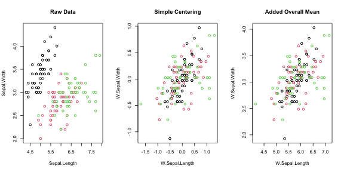
<p class="caption">plot of chunk BWplot</p>
</div>

```r
par(oldpar)
```
<!--
# Note: This is not just slightly faster than fmean(x, g, TRA = "-+"), but if weights are used, fmean(x, g, w, "-+")
# gives a wrong result: It subtracts weighted group means but then centers on the frequency-weighted average of those group means,
# whereas fwithin(x, g, w, mean = "overall.mean") will also center on the properly weighted overall mean.
-->

Another great utility of operators is that they can be employed in regression formulas in a manor that is both very efficient and pleasing to the eyes. The code below demonstrates the use of `W` and `B` to efficiently run fixed-effects regressions with `lm`.

```r
# When using operators in formulas, we need to remove missing values beforehand to obtain the same results as a Fixed-Effects package
data <- wlddev %>% fselect(iso3c, year, PCGDP, LIFEEX) %>% na_omit

# classical lm() -> iso3c is a factor, creates a matrix of 200+ country dummies.
coef(lm(PCGDP ~ LIFEEX + iso3c, data))[1:2]
# (Intercept)      LIFEEX 
#   -2837.039     380.448

# Centering each variable individually
coef(lm(W(PCGDP, iso3c) ~ W(LIFEEX, iso3c), data))
#      (Intercept) W(LIFEEX, iso3c) 
#     5.596034e-13     3.804480e+02

# Centering the data
coef(lm(W.PCGDP ~ W.LIFEEX, W(data, PCGDP + LIFEEX ~ iso3c)))
#  (Intercept)     W.LIFEEX 
# 5.596034e-13 3.804480e+02

# Adding the overall mean back to the data only changes the intercept
coef(lm(W.PCGDP ~ W.LIFEEX, W(data, PCGDP + LIFEEX  ~ iso3c, mean = "overall.mean")))
# (Intercept)    W.LIFEEX 
#  -14020.142     380.448

# Procedure suggested by Mundlak (1978) - controlling for group averages instead of demeaning
coef(lm(PCGDP ~ LIFEEX + B(LIFEEX, iso3c), data))
#      (Intercept)           LIFEEX B(LIFEEX, iso3c) 
#      -52254.7421         380.4480         585.8386
```

In general it is recommended calling the long names (i.e. `fwithin` or `fscale` etc.) for programming since they are a bit more efficient on the R-side of things and require all input in terms of data. For all other purposes the operators are more convenient. It is important to note that the operators can do everything the functions can do (i.e. you can also pass grouping vectors or *GRP* objects to them). They are just simple wrappers that in the data frame method add 4 additional features:

* The possibility of formula input to `by` i.e. `W(mtcars, ~ cyl)` or `W(mtcars, mpg ~ cyl)`
* They preserve grouping columns (`cyl` in the above example) when passed in a formula (default `keep.by = TRUE`)
* The ability to subset many columns using the `cols` argument (i.e. `W(mtcars, ~ cyl, cols = 4:7)` is the same as `W(mtcars, hp + drat + wt + qsec ~ cyl)`)
* They rename transformed columns by adding a prefix (default `stub = "W."`)

<!-- That's it about operators! If you like this kind of parsimony use them, otherwise leave it. -->

<!-- # Now with cyl, vs and am fixed effects -->
<!-- lm(W(mpg,list(cyl,vs,am)) ~ W(carb,list(cyl,vs,am)), data = mtcars) -->
<!-- lm(mpg ~ carb, data = W(mtcars, ~ cyl + vs + am, stub = FALSE)) -->
<!-- lm(mpg ~ carb + collapse::B(carb,list(cyl,vs,am)), data = mtcars) -->

<!-- # Now with cyl, vs and am fixed effects weighted by hp: -->
<!-- lm(W(mpg,list(cyl,vs,am),hp) ~ W(carb,list(cyl,vs,am),hp), data = mtcars) -->
<!-- lm(mpg ~ carb, data = W(mtcars, ~ cyl + vs + am, ~ hp, stub = FALSE)) -->
<!-- lm(mpg ~ carb + collapse::B(carb,list(cyl,vs,am),hp), data = mtcars)       # This gives a slightly different coefficient!! -->

### 6.6 HD Centering and Linear Prediction
Sometimes simple centering is not enough, for example if a linear model with multiple levels of fixed-effects needs to be estimated, potentially involving interactions with continuous covariates. For these purposes `fhdwithin / HDW` and `fhdbetween / HDB` were created as efficient multi-purpose functions for linear prediction and partialling out. They operate by splitting complex regression problems in 2 parts: Factors and factor-interactions are projected out using `fixest::demean`, an efficient `C++` routine for centering vectors on multiple factors, whereas continuous variables are dealt with using a standard `chol` or `qr` decomposition in base R. The examples below show the use of the `HDW` operator in manually solving a regression problem with country and time fixed effects.


```r
data$year <- qF(data$year, na.exclude = FALSE) # the country code (iso3c) is already a factor

# classical lm() -> creates a matrix of 196 country dummies and 56 year dummies
coef(lm(PCGDP ~ LIFEEX + iso3c + year, data))[1:2]
# (Intercept)      LIFEEX 
#  37388.0493   -333.0115

# Centering each variable individually
coef(lm(HDW(PCGDP, list(iso3c, year)) ~ HDW(LIFEEX, list(iso3c, year)), data))
#                    (Intercept) HDW(LIFEEX, list(iso3c, year)) 
#                  -2.450245e-13                  -3.330115e+02

# Centering the entire data
coef(lm(HDW.PCGDP ~ HDW.LIFEEX, HDW(data, PCGDP + LIFEEX ~ iso3c + year)))
#   (Intercept)    HDW.LIFEEX 
# -2.450245e-13 -3.330115e+02

# Procedure suggested by Mundlak (1978) - controlling for averages instead of demeaning
coef(lm(PCGDP ~ LIFEEX + HDB(LIFEEX, list(iso3c, year)), data))
#                    (Intercept)                         LIFEEX HDB(LIFEEX, list(iso3c, year)) 
#                    -48141.1094                      -333.0115                      1236.2681
```
We may wish to test whether including time fixed-effects in the above regression actually impacts the fit. This can be done with the fast F-test:

```r
# The syntax is fFtest(y, exc, X, ...). 'exc' are exclusion restrictions.
data %$% fFtest(PCGDP, year, list(LIFEEX, iso3c))
#                     R-Sq.  DF1  DF2  F-Stat.  P-Value
# Full Model          0.894  258 8763  286.130    0.000
# Restricted Model    0.873  199 8822  304.661    0.000
# Exclusion Rest.     0.021   59 8763   29.280    0.000
```
The test shows that the time fixed-effects (accounted for like year dummies) are jointly significant.

One can also use `fhdbetween / HDB` and `fhdwithin / HDW` to project out interactions and continuous covariates.


```r
wlddev$year <- as.numeric(wlddev$year)

# classical lm() -> full country-year interaction, -> 200+ country dummies, 200+ trends, year and ODA
coef(lm(PCGDP ~ LIFEEX + iso3c * year + ODA, wlddev))[1:2]
#   (Intercept)        LIFEEX 
# -7.257955e+05  8.938626e+00

# Same using HDW
coef(lm(HDW.PCGDP ~ HDW.LIFEEX, HDW(wlddev, PCGDP + LIFEEX ~ iso3c * year + ODA)))
#  (Intercept)   HDW.LIFEEX 
# 3.403288e-12 8.938626e+00

# example of a simple continuous problem
HDW(iris[1:2], iris[3:4]) %>% head
#   HDW.Sepal.Length HDW.Sepal.Width
# 1       0.21483967       0.2001352
# 2       0.01483967      -0.2998648
# 3      -0.13098262      -0.1255786
# 4      -0.33933805      -0.1741510
# 5       0.11483967       0.3001352
# 6       0.41621663       0.6044681

# May include factors..
HDW(iris[1:2], iris[3:5]) %>% head
#   HDW.Sepal.Length HDW.Sepal.Width
# 1       0.14989286       0.1102684
# 2      -0.05010714      -0.3897316
# 3      -0.15951256      -0.1742640
# 4      -0.44070173      -0.3051992
# 5       0.04989286       0.2102684
# 6       0.17930818       0.3391766
```


## 7. Time Series and Panel Series
*collapse* also presents some essential contributions in the time series domain, particularly in the area of (irregular) time series, panel data and efficient and secure computations on (potentially unordered) time-dependent vectors and (unbalanced) panels.

### 7.1 Panel Series to Array Conversions
To facilitate the exploration and access of panel data, `psmat` was created as an S3 generic to efficiently obtain matrices or 3D-arrays from panel data.

```r
mts <- psmat(wlddev, PCGDP ~ iso3c, ~ year)
str(mts)
#  'psmat' num [1:216, 1:61] NA NA NA NA NA ...
#  - attr(*, "dimnames")=List of 2
#   ..$ : chr [1:216] "ABW" "AFG" "AGO" "ALB" ...
#   ..$ : chr [1:61] "1960" "1961" "1962" "1963" ...
#  - attr(*, "transpose")= logi FALSE
plot(log10(mts), main = paste("Log10", vlabels(wlddev$PCGDP)), xlab = "Year")
```

<div class="figure">
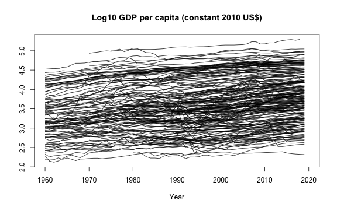
<p class="caption">plot of chunk psmatplot</p>
</div>

Passing a data frame of panel series to `psmat` generates a 3D array:

```r
# Get panel series array
psar <- psmat(wlddev, ~ iso3c, ~ year, cols = 9:12)
str(psar)
#  'psmat' num [1:216, 1:61, 1:4] NA NA NA NA NA ...
#  - attr(*, "dimnames")=List of 3
#   ..$ : chr [1:216] "ABW" "AFG" "AGO" "ALB" ...
#   ..$ : chr [1:61] "1960" "1961" "1962" "1963" ...
#   ..$ : chr [1:4] "PCGDP" "LIFEEX" "GINI" "ODA"
#  - attr(*, "transpose")= logi FALSE
plot(psar)
```

<div class="figure">
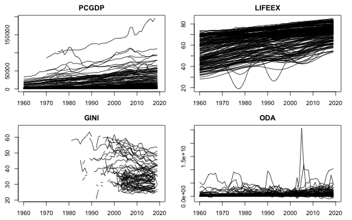
<p class="caption">plot of chunk psarplot</p>
</div>

```r
# Plot array of Panel Series aggregated by region:
collap(wlddev, ~ region + year, cols = 9:12) %>%
  psmat( ~ region, ~ year) %>%
  plot(legend = TRUE, labs = vlabels(wlddev)[9:12])
```

<div class="figure">

<p class="caption">plot of chunk psarplot2</p>
</div>
`psmat` can also output a list of panel series matrices, which can be used among other things to reshape the data with `unlist2d` (discussed in more detail in List-Processing section).

```r
# This gives list of ps-matrices
psml <- psmat(wlddev, ~ iso3c, ~ year, 9:12, array = FALSE)
str(psml, give.attr = FALSE)
# List of 4
#  $ PCGDP : 'psmat' num [1:216, 1:61] NA NA NA NA NA ...
#  $ LIFEEX: 'psmat' num [1:216, 1:61] 65.7 32.4 37.5 62.3 NA ...
#  $ GINI  : 'psmat' num [1:216, 1:61] NA NA NA NA NA NA NA NA NA NA ...
#  $ ODA   : 'psmat' num [1:216, 1:61] NA 116769997 -390000 NA NA ...

# Using unlist2d, can generate a data.frame
unlist2d(psml, idcols = "Variable", row.names = "Country") %>% gv(1:10) %>% head
#   Variable Country 1960 1961 1962 1963 1964 1965 1966 1967
# 1    PCGDP     ABW   NA   NA   NA   NA   NA   NA   NA   NA
# 2    PCGDP     AFG   NA   NA   NA   NA   NA   NA   NA   NA
# 3    PCGDP     AGO   NA   NA   NA   NA   NA   NA   NA   NA
# 4    PCGDP     ALB   NA   NA   NA   NA   NA   NA   NA   NA
# 5    PCGDP     AND   NA   NA   NA   NA   NA   NA   NA   NA
# 6    PCGDP     ARE   NA   NA   NA   NA   NA   NA   NA   NA
```

### 7.2 Panel Series ACF, PACF and CCF
The correlation structure of panel data can also be explored with `psacf`, `pspacf` and `psccf`. These functions are exact analogues to `stats::acf`, `stats::pacf` and `stats::ccf`. They use `fscale` to group-scale panel data by the panel-id provided, and then compute the covariance of a sequence of panel-lags (generated with `flag` discussed below) with the group-scaled level-series, dividing by the variance of the group-scaled level series. The Partial-ACF is generated from the ACF using a Yule-Walker decomposition (as in `stats::pacf`).

```r
# Panel-ACF of GDP per Capita
psacf(wlddev, PCGDP ~ iso3c, ~year)
```

<div class="figure">

<p class="caption">plot of chunk PSACF</p>
</div>

```r
# Panel-Partial-ACF of GDP per Capia
pspacf(wlddev, PCGDP ~ iso3c, ~year)
```

<div class="figure">
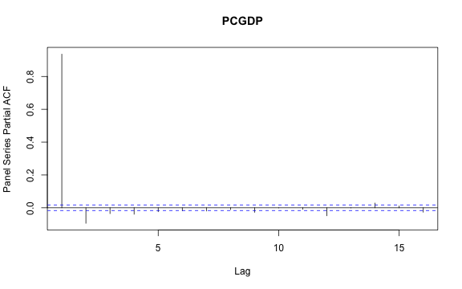
<p class="caption">plot of chunk PSACF</p>
</div>

```r
# Panel- Cross-Correlation function of GDP per Capia and Life-Expectancy
wlddev %$% psccf(PCGDP, LIFEEX, iso3c, year)
```

<div class="figure">
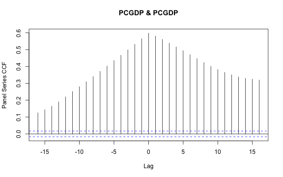
<p class="caption">plot of chunk PSACF</p>
</div>

```r
# Multivariate Panel-auto and cross-correlation function of 3 variables:
psacf(wlddev, PCGDP + LIFEEX + ODA ~ iso3c, ~year)
```

<div class="figure">
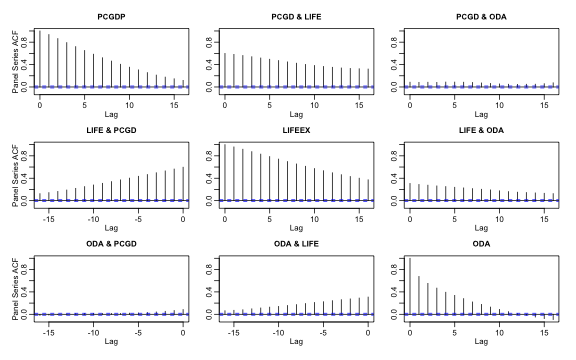
<p class="caption">plot of chunk PSACF</p>
</div>

### 7.3 Fast Lags and Leads
`flag` and the corresponding lag- and lead- operators `L` and `F` are S3 generics to efficiently compute lags and leads on time series and panel data. The code below shows how to compute simple lags and leads on the classic Box & Jenkins airline data that comes with R.

```r
# 1 lag
L(AirPassengers)
#      Jan Feb Mar Apr May Jun Jul Aug Sep Oct Nov Dec
# 1949  NA 112 118 132 129 121 135 148 148 136 119 104
# 1950 118 115 126 141 135 125 149 170 170 158 133 114
# 1951 140 145 150 178 163 172 178 199 199 184 162 146
# 1952 166 171 180 193 181 183 218 230 242 209 191 172
# 1953 194 196 196 236 235 229 243 264 272 237 211 180
# 1954 201 204 188 235 227 234 264 302 293 259 229 203
# 1955 229 242 233 267 269 270 315 364 347 312 274 237
# 1956 278 284 277 317 313 318 374 413 405 355 306 271
# 1957 306 315 301 356 348 355 422 465 467 404 347 305
# 1958 336 340 318 362 348 363 435 491 505 404 359 310
# 1959 337 360 342 406 396 420 472 548 559 463 407 362
# 1960 405 417 391 419 461 472 535 622 606 508 461 390

# 3 identical ways of computing 1 lag
all_identical(flag(AirPassengers), L(AirPassengers), F(AirPassengers,-1))
# [1] TRUE

# 1 lead and 3 lags - output as matrix
L(AirPassengers, -1:3) %>% head
#       F1  --  L1  L2  L3
# [1,] 118 112  NA  NA  NA
# [2,] 132 118 112  NA  NA
# [3,] 129 132 118 112  NA
# [4,] 121 129 132 118 112
# [5,] 135 121 129 132 118
# [6,] 148 135 121 129 132

# ... this is still a time series object:
attributes(L(AirPassengers, -1:3))
# $tsp
# [1] 1949.000 1960.917   12.000
# 
# $class
# [1] "ts"     "matrix"
# 
# $dim
# [1] 144   5
# 
# $dimnames
# $dimnames[[1]]
# NULL
# 
# $dimnames[[2]]
# [1] "F1" "--" "L1" "L2" "L3"
```
`flag / L / F` also work well on (time series) matrices. Below a regression with daily closing prices of major European stock indices is run: Germany DAX (Ibis), Switzerland SMI, France CAC, and UK FTSE. The data are sampled in business time, i.e. weekends and holidays are omitted.


```r
str(EuStockMarkets)
#  Time-Series [1:1860, 1:4] from 1991 to 1999: 1629 1614 1607 1621 1618 ...
#  - attr(*, "dimnames")=List of 2
#   ..$ : NULL
#   ..$ : chr [1:4] "DAX" "SMI" "CAC" "FTSE"

# Data is recorded on 260 days per year, 1991-1999
tsp(EuStockMarkets)
# [1] 1991.496 1998.646  260.000
freq <- frequency(EuStockMarkets)

# There is some obvious seasonality
stl(EuStockMarkets[, "DAX"], freq) %>% plot
```

<div class="figure">
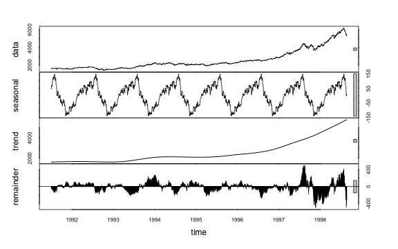
<p class="caption">plot of chunk mts</p>
</div>

```r

# 1 annual lead and 1 annual lag
L(EuStockMarkets, -1:1*freq) %>% head
#      F260.DAX     DAX L260.DAX F260.SMI    SMI L260.SMI F260.CAC    CAC L260.CAC F260.FTSE   FTSE
# [1,]  1755.98 1628.75       NA   1846.6 1678.1       NA   1907.3 1772.8       NA    2515.8 2443.6
# [2,]  1754.95 1613.63       NA   1854.8 1688.5       NA   1900.6 1750.5       NA    2521.2 2460.2
# [3,]  1759.90 1606.51       NA   1845.3 1678.6       NA   1880.9 1718.0       NA    2493.9 2448.2
# [4,]  1759.84 1621.04       NA   1854.5 1684.1       NA   1873.5 1708.1       NA    2476.1 2470.4
# [5,]  1776.50 1618.16       NA   1870.5 1686.6       NA   1883.6 1723.1       NA    2497.1 2484.7
# [6,]  1769.98 1610.61       NA   1862.6 1671.6       NA   1868.5 1714.3       NA    2469.0 2466.8
#      L260.FTSE
# [1,]        NA
# [2,]        NA
# [3,]        NA
# [4,]        NA
# [5,]        NA
# [6,]        NA

# DAX regressed on it's own 2 annual lags and the lags of the other indicators
lm(DAX ~., data = L(EuStockMarkets, 0:2*freq)) %>% summary
# 
# Call:
# lm(formula = DAX ~ ., data = L(EuStockMarkets, 0:2 * freq))
# 
# Residuals:
#     Min      1Q  Median      3Q     Max 
# -240.46  -51.28  -12.01   45.19  358.02 
# 
# Coefficients:
#               Estimate Std. Error t value Pr(>|t|)    
# (Intercept) -564.02041   93.94903  -6.003 2.49e-09 ***
# L260.DAX      -0.12577    0.03002  -4.189 2.99e-05 ***
# L520.DAX      -0.12528    0.04103  -3.053  0.00231 ** 
# SMI            0.32601    0.01726  18.890  < 2e-16 ***
# L260.SMI       0.27499    0.02517  10.926  < 2e-16 ***
# L520.SMI       0.04602    0.02602   1.769  0.07721 .  
# CAC            0.59637    0.02349  25.389  < 2e-16 ***
# L260.CAC      -0.14283    0.02763  -5.169 2.72e-07 ***
# L520.CAC       0.05196    0.03657   1.421  0.15557    
# FTSE           0.01002    0.02403   0.417  0.67675    
# L260.FTSE      0.04509    0.02807   1.606  0.10843    
# L520.FTSE      0.10601    0.02717   3.902  0.00010 ***
# ---
# Signif. codes:  0 '***' 0.001 '**' 0.01 '*' 0.05 '.' 0.1 ' ' 1
# 
# Residual standard error: 83.06 on 1328 degrees of freedom
#   (520 observations deleted due to missingness)
# Multiple R-squared:  0.9943,	Adjusted R-squared:  0.9942 
# F-statistic: 2.092e+04 on 11 and 1328 DF,  p-value: < 2.2e-16
```
Since v1.5.0, irregular time series are supported:

```r
t <- seq_row(EuStockMarkets)[-4L]

flag(EuStockMarkets[-4L, ], -1:1, t = t) %>% head
#       F1.DAX     DAX  L1.DAX F1.SMI    SMI L1.SMI F1.CAC    CAC L1.CAC F1.FTSE   FTSE L1.FTSE
# [1,] 1613.63 1628.75      NA 1688.5 1678.1     NA 1750.5 1772.8     NA  2460.2 2443.6      NA
# [2,] 1606.51 1613.63 1628.75 1678.6 1688.5 1678.1 1718.0 1750.5 1772.8  2448.2 2460.2  2443.6
# [3,]      NA 1606.51 1613.63     NA 1678.6 1688.5     NA 1718.0 1750.5      NA 2448.2  2460.2
# [4,] 1610.61 1618.16      NA 1671.6 1686.6     NA 1714.3 1723.1     NA  2466.8 2484.7      NA
# [5,] 1630.75 1610.61 1618.16 1682.9 1671.6 1686.6 1734.5 1714.3 1723.1  2487.9 2466.8  2484.7
# [6,] 1640.17 1630.75 1610.61 1703.6 1682.9 1671.6 1757.4 1734.5 1714.3  2508.4 2487.9  2466.8
```

The main innovation of `flag / L / F` is the ability to very efficiently compute sequences of lags and leads on panel data, and that this panel data need not be ordered or balanced:


```r
# This lags all 4 series
L(wlddev, 1L, ~ iso3c, ~ year, cols = 9:12) %>% head
#   iso3c year L1.PCGDP L1.LIFEEX L1.GINI    L1.ODA
# 1   AFG 1960       NA        NA      NA        NA
# 2   AFG 1961       NA    32.446      NA 116769997
# 3   AFG 1962       NA    32.962      NA 232080002
# 4   AFG 1963       NA    33.471      NA 112839996
# 5   AFG 1964       NA    33.971      NA 237720001
# 6   AFG 1965       NA    34.463      NA 295920013

# Without t: Works here because data is ordered, but gives a message
L(wlddev, 1L, ~ iso3c, cols = 9:12) %>% head
#   iso3c L1.PCGDP L1.LIFEEX L1.GINI    L1.ODA
# 1   AFG       NA        NA      NA        NA
# 2   AFG       NA    32.446      NA 116769997
# 3   AFG       NA    32.962      NA 232080002
# 4   AFG       NA    33.471      NA 112839996
# 5   AFG       NA    33.971      NA 237720001
# 6   AFG       NA    34.463      NA 295920013

# 1 lead and 2 lags of Life Expectancy
# after removing the 4th row, thus creating an unbalanced panel
wlddev %>% ss(-4L) %>%
  L(-1:2, LIFEEX ~ iso3c, ~year) %>% head
#   iso3c year F1.LIFEEX LIFEEX L1.LIFEEX L2.LIFEEX
# 1   AFG 1960    32.962 32.446        NA        NA
# 2   AFG 1961    33.471 32.962    32.446        NA
# 3   AFG 1962        NA 33.471    32.962    32.446
# 4   AFG 1964    34.948 34.463        NA    33.471
# 5   AFG 1965    35.430 34.948    34.463        NA
# 6   AFG 1966    35.914 35.430    34.948    34.463
```

Optimal performance is obtained if the panel-id is a factor, and the time variable also a factor or an integer variable. In that case an ordering vector of the data is computed directly without any prior sorting or grouping, and the data is accessed through this vector. Thus the data need not be sorted to compute a fully-identified panel-lag, which is a key advantage to, say, the `shift` function in `data.table`.

<!--
One caveat of the direct computation of the ordering is that `flag / L / F` requires regularly spaced panel data, and provides errors for repeated values or gaps in time within any group:


```r
g <- c(1,1,1,2,2,2)
tryCatch(flag(1:6, 1, g, t = c(1,2,3,1,2,2)),
         error = function(e) e)
# <Rcpp::exception in eval(expr, envir, enclos): Repeated values of timevar within one or more groups>
tryCatch(flag(1:6, 1, g, t = c(1,2,3,1,2,4)),
         error = function(e) e)
# [1] NA  1  2 NA  4 NA
```

Note that all of this does not require the panel to be balanced. `flag / L /F` works for unbalanced panel data as long as there are no gaps or repeated values in the time-variable for an individual. Since this sacrifices some functionality for speed and has been a requested feature, *collapse* 1.2.0 introduced the function `seqid`, which can be used to generate an new panel-id variable which identifies consecutive time-sequences at the sub-individual level, an thus enables the use of `flag / L /F` on irregular panels.
-->

One intended area of use, especially for the operators `L` and `F`, is to substantially facilitate the implementation of dynamic models in various contexts (independent of the estimation package). Below different ways `L` can be used to estimate a dynamic panel-model using `lm` are shown:

```r
# Different ways of regressing GDP on it's lags and life-Expectancy and it's lags

# 1 - Precomputing lags
lm(PCGDP ~ ., L(wlddev, 0:2, PCGDP + LIFEEX ~ iso3c, ~ year, keep.ids = FALSE)) %>% summary
# 
# Call:
# lm(formula = PCGDP ~ ., data = L(wlddev, 0:2, PCGDP + LIFEEX ~ 
#     iso3c, ~year, keep.ids = FALSE))
# 
# Residuals:
#      Min       1Q   Median       3Q      Max 
# -16776.5   -102.2    -17.2     91.5  12277.1 
# 
# Coefficients:
#               Estimate Std. Error t value Pr(>|t|)    
# (Intercept) -333.93994   61.04617  -5.470 4.62e-08 ***
# L1.PCGDP       1.31959    0.01021 129.270  < 2e-16 ***
# L2.PCGDP      -0.31707    0.01029 -30.815  < 2e-16 ***
# LIFEEX       -17.77368   35.47772  -0.501    0.616    
# L1.LIFEEX     45.76286   65.87124   0.695    0.487    
# L2.LIFEEX    -21.43005   34.98964  -0.612    0.540    
# ---
# Signif. codes:  0 '***' 0.001 '**' 0.01 '*' 0.05 '.' 0.1 ' ' 1
# 
# Residual standard error: 787.3 on 8609 degrees of freedom
#   (4561 observations deleted due to missingness)
# Multiple R-squared:  0.9976,	Adjusted R-squared:  0.9976 
# F-statistic: 7.26e+05 on 5 and 8609 DF,  p-value: < 2.2e-16

# 2 - Ad-hoc computation in lm formula
lm(PCGDP ~ L(PCGDP, 1:2, iso3c, year) + L(LIFEEX, 0:2, iso3c, year), wlddev) %>% summary
# 
# Call:
# lm(formula = PCGDP ~ L(PCGDP, 1:2, iso3c, year) + L(LIFEEX, 0:2, 
#     iso3c, year), data = wlddev)
# 
# Residuals:
#      Min       1Q   Median       3Q      Max 
# -16776.5   -102.2    -17.2     91.5  12277.1 
# 
# Coefficients:
#                                 Estimate Std. Error t value Pr(>|t|)    
# (Intercept)                   -333.93994   61.04617  -5.470 4.62e-08 ***
# L(PCGDP, 1:2, iso3c, year)L1     1.31959    0.01021 129.270  < 2e-16 ***
# L(PCGDP, 1:2, iso3c, year)L2    -0.31707    0.01029 -30.815  < 2e-16 ***
# L(LIFEEX, 0:2, iso3c, year)--  -17.77368   35.47772  -0.501    0.616    
# L(LIFEEX, 0:2, iso3c, year)L1   45.76286   65.87124   0.695    0.487    
# L(LIFEEX, 0:2, iso3c, year)L2  -21.43005   34.98964  -0.612    0.540    
# ---
# Signif. codes:  0 '***' 0.001 '**' 0.01 '*' 0.05 '.' 0.1 ' ' 1
# 
# Residual standard error: 787.3 on 8609 degrees of freedom
#   (4561 observations deleted due to missingness)
# Multiple R-squared:  0.9976,	Adjusted R-squared:  0.9976 
# F-statistic: 7.26e+05 on 5 and 8609 DF,  p-value: < 2.2e-16

# 3 - Precomputing panel-identifiers
g = qF(wlddev$iso3c, na.exclude = FALSE)
t = qF(wlddev$year, na.exclude = FALSE)
lm(PCGDP ~ L(PCGDP, 1:2, g, t) + L(LIFEEX, 0:2, g, t), wlddev) %>% summary
# 
# Call:
# lm(formula = PCGDP ~ L(PCGDP, 1:2, g, t) + L(LIFEEX, 0:2, g, 
#     t), data = wlddev)
# 
# Residuals:
#      Min       1Q   Median       3Q      Max 
# -16776.5   -102.2    -17.2     91.5  12277.1 
# 
# Coefficients:
#                          Estimate Std. Error t value Pr(>|t|)    
# (Intercept)            -333.93994   61.04617  -5.470 4.62e-08 ***
# L(PCGDP, 1:2, g, t)L1     1.31959    0.01021 129.270  < 2e-16 ***
# L(PCGDP, 1:2, g, t)L2    -0.31707    0.01029 -30.815  < 2e-16 ***
# L(LIFEEX, 0:2, g, t)--  -17.77368   35.47772  -0.501    0.616    
# L(LIFEEX, 0:2, g, t)L1   45.76286   65.87124   0.695    0.487    
# L(LIFEEX, 0:2, g, t)L2  -21.43005   34.98964  -0.612    0.540    
# ---
# Signif. codes:  0 '***' 0.001 '**' 0.01 '*' 0.05 '.' 0.1 ' ' 1
# 
# Residual standard error: 787.3 on 8609 degrees of freedom
#   (4561 observations deleted due to missingness)
# Multiple R-squared:  0.9976,	Adjusted R-squared:  0.9976 
# F-statistic: 7.26e+05 on 5 and 8609 DF,  p-value: < 2.2e-16
```

### 7.4 Fast Differences and Growth Rates
Similarly to `flag / L / F`, `fdiff / D / Dlog` computes sequences of suitably lagged / leaded and iterated differences, quasi-differences or (quasi-)log-differences on time series and panel data, and `fgrowth / G` computes growth rates. Using again the `Airpassengers` data, the seasonal decomposition shows significant seasonality:

```r
stl(AirPassengers, "periodic") %>% plot
```

<div class="figure">

<p class="caption">plot of chunk stl</p>
</div>
We can test the statistical significance of this seasonality by jointly testing a set of monthly dummies regressed on the differenced series. Given that the seasonal fluctuations are increasing in magnitude, using growth rates for the test seems more appropriate:

```r
f <- qF(cycle(AirPassengers))
fFtest(fgrowth(AirPassengers), f)
#   R-Sq.     DF1     DF2 F-Stat. P-value 
#   0.874      11     131  82.238   0.000
```
The test shows significant seasonality, accounting for 87% of the variation in the growth rate of the series. We can plot the series together with the ordinary, seasonal (12-month) and deseasonalized monthly growth rate using:

```r
G(AirPassengers, c(0, 1, 12)) %>% cbind(W.G1 = W(G(AirPassengers), f)) %>%
  plot(main = "Growth Rate of Airpassengers")
```

<div class="figure">

<p class="caption">plot of chunk Gplot</p>
</div>
It is evident that taking the annualized growth rate also removes the periodic behavior. We can also compute second differences or growth rates of growth rates. Below a plot of the ordinary and annual first and second differences of the data:

```r
D(AirPassengers, c(1,12), 1:2) %>% plot
```

<div class="figure">

<p class="caption">plot of chunk Dplot</p>
</div>
In general, both `fdiff / D` and `fgrowth / G` can compute sequences of lagged / leaded and iterated differences / growth rates.

```r
# sequence of leaded/lagged and iterated differences
y = 1:10
D(y, -2:2, 1:3)
#       F2D1 F2D2 F2D3 FD1 FD2 FD3 -- D1 D2 D3 L2D1 L2D2 L2D3
#  [1,]   -2    0    0  -1   0   0  1 NA NA NA   NA   NA   NA
#  [2,]   -2    0    0  -1   0   0  2  1 NA NA   NA   NA   NA
#  [3,]   -2    0    0  -1   0   0  3  1  0 NA    2   NA   NA
#  [4,]   -2    0    0  -1   0   0  4  1  0  0    2   NA   NA
#  [5,]   -2    0   NA  -1   0   0  5  1  0  0    2    0   NA
#  [6,]   -2    0   NA  -1   0   0  6  1  0  0    2    0   NA
#  [7,]   -2   NA   NA  -1   0   0  7  1  0  0    2    0    0
#  [8,]   -2   NA   NA  -1   0  NA  8  1  0  0    2    0    0
#  [9,]   NA   NA   NA  -1  NA  NA  9  1  0  0    2    0    0
# [10,]   NA   NA   NA  NA  NA  NA 10  1  0  0    2    0    0
```
All of this also works for panel data. The code below gives an example:

```r
g = rep(1:2, each = 5)
t = rep(1:5, 2)

D(y, -2:2, 1:2, g, t)
#       F2D1 F2D2 FD1 FD2 -- D1 D2 L2D1 L2D2
#  [1,]   -2    0  -1   0  1 NA NA   NA   NA
#  [2,]   -2   NA  -1   0  2  1 NA   NA   NA
#  [3,]   -2   NA  -1   0  3  1  0    2   NA
#  [4,]   NA   NA  -1  NA  4  1  0    2   NA
#  [5,]   NA   NA  NA  NA  5  1  0    2    0
#  [6,]   -2    0  -1   0  6 NA NA   NA   NA
#  [7,]   -2   NA  -1   0  7  1 NA   NA   NA
#  [8,]   -2   NA  -1   0  8  1  0    2   NA
#  [9,]   NA   NA  -1  NA  9  1  0    2   NA
# [10,]   NA   NA  NA  NA 10  1  0    2    0
```
Calls to `flag / L / F`, `fdiff / D` and `fgrowth / G` can be nested. In the example below, `L.matrix` is called on the right-half ob the above sequence:

```r
L(D(y, 0:2, 1:2, g, t), 0:1, g, t)
#       -- L1.-- D1 L1.D1 D2 L1.D2 L2D1 L1.L2D1 L2D2 L1.L2D2
#  [1,]  1    NA NA    NA NA    NA   NA      NA   NA      NA
#  [2,]  2     1  1    NA NA    NA   NA      NA   NA      NA
#  [3,]  3     2  1     1  0    NA    2      NA   NA      NA
#  [4,]  4     3  1     1  0     0    2       2   NA      NA
#  [5,]  5     4  1     1  0     0    2       2    0      NA
#  [6,]  6    NA NA    NA NA    NA   NA      NA   NA      NA
#  [7,]  7     6  1    NA NA    NA   NA      NA   NA      NA
#  [8,]  8     7  1     1  0    NA    2      NA   NA      NA
#  [9,]  9     8  1     1  0     0    2       2   NA      NA
# [10,] 10     9  1     1  0     0    2       2    0      NA
```
<!-- THIS GAVE ERROR ON CRAN Checks !! -->
<!-- If `n * diff` (or `n` in `flag / L / F`) exceeds the length of the data or the average group size in panel-computations, all of these functions will throw appropriate errors: -->
<!-- ```{r} -->
<!-- D(y, 3, 2, g, t) -->
<!-- ``` -->

`fdiff / D` and `fgrowth / G` also come with a data frame method, making the computation of growth-variables on datasets very easy:

```r
G(GGDC10S, 1L, 1L, ~ Variable + Country, ~ Year, cols = 6:10) %>% head
#   Variable Country Year    G1.AGR    G1.MIN   G1.MAN    G1.PU   G1.CON
# 1       VA     BWA 1960        NA        NA       NA       NA       NA
# 2       VA     BWA 1961        NA        NA       NA       NA       NA
# 3       VA     BWA 1962        NA        NA       NA       NA       NA
# 4       VA     BWA 1963        NA        NA       NA       NA       NA
# 5       VA     BWA 1964        NA        NA       NA       NA       NA
# 6       VA     BWA 1965 -3.524492 -28.57143 38.23529 29.41176 103.9604
```
<!-- One could also add variables by reference using *data.table*: -->
<!-- ```{r, warning=FALSE, message=FALSE, error=FALSE} -->
<!-- head(qDT(wlddev)[, paste0("G.", names(wlddev)[9:12]) := fgrowth(.SD,1,1,iso3c,year), .SDcols = 9:12]) -->

<!-- ``` -->
<!-- When working with *data.table* it is important to realize that while collapse functions will work with *data.table* grouping using `by` or `keyby`, this is very slow because it will run a method-dispatch for every group. It is much better and more secure to utilize the functions fast internal grouping facilities, as I have done in the above example. -->

The code below estimates a dynamic panel model regressing the 10-year growth rate of GDP per capita on it's 10-year lagged level and the 10-year growth rate of life-expectancy:


```r
summary(lm(G(PCGDP,10,1,iso3c,year) ~
             L(PCGDP,10,iso3c,year) +
             G(LIFEEX,10,1,iso3c,year), data = wlddev))
# 
# Call:
# lm(formula = G(PCGDP, 10, 1, iso3c, year) ~ L(PCGDP, 10, iso3c, 
#     year) + G(LIFEEX, 10, 1, iso3c, year), data = wlddev)
# 
# Residuals:
#     Min      1Q  Median      3Q     Max 
# -104.32  -21.97   -3.96   13.26 1714.58 
# 
# Coefficients:
#                                 Estimate Std. Error t value Pr(>|t|)    
# (Intercept)                    2.740e+01  1.089e+00  25.168  < 2e-16 ***
# L(PCGDP, 10, iso3c, year)     -3.337e-04  4.756e-05  -7.016 2.49e-12 ***
# G(LIFEEX, 10, 1, iso3c, year)  4.617e-01  1.124e-01   4.107 4.05e-05 ***
# ---
# Signif. codes:  0 '***' 0.001 '**' 0.01 '*' 0.05 '.' 0.1 ' ' 1
# 
# Residual standard error: 58.43 on 7113 degrees of freedom
#   (6060 observations deleted due to missingness)
# Multiple R-squared:  0.01132,	Adjusted R-squared:  0.01104 
# F-statistic: 40.73 on 2 and 7113 DF,  p-value: < 2.2e-16
```
To go a step further, the code below regresses the 10-year growth rate of GDP on the 10-year lagged levels and 10-year growth rates of GDP and life expectancy, with country and time-fixed effects projected out using `HDW`. The standard errors are unreliable without bootstrapping, but this example nicely demonstrates the potential for complex estimations brought by *collapse*.

```r
moddat <- HDW(L(G(wlddev, c(0, 10), 1, ~iso3c, ~year, 9:10), c(0, 10), ~iso3c, ~year), ~iso3c + qF(year))[-c(1,5)]
summary(lm(HDW.L10G1.PCGDP ~. , moddat))
# 
# Call:
# lm(formula = HDW.L10G1.PCGDP ~ ., data = moddat)
# 
# Residuals:
#     Min      1Q  Median      3Q     Max 
# -807.68  -10.80   -0.64   10.23  779.99 
# 
# Coefficients:
#                        Estimate Std. Error t value Pr(>|t|)    
# (Intercept)           1.907e-15  4.930e-01   0.000 1.000000    
# HDW.L10.PCGDP        -2.500e-03  1.292e-04 -19.347  < 2e-16 ***
# HDW.L10.L10G1.PCGDP  -5.885e-01  1.082e-02 -54.412  < 2e-16 ***
# HDW.L10.LIFEEX        1.056e+00  2.885e-01   3.661 0.000254 ***
# HDW.L10G1.LIFEEX      6.927e-01  1.154e-01   6.002 2.08e-09 ***
# HDW.L10.L10G1.LIFEEX  8.749e-01  1.108e-01   7.899 3.39e-15 ***
# ---
# Signif. codes:  0 '***' 0.001 '**' 0.01 '*' 0.05 '.' 0.1 ' ' 1
# 
# Residual standard error: 35.69 on 5235 degrees of freedom
# Multiple R-squared:  0.4029,	Adjusted R-squared:  0.4023 
# F-statistic: 706.4 on 5 and 5235 DF,  p-value: < 2.2e-16
```

<!-- How long did it take to run this computation? About 4 milliseconds on my laptop (2x 2.2 GHZ, 8 GB RAM), so there is plenty of room to do this with much larger data. -->
<!-- ```{r} -->
<!-- microbenchmark(HDW(L(G(wlddev, c(0, 10), 1, ~iso3c, ~year, 9:10), c(0, 10), ~iso3c, ~year), ~iso3c + qF(year))) -->
<!-- ``` -->

One of the inconveniences of the above computations is that it requires declaring the panel-identifiers `iso3c` and `year` again and again for each function. A great remedy here are the *plm* classes *pseries* and *pdata.frame* which *collapse* was built to support. This shows how one could run the same regression with plm:

```r
pwlddev <- plm::pdata.frame(wlddev, index = c("iso3c", "year"))
moddat <- HDW(L(G(pwlddev, c(0, 10), 1, 9:10), c(0, 10)))[-c(1,5)]
summary(lm(HDW.L10G1.PCGDP ~. , moddat))
# 
# Call:
# lm(formula = HDW.L10G1.PCGDP ~ ., data = moddat)
# 
# Residuals:
#     Min      1Q  Median      3Q     Max 
# -677.61  -12.45   -1.02   10.86  913.22 
# 
# Coefficients:
#                        Estimate Std. Error t value Pr(>|t|)    
# (Intercept)           0.1456192  0.5187976   0.281 0.778962    
# HDW.L10.PCGDP        -0.0022910  0.0001253 -18.291  < 2e-16 ***
# HDW.L10.L10G1.PCGDP  -0.5859896  0.0113538 -51.612  < 2e-16 ***
# HDW.L10.LIFEEX        0.8701877  0.2456255   3.543 0.000399 ***
# HDW.L10G1.LIFEEX      0.6910533  0.1132028   6.105 1.11e-09 ***
# HDW.L10.L10G1.LIFEEX  0.8990853  0.1068241   8.417  < 2e-16 ***
# ---
# Signif. codes:  0 '***' 0.001 '**' 0.01 '*' 0.05 '.' 0.1 ' ' 1
# 
# Residual standard error: 37.51 on 5235 degrees of freedom
#   (7935 observations deleted due to missingness)
# Multiple R-squared:  0.3784,	Adjusted R-squared:  0.3778 
# F-statistic: 637.4 on 5 and 5235 DF,  p-value: < 2.2e-16
```
To learn more about the integration of *collapse* and *plm*, consult the corresponding vignette.

## 8. List Processing and a Panel-VAR Example
*collapse* also provides an ensemble of list-processing functions that grew out of a necessity of working with complex nested lists of data objects. The example provided in this section is also somewhat complex, but it demonstrates the utility of these functions while also providing a nice data-transformation task.

When summarizing the `GGDC10S` data in section 1, it was evident that certain sectors have a high share of economic activity in almost all countries in the sample. This prompts the question of whether there exist common patterns in the interaction of these important sectors across countries. One way to empirically study this could be through a (Structural) Panel-Vector-Autoregression (PSVAR) in value added with the 6 most important sectors (excluding government): Agriculture, manufacturing, wholesale and retail trade, construction, transport and storage and finance and real estate.

For this we will use the *vars* package^[I noticed there is a *panelvar* package, but I am more familiar with *vars* and *panelvar* can be pretty slow in my experience. We also have about 50 years of data here, so dynamic panel bias is not a big issue.]. Since *vars* natively does not support panel-VAR, we need to create the central *varest* object manually and then run the `SVAR` function to impose identification restrictions. We start with exploring and harmonizing the data:
<!-- and then the `irf` and `fevd` commands which create the impulse response functions and the forecast error variance decompositions, respectively.  -->


<!-- # We will estimate a panel-VAR with 1 lag -->
<!-- p <- 1 -->
<!-- # This creates a data.table containing the value added of the 6 most important non-government sectors -->
<!-- data <- qDT(GGDC10S)[Variable == "VA", c("Country","Year","AGR","MAN","WRT","CON","TRA","FIRE")] -->
<!-- # Standardizing by country takes country fixed-effects and gets rid of local-currencies -->
<!-- get_vars(data, 3:8) <- STD(data, ~ Country, cols = 3:8, keep.by = FALSE) -->
<!-- # This also subtracts time fixed-effects accounting for global shocks -->
<!-- data <- na_omit(cbind(get_vars(data, 1), W(data, ~ Year, cols = 3:8))) -->
<!-- # Here we add p panel-lags to the country-scaled and time-demeaned data -->
<!-- data <- cbind(get_vars(data, -(1:2)), L(data, 1:p, ~Country, ~Year, keep.ids = FALSE)) -->
<!-- # This removes missing values generated by L from all but the first row  -->
<!-- data <- rbind(data[1:p], na_omit(data[-(1:p)])) # (vars will treat this as a single time series) -->
<!-- # adding a contant term -->
<!-- data[["const"]] <- rep(1, nrow(data)) -->
<!-- # saving the names of the 6 sectors -->
<!-- nam <- names(data)[1:6] -->

<!-- AGRmat <- sweep(AGRmat, 1, rowMeans(AGRmat, na.rm = TRUE), "-") -->


```r
library(vars)
# The 6 most important non-government sectors (see section 1)
sec <- c("AGR", "MAN", "WRT", "CON", "TRA", "FIRE")
# This creates a data.frame containing the value added of the 6 most important non-government sectors
data <- fsubset(GGDC10S, Variable == "VA", c("Country", "Year", sec)) %>%
  na_omit(cols = sec)
# Let's look at the log VA in agriculture across countries:
AGRmat <- psmat(data, AGR ~ Country, ~ Year, transpose = TRUE) %>% log   # Converting to panel series matrix
plot(AGRmat)
```

<div class="figure">
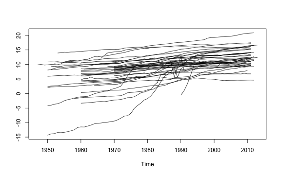
<p class="caption">plot of chunk AGRmat</p>
</div>
The plot shows quite some heterogeneity both in the levels (VA is in local currency) and in trend growth rates. In the panel-VAR estimation we are only really interested in the sectoral relationships within countries. Thus we need to harmonize this sectoral data further. One way would be taking growth rates or log-differences of the data, but VAR's are usually estimated in levels unless the data are cointegrated (and value added series do not, in general, exhibit unit-root behavior). Thus to harmonize the data further we opt for subtracting a country-sector specific cubic trend from the data in logs:


```r
# Subtracting a country specific cubic growth trend
AGRmat <- dapply(AGRmat, fhdwithin, poly(seq_row(AGRmat), 3), fill = TRUE)

plot(AGRmat)
```

<div class="figure">
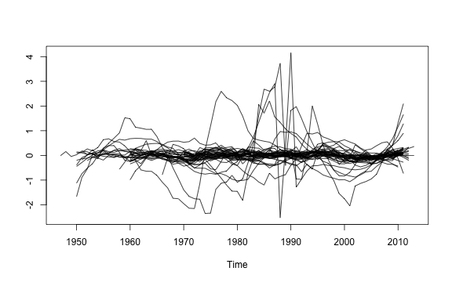
<p class="caption">plot of chunk AGRmatplot</p>
</div>
This seems to have done a decent job in curbing most of the heterogeneity. Some series however have a high variance around that cubic trend. Therefore a final step is to standardize the data to bring the variances in line:


```r
# Standardizing the cubic log-detrended data
AGRmat <- fscale(AGRmat)
plot(AGRmat)
```

<div class="figure">

<p class="caption">plot of chunk AGRmatplot2</p>
</div>

Now this looks pretty good, and is about the most we can do in terms of harmonization without differencing the data. The code below applies these transformations to all sectors:


```r
# Taking logs
settransformv(data, 3:8, log)
# Projecting out country FE and cubic trends from complete cases
gv(data, 3:8) <- HDW(data, ~ qF(Country)*poly(Year, 3), fill = TRUE)
# Scaling
gv(data, 3:8) <- STD(data, ~ Country, cols = 3:8, keep.by = FALSE)

# Check the plot
psmat(data, ~ Country, ~ Year) %>% plot
```

<div class="figure">

<p class="caption">plot of chunk psmatplot2</p>
</div>

Since the data is annual, let us estimate the Panel-VAR with one lag:


```r
# This adds one lag of all series to the data
add_vars(data) <- L(data, 1, ~ Country, ~ Year, keep.ids = FALSE)
# This removes missing values from all but the first row and drops identifier columns (vars is made for time series without gaps)
data <- rbind(ss(data, 1, -(1:2)), na_omit(ss(data, -1, -(1:2))))
head(data)
#   STD.HDW.AGR STD.HDW.MAN STD.HDW.WRT STD.HDW.CON STD.HDW.TRA STD.HDW.FIRE L1.STD.HDW.AGR
# 1  0.65713943   2.2350584    1.946383 -0.03574399   1.0877811    1.0476507             NA
# 2 -0.14377115   1.8693570    1.905081  1.23225734   1.0542315    0.9105622     0.65713943
# 3 -0.09209878  -0.8212004    1.997253 -0.01783824   0.6718465    0.6134260    -0.14377115
# 4 -0.25213869  -1.7830320   -1.970855 -2.68332505  -1.8475551    0.4382902    -0.09209878
# 5 -0.31623401  -4.2931567   -1.822211 -2.75551916  -0.7066491   -2.1982640    -0.25213869
# 6 -0.72691916  -1.3219387   -2.079333 -0.12148295  -1.1398220   -2.2230474    -0.31623401
#   L1.STD.HDW.MAN L1.STD.HDW.WRT L1.STD.HDW.CON L1.STD.HDW.TRA L1.STD.HDW.FIRE
# 1             NA             NA             NA             NA              NA
# 2      2.2350584       1.946383    -0.03574399      1.0877811       1.0476507
# 3      1.8693570       1.905081     1.23225734      1.0542315       0.9105622
# 4     -0.8212004       1.997253    -0.01783824      0.6718465       0.6134260
# 5     -1.7830320      -1.970855    -2.68332505     -1.8475551       0.4382902
# 6     -4.2931567      -1.822211    -2.75551916     -0.7066491      -2.1982640
```


Having prepared the data, the code below estimates the panel-VAR using `lm` and creates the *varest* object:

<!-- pVAR <- list(varresult = setNames(lapply(seq_len(6), function(i)    # list of 6 lm's each regressing -->
<!--                lm(as.formula(paste0(nam[i],"~ -1 + . ")),           # the sector on all lags of  -->
<!--                get_vars(data, c(i,7:length(data)))[-(1:p)])), nam), # itself and other sectors -->
<!--              datamat = data[-(1:p)], # The full data containing levels and lags of the sectors -->
<!--              y = do.call(cbind, get_vars(data, 1:6)), # Only the levels data as matrix -->
<!--              type = "const", # Specifying that a constant term was added -->
<!--              p = p, # The lag-order -->
<!--              K = 6, # The number of variables -->
<!--              obs = nrow(data)-p, # The number of non-missing obs -->
<!--              totobs = nrow(data), # The total number of obs -->
<!--              restrictions = NULL,  -->
<!--              call = quote(VAR(y = data))) -->


```r
# saving the names of the 6 sectors
nam <- names(data)[1:6]

pVAR <- list(varresult = setNames(lapply(seq_len(6), function(i)    # list of 6 lm's each regressing
               lm(as.formula(paste0(nam[i], "~ -1 + . ")),          # the sector on all lags of
               get_vars(data, c(i, 7:fncol(data))))), nam),         # itself and other sectors, removing the missing first row
             datamat = ss(data, -1),                                # The full data containing levels and lags of the sectors, removing the missing first row
             y = do.call(cbind, get_vars(data, 1:6)),               # Only the levels data as matrix
             type = "none",                                         # No constant or tend term: We harmonized the data already
             p = 1,                                                 # The lag-order
             K = 6,                                                 # The number of variables
             obs = fnrow(data)-1,                                   # The number of non-missing obs
             totobs = fnrow(data),                                  # The total number of obs
             restrictions = NULL,
             call = quote(VAR(y = data)))

class(pVAR) <- "varest"
```
The significant serial-correlation test below suggests that the panel-VAR with one lag is ill-identified, but the sample size is also quite large so the test is prone to reject, and the test is likely also still picking up remaining cross-sectional heterogeneity. For the purposes of this vignette this shall not bother us.

```r
serial.test(pVAR)
# 
# 	Portmanteau Test (asymptotic)
# 
# data:  Residuals of VAR object pVAR
# Chi-squared = 1680.8, df = 540, p-value < 2.2e-16
```
 By default the VAR is identified using a Choleski ordering of the direct impact matrix in which the first variable (here Agriculture) is assumed to not be directly impacted by any other sector in the current period, and this descends down to the last variable (Finance and Real Estate), which is assumed to be impacted by all other sectors in the current period. For structural identification it is usually necessary to impose restrictions on the direct impact matrix in line with economic theory. It is difficult to conceive theories on the average worldwide interaction of broad economic sectors, but to aid identification we will compute the correlation matrix in growth rates and restrict the lowest coefficients to be 0, which should be better than just imposing a random Choleski ordering.
 <!-- This will also provide room for a demonstration of the grouped tibble methods for *collapse* functions, discussed in more detail in the '*collapse* and *dplyr*' vignette: -->

<!-- # This computes the correlation matrix in panel growth rates of VA of the 6 sectors, removing very large positive or negative growth rates:  -->
<!-- corr <- GGDC10S %>% fsubset(Variable == "VA") %>%                           # Taking VA series -->
<!--           G(by = ~Country, t = ~Year, cols = sec) %>% {                    # Exact panel growth rates -->
<!--            STD(replace_outliers(get_vars(.,3:8), c(-100, 100)), .$Country) # Standardizing (i.e. harmonizing trend growth rates and variance, and removing some gross outliers) -->
<!--           } %>% na_omit %>% pwcor                                          # Computing correlations -->
<!-- corr -->


<!-- ```{r} -->
<!-- # This computes the average correlation in growth rates of value added of the 6 sectors in each country -->
<!-- corr <- GGDC10S %>% fsubset(Variable == "VA") %>%         # Only VA data -->
<!--               psmat(~ Country, ~ Year, cols = sec) %>%   # Convert to 3D Array -->
<!--                 apply(1, function(x) pwcor(G(x))) %>%    # For each country (dimension 1) compute pairwise correlations of the sectoral growth rates -->
<!--                    rowMeans %>%                          # Compute the mean correlation coefficient across countries -->
<!--                      structure(dim = c(6,6),             # Output as a correlation matrix, class 'pwcor' for pretty printing -->
<!--                                dimnames = list(sec, sec),  -->
<!--                                class = "pwcov")  -->

<!-- corr -->

<!-- # Another solution using data.table ... a bit more compact -->
<!-- qDT(GGDC10S)[Variable == "VA", pwcor(fgrowth(.SD)), by = Country, .SDcols = sec][, -->
<!--              coef := rowid(Country)][, mean(V1), by = coef][[2]] %>% -->
<!--              structure(dim = c(6,6), dimnames = list(sec, sec), class = "pwcor") -->

<!-- ``` -->


```r
# This computes the pairwise correlations between standardized sectoral growth rates across countries
corr <- fsubset(GGDC10S, Variable == "VA") %>%   # Subset rows: Only VA
           fgroup_by(Country) %>%                # Group by country
                get_vars(sec) %>%                # Select the 6 sectors
                   fgrowth %>%                   # Compute Sectoral growth rates (a time-variable can be passed, but not necessary here as the data is ordered)
                      fscale %>%                 # Scale and center (i.e. standardize)
                         pwcor                   # Compute Pairwise correlations

corr
#        AGR   MAN   WRT   CON   TRA  FIRE
# AGR     1    .55   .59   .39   .52   .41
# MAN    .55    1    .67   .54   .65   .48
# WRT    .59   .67    1    .56   .66   .52
# CON    .39   .54   .56    1    .53   .46
# TRA    .52   .65   .66   .53    1    .51
# FIRE   .41   .48   .52   .46   .51    1

# We need to impose K*(K-1)/2 = 15 (with K = 6 variables) restrictions for identification
corr[corr <= sort(corr)[15]] <- 0
corr
#        AGR   MAN   WRT   CON   TRA  FIRE
# AGR     1    .55   .59   .00   .00   .00
# MAN    .55    1    .67   .54   .65   .00
# WRT    .59   .67    1    .56   .66   .00
# CON    .00   .54   .56    1    .00   .00
# TRA    .00   .65   .66   .00    1    .00
# FIRE   .00   .00   .00   .00   .00    1

# The rest is unknown (i.e. will be estimated)
corr[corr > 0 & corr < 1] <- NA

# Using a diagonal shock vcov matrix (standard assumption for SVAR)
Bmat <- diag(6)
diag(Bmat) <- NA


# This estimates the Panel-SVAR using Maximum Likelihood:
pSVAR <- SVAR(pVAR, Amat = unclass(corr), Bmat = Bmat, estmethod = "direct")
pSVAR
# 
# SVAR Estimation Results:
# ======================== 
# 
# 
# Estimated A matrix:
#              STD.HDW.AGR STD.HDW.MAN STD.HDW.WRT STD.HDW.CON STD.HDW.TRA STD.HDW.FIRE
# STD.HDW.AGR       1.0000    -0.59223     0.51301      0.0000     0.00000            0
# STD.HDW.MAN      -0.2547     1.00000    -0.07819     -0.1711     0.14207            0
# STD.HDW.WRT      -0.3924    -0.56875     1.00000     -0.0135    -0.01391            0
# STD.HDW.CON       0.0000     0.02595    -0.18541      1.0000     0.00000            0
# STD.HDW.TRA       0.0000    -0.03321    -0.05370      0.0000     1.00000            0
# STD.HDW.FIRE      0.0000     0.00000     0.00000      0.0000     0.00000            1
# 
# Estimated B matrix:
#              STD.HDW.AGR STD.HDW.MAN STD.HDW.WRT STD.HDW.CON STD.HDW.TRA STD.HDW.FIRE
# STD.HDW.AGR        0.678      0.0000      0.0000      0.0000      0.0000       0.0000
# STD.HDW.MAN        0.000      0.6248      0.0000      0.0000      0.0000       0.0000
# STD.HDW.WRT        0.000      0.0000      0.4155      0.0000      0.0000       0.0000
# STD.HDW.CON        0.000      0.0000      0.0000      0.5028      0.0000       0.0000
# STD.HDW.TRA        0.000      0.0000      0.0000      0.0000      0.5593       0.0000
# STD.HDW.FIRE       0.000      0.0000      0.0000      0.0000      0.0000       0.6475
```

Now this object is quite involved, which brings us to the actual subject of this section:

```r
# psVAR$var$varresult is a list containing the 6 linear models fitted above, it is not displayed in full here.
str(pSVAR, give.attr = FALSE, max.level = 3)
# List of 13
#  $ A      : num [1:6, 1:6] 1 -0.255 -0.392 0 0 ...
#  $ Ase    : num [1:6, 1:6] 0 0 0 0 0 0 0 0 0 0 ...
#  $ B      : num [1:6, 1:6] 0.678 0 0 0 0 ...
#  $ Bse    : num [1:6, 1:6] 0 0 0 0 0 0 0 0 0 0 ...
#  $ LRIM   : NULL
#  $ Sigma.U: num [1:6, 1:6] 43.898 24.88 23.941 4.873 0.661 ...
#  $ LR     :List of 5
#   ..$ statistic: Named num 1130
#   ..$ parameter: Named num 1
#   ..$ p.value  : Named num 0
#   ..$ method   : chr "LR overidentification"
#   ..$ data.name: symbol data
#  $ opt    :List of 5
#   ..$ par        : num [1:20] -0.2547 -0.3924 -0.5922 -0.5688 0.0259 ...
#   ..$ value      : num 10924
#   ..$ counts     : Named int [1:2] 501 NA
#   ..$ convergence: int 1
#   ..$ message    : NULL
#  $ start  : num [1:20] 0.1 0.1 0.1 0.1 0.1 0.1 0.1 0.1 0.1 0.1 ...
#  $ type   : chr "AB-model"
#  $ var    :List of 10
#   ..$ varresult   :List of 6
#   .. ..$ STD.HDW.AGR :List of 13
#   .. ..$ STD.HDW.MAN :List of 13
#   .. ..$ STD.HDW.WRT :List of 13
#   .. ..$ STD.HDW.CON :List of 13
#   .. ..$ STD.HDW.TRA :List of 13
#   .. ..$ STD.HDW.FIRE:List of 13
#   ..$ datamat     :'data.frame':	2060 obs. of  12 variables:
#   .. ..$ STD.HDW.AGR    : num [1:2060] -0.1438 -0.0921 -0.2521 -0.3162 -0.7269 ...
#   .. ..$ STD.HDW.MAN    : num [1:2060] 1.869 -0.821 -1.783 -4.293 -1.322 ...
#   .. ..$ STD.HDW.WRT    : num [1:2060] 1.91 2 -1.97 -1.82 -2.08 ...
#   .. ..$ STD.HDW.CON    : num [1:2060] 1.2323 -0.0178 -2.6833 -2.7555 -0.1215 ...
#   .. ..$ STD.HDW.TRA    : num [1:2060] 1.054 0.672 -1.848 -0.707 -1.14 ...
#   .. ..$ STD.HDW.FIRE   : num [1:2060] 0.911 0.613 0.438 -2.198 -2.223 ...
#   .. ..$ L1.STD.HDW.AGR : num [1:2060] 0.6571 -0.1438 -0.0921 -0.2521 -0.3162 ...
#   .. ..$ L1.STD.HDW.MAN : num [1:2060] 2.235 1.869 -0.821 -1.783 -4.293 ...
#   .. ..$ L1.STD.HDW.WRT : num [1:2060] 1.95 1.91 2 -1.97 -1.82 ...
#   .. ..$ L1.STD.HDW.CON : num [1:2060] -0.0357 1.2323 -0.0178 -2.6833 -2.7555 ...
#   .. ..$ L1.STD.HDW.TRA : num [1:2060] 1.088 1.054 0.672 -1.848 -0.707 ...
#   .. ..$ L1.STD.HDW.FIRE: num [1:2060] 1.048 0.911 0.613 0.438 -2.198 ...
#   ..$ y           : num [1:2061, 1:6] 0.6571 -0.1438 -0.0921 -0.2521 -0.3162 ...
#   ..$ type        : chr "none"
#   ..$ p           : num 1
#   ..$ K           : num 6
#   ..$ obs         : num 2060
#   ..$ totobs      : int 2061
#   ..$ restrictions: NULL
#   ..$ call        : language VAR(y = data)
#  $ iter   : Named int 501
#  $ call   : language SVAR(x = pVAR, estmethod = "direct", Amat = unclass(corr), Bmat = Bmat)
```

### 8.1 List Search and Identification

When dealing with such a list-like object, we might be interested in its complexity by measuring the level of nesting. This can be done with `ldepth`:

```r
# The list-tree of this object has 5 levels of nesting
ldepth(pSVAR)
# [1] 5

# This data has a depth of 1, thus this dataset does not contain list-columns
ldepth(data)
# [1] 1
```
Further we might be interested in knowing whether this list-object contains non-atomic elements like call, terms or formulas. The function `is.regular` in the *collapse* package checks if an object is atomic or list-like, and the recursive version `is_unlistable` checks whether all objects in a nested structure are atomic or list-like:

```r
# Is this object composed only of atomic elements e.g. can it be unlisted?
is_unlistable(pSVAR)
# [1] FALSE
```
Evidently this object is not unlistable, from viewing its structure we know that it contains several call and terms objects. We might also want to know if this object saves some kind of residuals or fitted values. This can be done using `has_elem`, which also supports regular expression search of element names:

```r
# Does this object contain an element with "fitted" in its name?
has_elem(pSVAR, "fitted", regex = TRUE)
# [1] TRUE

# Does this object contain an element with "residuals" in its name?
has_elem(pSVAR, "residuals", regex = TRUE)
# [1] TRUE
```
We might also want to know whether the object contains some kind of data-matrix. This can be checked by calling:

```r
# Is there a matrix stored in this object?
has_elem(pSVAR, is.matrix)
# [1] TRUE
```

These functions can sometimes be helpful in exploring objects. A much greater advantage of having functions to search and check lists is the ability to write more complex programs with them (which will not be demonstrated here).

### 8.2 List Subsetting
Having gathered some information about the `pSVAR` object, this section introduces several extractor functions to pull out elements from such lists: `get_elem` can be used to pull out elements from lists in a simplified format^[The *vars* package also provides convenient extractor functions for some quantities, but `get_elem` of course works in a much broader range of contexts.].

```r
# This is the path to the residuals from a single equation
str(pSVAR$var$varresult$STD.HDW.AGR$residuals)
#  Named num [1:2060] -0.7234 -0.1962 -0.1993 0.0739 -0.1418 ...
#  - attr(*, "names")= chr [1:2060] "2" "3" "4" "5" ...

# get_elem gets the residuals from all 6 equations and puts them in a top-level list
resid <- get_elem(pSVAR, "residuals")
str(resid, give.attr = FALSE)
# List of 6
#  $ STD.HDW.AGR : Named num [1:2060] -0.7234 -0.1962 -0.1993 0.0739 -0.1418 ...
#  $ STD.HDW.MAN : Named num [1:2060] 0.363 -1.989 -1.167 -3.082 1.474 ...
#  $ STD.HDW.WRT : Named num [1:2060] 0.37 0.628 -3.054 -0.406 -0.384 ...
#  $ STD.HDW.CON : Named num [1:2060] 1.035 -1.093 -2.62 -0.611 2.307 ...
#  $ STD.HDW.TRA : Named num [1:2060] 0.1481 -0.2599 -2.2361 0.8619 -0.0915 ...
#  $ STD.HDW.FIRE: Named num [1:2060] -0.11396 -0.33092 0.11754 -2.10521 -0.00968 ...

# Quick conversion to matrix and plotting
qM(resid) %>% plot.ts(main = "Panel-VAR Residuals")
```

<div class="figure">

<p class="caption">plot of chunk PVARplot</p>
</div>
Similarly, we could pull out and plot the fitted values:

```r
# Regular expression search and retrieval of fitted values
get_elem(pSVAR, "^fi", regex = TRUE) %>% qM %>%
  plot.ts(main = "Panel-VAR Fitted Values")
```

<div class="figure">
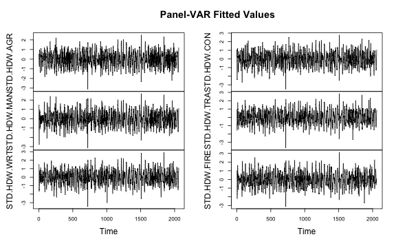
<p class="caption">plot of chunk PVARfittedplot</p>
</div>
Below the main quantities of interest in SVAR analysis are computed: The impulse response functions (IRF's) and forecast error variance decompositions (FEVD's):

```r
# This computes orthogonalized impulse response functions
pIRF <- irf(pSVAR)
# This computes the forecast error variance decompositions
pFEVD <- fevd(pSVAR)
```
The `pIRF` object contains the IRF's with lower and upper confidence bounds and some atomic elements providing information about the object:

```r
# See the structure of a vars IRF object:
str(pIRF, give.attr = FALSE)
# List of 11
#  $ irf       :List of 6
#   ..$ STD.HDW.AGR : num [1:11, 1:6] 0.611 0.399 0.268 0.185 0.132 ...
#   ..$ STD.HDW.MAN : num [1:11, 1:6] 0.1774 0.1549 0.134 0.1142 0.0959 ...
#   ..$ STD.HDW.WRT : num [1:11, 1:6] -0.1807 -0.1071 -0.0647 -0.0402 -0.0259 ...
#   ..$ STD.HDW.CON : num [1:11, 1:6] 0.0215 0.0383 0.0442 0.0438 0.0403 ...
#   ..$ STD.HDW.TRA : num [1:11, 1:6] -0.02595 -0.01257 -0.00721 -0.00511 -0.00421 ...
#   ..$ STD.HDW.FIRE: num [1:11, 1:6] 0 0.0122 0.0147 0.0132 0.0104 ...
#  $ Lower     :List of 6
#   ..$ STD.HDW.AGR : num [1:11, 1:6] 0.1137 -0.0144 -0.0393 -0.0446 -0.0439 ...
#   ..$ STD.HDW.MAN : num [1:11, 1:6] -0.6474 -0.3434 -0.2069 -0.125 -0.0734 ...
#   ..$ STD.HDW.WRT : num [1:11, 1:6] -0.659 -0.427 -0.311 -0.236 -0.189 ...
#   ..$ STD.HDW.CON : num [1:11, 1:6] -0.721 -0.417 -0.258 -0.183 -0.123 ...
#   ..$ STD.HDW.TRA : num [1:11, 1:6] -0.4161 -0.2568 -0.169 -0.1231 -0.0894 ...
#   ..$ STD.HDW.FIRE: num [1:11, 1:6] 0 -0.0157 -0.022 -0.0227 -0.0211 ...
#  $ Upper     :List of 6
#   ..$ STD.HDW.AGR : num [1:11, 1:6] 1.218 0.801 0.565 0.389 0.275 ...
#   ..$ STD.HDW.MAN : num [1:11, 1:6] 0.906 0.601 0.439 0.328 0.239 ...
#   ..$ STD.HDW.WRT : num [1:11, 1:6] 0.846 0.601 0.428 0.319 0.239 ...
#   ..$ STD.HDW.CON : num [1:11, 1:6] 0.716 0.514 0.4 0.305 0.234 ...
#   ..$ STD.HDW.TRA : num [1:11, 1:6] 0.2866 0.21 0.1591 0.1207 0.0899 ...
#   ..$ STD.HDW.FIRE: num [1:11, 1:6] 0 0.0363 0.0471 0.0461 0.0405 ...
#  $ response  : chr [1:6] "STD.HDW.AGR" "STD.HDW.MAN" "STD.HDW.WRT" "STD.HDW.CON" ...
#  $ impulse   : chr [1:6] "STD.HDW.AGR" "STD.HDW.MAN" "STD.HDW.WRT" "STD.HDW.CON" ...
#  $ ortho     : logi TRUE
#  $ cumulative: logi FALSE
#  $ runs      : num 100
#  $ ci        : num 0.05
#  $ boot      : logi TRUE
#  $ model     : chr "svarest"
```
We could separately access the top-level atomic or list elements using `atomic_elem` or `list_elem`:

```r
# Pool-out top-level atomic elements in the list
str(atomic_elem(pIRF))
# List of 8
#  $ response  : chr [1:6] "STD.HDW.AGR" "STD.HDW.MAN" "STD.HDW.WRT" "STD.HDW.CON" ...
#  $ impulse   : chr [1:6] "STD.HDW.AGR" "STD.HDW.MAN" "STD.HDW.WRT" "STD.HDW.CON" ...
#  $ ortho     : logi TRUE
#  $ cumulative: logi FALSE
#  $ runs      : num 100
#  $ ci        : num 0.05
#  $ boot      : logi TRUE
#  $ model     : chr "svarest"
```
There are also recursive versions of `atomic_elem` and `list_elem` named `reg_elem` and `irreg_elem` which can be used to split nested lists into the atomic and non-atomic parts. These are not covered in this vignette.

### 8.3 Recursive Apply and Unlisting in 2D
*vars* supplies simple `plot` methods for IRF and FEVD objects using base graphics.
<!-- , for example: -->
<!-- ```{r} -->
<!-- # Plot the forecast-error variance decmpositions -->
<!-- plot(pFEVD) -->
<!-- ``` -->
<!-- `plot(pIRF)` would give us 6 charts of all sectoral responses to each sectoral shock.  -->
In this section we however want to generate nicer and more compact plots using `ggplot2`, and also compute some statistics on the IRF data. Starting with the latter, the code below sums the 10-period impulse response coefficients of each sector in response to each sectoral impulse and stores them in a data frame:

```r
# Computing the cumulative impact after 10 periods
list_elem(pIRF) %>%                            # Pull out the sublist elements containing the IRF coefficients + CI's
  rapply2d(function(x) round(fsum(x), 2)) %>%  # Recursively apply the column-sums to coefficient matrices (could also use colSums)
  unlist2d(c("Type", "Impulse"))               # Recursively row-bind the result to a data.frame and add identifier columns
#     Type      Impulse STD.HDW.AGR STD.HDW.MAN STD.HDW.WRT STD.HDW.CON STD.HDW.TRA STD.HDW.FIRE
# 1    irf  STD.HDW.AGR        1.92        1.08        1.68        0.83        0.72         0.54
# 2    irf  STD.HDW.MAN        0.98        2.22        2.12        1.09        0.97         1.05
# 3    irf  STD.HDW.WRT       -0.47       -0.27        0.65        0.17        0.03        -0.02
# 4    irf  STD.HDW.CON        0.33        0.39        0.34        2.00        0.55         0.38
# 5    irf  STD.HDW.TRA       -0.07       -0.11       -0.24       -0.30        1.31        -0.20
# 6    irf STD.HDW.FIRE        0.07       -0.07        0.02       -0.09       -0.06         1.84
# 7  Lower  STD.HDW.AGR       -0.18       -2.08       -3.14       -0.68       -2.46        -0.68
# 8  Lower  STD.HDW.MAN       -1.52        0.38       -1.30       -0.86       -1.82         0.12
# 9  Lower  STD.HDW.WRT       -2.38       -2.65       -0.22       -2.68       -2.01        -1.20
# 10 Lower  STD.HDW.CON       -2.01       -2.47       -2.16        0.53       -1.68        -0.80
# 11 Lower  STD.HDW.TRA       -1.32       -1.34       -1.17       -1.64        0.31        -0.69
# 12 Lower STD.HDW.FIRE       -0.16       -0.26       -0.16       -0.27       -0.20         0.96
# 13 Upper  STD.HDW.AGR        3.97        3.18        3.21        3.69        2.61         1.58
# 14 Upper  STD.HDW.MAN        3.19        3.85        3.00        3.60        3.05         1.78
# 15 Upper  STD.HDW.WRT        3.06        2.66        4.41        2.49        3.31         1.47
# 16 Upper  STD.HDW.CON        2.85        3.30        3.20        3.88        2.59         1.76
# 17 Upper  STD.HDW.TRA        1.08        1.93        1.76        0.72        2.82         0.63
# 18 Upper STD.HDW.FIRE        0.30        0.15        0.30        0.12        0.18         2.21
```
The function `rapply2d` used here is very similar to `base::rapply`, with the difference that the result is not simplified / unlisted by default and that `rapply2d` will treat data frames like atomic objects and apply functions to them. `unlist2d` is an efficient generalization of `base::unlist` to 2-dimensions, or one could also think of it as a recursive generalization of `do.call(rbind, ...)`. It efficiently unlists nested lists of data objects and creates a data frame with identifier columns for each level of nesting on the left, and the content of the list in columns on the right.

The above cumulative coefficients suggest that Agriculture responds mostly to it's own shock, and a bit to shocks in Manufacturing and Wholesale and Retail Trade. Similar patters can be observed for Manufacturing and Wholesale and Retail Trade. Thus these three sectors seem to be interlinked in most countries. The remaining three sectors are mostly affected by their own dynamics, but also by Agriculture and Manufacturing.

<!-- Finance and Real Estate sector seems even more independent and really only responds to it's own dynamics. Manufacturing and Transport and Storage seem to be pretty interlinked with the other broad sectors. Wholesale and Retail Trade and Construction exhibit some strange dynamics (i.e. WRT responds more to the CON shock that to it's own shock, and CON responds strongly negatively to the WRT shock). -->

Let us use `ggplot2` to create nice compact plots of the IRF's and FEVD's. For this task `unlist2d` will again be extremely helpful in creating the data frame representation required. Starting with the IRF's, we will discard the upper and lower bounds and just use the impulses:

```r
# This binds the matrices after adding integer row-names to them to a data.table

data <- pIRF$irf %>%                      # Get only the coefficient matrices, discard the confidence bounds
           unlist2d(idcols = "Impulse",   # Recursive unlisting to data.table creating a factor id-column
                    row.names = "Time",   # and saving generated rownames in a variable called 'Time'
                    id.factor = TRUE,     # -> Create Id column ('Impulse') as factor
                    DT = TRUE)            # -> Output as data.table (default is data.frame)

head(data, 3)
#        Impulse  Time STD.HDW.AGR STD.HDW.MAN STD.HDW.WRT STD.HDW.CON STD.HDW.TRA STD.HDW.FIRE
#         <fctr> <int>       <num>       <num>       <num>       <num>       <num>        <num>
# 1: STD.HDW.AGR     1   0.6113132   0.1896711   0.3488940  0.05976606  0.02503336   0.00000000
# 2: STD.HDW.AGR     2   0.3986337   0.1892803   0.3014961  0.09430567  0.07263670   0.03669857
# 3: STD.HDW.AGR     3   0.2676944   0.1654161   0.2491999  0.10769335  0.09330830   0.06042380

data <- melt(data, 1:2)                   # Using data.table's melt
head(data, 3)
#        Impulse  Time    variable     value
#         <fctr> <int>      <fctr>     <num>
# 1: STD.HDW.AGR     1 STD.HDW.AGR 0.6113132
# 2: STD.HDW.AGR     2 STD.HDW.AGR 0.3986337
# 3: STD.HDW.AGR     3 STD.HDW.AGR 0.2676944

# Here comes the plot:
  ggplot(data, aes(x = Time, y = value, color = Impulse)) +
    geom_line(size = I(1)) + geom_hline(yintercept = 0) +
    labs(y = NULL, title = "Orthogonal Impulse Response Functions") +
    scale_color_manual(values = rainbow(6)) +
    facet_wrap(~ variable) +
    theme_light(base_size = 14) +
    scale_x_continuous(breaks = scales::pretty_breaks(n=7), expand = c(0, 0))+
    scale_y_continuous(breaks = scales::pretty_breaks(n=7), expand = c(0, 0))+
    theme(axis.text = element_text(colour = "black"),
      plot.title = element_text(hjust = 0.5),
      strip.background = element_rect(fill = "white", colour = NA),
      strip.text = element_text(face = "bold", colour = "grey30"),
      axis.ticks = element_line(colour = "black"),
      panel.border = element_rect(colour = "black"))
```

<div class="figure">
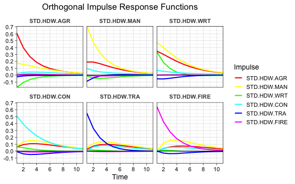
<p class="caption">plot of chunk IRFplot</p>
</div>
To round things off, below we do the same thing for the FEVD's:

```r
data <- unlist2d(pFEVD, idcols = "variable", row.names = "Time", id.factor = TRUE, DT = TRUE) %>%
            melt(c("variable", "Time"), variable.name = "Sector")
head(data, 3)
#       variable  Time      Sector     value
#         <fctr> <int>      <fctr>     <num>
# 1: STD.HDW.AGR     1 STD.HDW.AGR 0.8513029
# 2: STD.HDW.AGR     2 STD.HDW.AGR 0.8385913
# 3: STD.HDW.AGR     3 STD.HDW.AGR 0.8264789

# Here comes the plot:
  ggplot(data, aes(x = Time, y = value, fill = Sector)) +
    geom_area(position = "fill", alpha = 0.8) +
    labs(y = NULL, title = "Forecast Error Variance Decompositions") +
    scale_fill_manual(values = rainbow(6)) +
    facet_wrap(~ set_class(variable, "factor")) +
    theme_linedraw(base_size = 14) +
    scale_x_continuous(breaks = scales::pretty_breaks(n=7), expand = c(0, 0))+
    scale_y_continuous(breaks = scales::pretty_breaks(n=7), expand = c(0, 0))+
    theme(plot.title = element_text(hjust = 0.5),
      strip.background = element_rect(fill = "white", colour = NA),
      strip.text = element_text(face = "bold", colour = "grey30"))
```

<div class="figure">
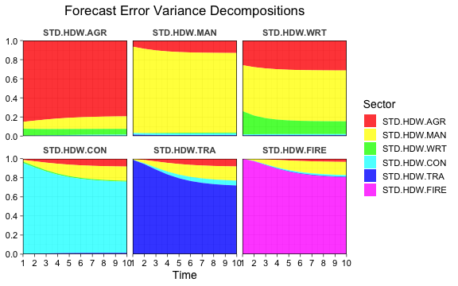
<p class="caption">plot of chunk FEVDplot</p>
</div>
Both the IRF's and the FEVD's show that Agriculture, Manufacturing and Wholesale and Retail Trade are broadly interlinked, even in the short-run, and that Agriculture and Manufacturing explain some of the variation in Construction, Transport and Finance at longer horizons. Of course the identification strategy used for this example was not really structural or theory based. A better strategy could be to aggregate the World Input-Output Database and use those shares for identification (which would be another very nice *collapse* exercise, but not for this vignette).


<!-- . There are also not much dynamics in the FEVD, suggesting that longer lag-lengths might be appropriate. The most important point of critique for this analysis is the structural identification strategy which is highly dubious (as correlation does not imply causation and we are also restricting sectoral relationships with a lower correlation to be 0 in the current period). A better method could be to aggregate the World Input-Output Database and use those shares for identification (which would be another very nice *collapse* exercise, but not for this vignette). -->


## Going Further
To learn more about *collapse*, just examine the documentation `help("collapse-documentation")` which is organized, extensive and contains lots of examples.


## References

Timmer, M. P., de Vries, G. J., & de Vries, K. (2015). "Patterns of Structural Change in Developing Countries." . In J. Weiss, & M. Tribe (Eds.), *Routledge Handbook of Industry and Development.* (pp. 65-83). Routledge.

Mundlak, Yair. 1978. “On the Pooling of Time Series and Cross Section Data.” *Econometrica* 46 (1): 69–85.


<!-- ## Benchmarks vs. *dplyr* and *data.table* -->
<!-- **Notes:**  -->
<!-- * Benchmarks are run on real and generated data, always with missing values. The largest data size is 10 columns each 1 Million Obs. and 100000 groups. -->

<!-- * Benchmarks are run on a conventional Windows 8.1 laptop with 2x 2.2 GHZ Intel i5 processor, 8GB DDR3 RAM and a Samsung 850 EVO SSD.  -->

<!-- * *data.table* multi-threading is enabled and 2 thread are used. *collapse* and *dplyr* are not parallelized.  -->


<!-- ### Aggregations -->

<!-- #### Large Data -->

<!-- ```{r, eval=RUNBENCH} -->
<!-- # Creating a data.table with 10 columns and 1 mio. obs, including 10% missing values -->
<!-- testdat <- na_insert(qDT(replicate(10, rnorm(1e6), simplify = FALSE)), prop = 0.1)  -->
<!-- testdat[["g1"]] <- sample.int(1000, 1e6, replace = TRUE) # 1000 groups -->
<!-- testdat[["g2"]] <- sample.int(100, 1e6, replace = TRUE) # 100 groups -->

<!-- # The average group size is 10, there are about 100000 groups -->
<!-- gtestdat <- group_by(testdat, g1, g2) -->
<!-- g <- GRP(testdat, ~ g1 + g2) -->
<!-- g -->

<!-- # Function performing the comparison -->
<!-- benchFUN <- function(FUN, fFUN, neval = 10, narm = TRUE, ...) { -->
<!--   eval(substitute(microbenchmark( -->
<!--    dplyr = summarize_all(group_by(testdat, g1, g2), FUN, ...), -->
<!--    dplyr_grouped = summarize_all(gtestdat, FUN, ...), -->
<!--    data.table_2_threads = testdat[, lapply(.SD, FUN, ...), keyby = c("g1","g2")], -->
<!--    collapse = collap(testdat, ~ g1 + g2, fFUN, keep.col.order = FALSE, na.rm = narm), -->
<!--    collapse_grouped = collap(testdat, g, fFUN, cols = 1:10, keep.col.order = FALSE, na.rm = narm),  -->
<!--    times = neval -->
<!--   ))) -->
<!-- } -->

<!-- # Sum -->
<!-- benchFUN(sum, fsum, na.rm = TRUE) -->

<!-- # Product -->
<!-- benchFUN(prod, fprod, na.rm = TRUE) -->

<!-- # Mean -->
<!-- benchFUN(mean, fmean, na.rm = TRUE) -->

<!-- # Maximum -->
<!-- benchFUN(max, fmax, na.rm = TRUE) -->

<!-- # Median -->
<!-- benchFUN(median, fmedian, 1, na.rm = TRUE) -->

<!-- # Variance -->
<!-- benchFUN(var, fvar, 1, na.rm = TRUE) -->
<!-- # Note: fvar implements a numerically stable online variance using Welfords Algorithm. -->

<!-- # Last Value -->
<!-- benchFUN(last, flast, 1, narm = FALSE) -->
<!-- # Note: collapse functions ffirst and flast by default also remove missing values i.e. take the first and last non-missing data point -->

<!-- # Number of Observations -->
<!-- options(collapse_unused_arg_action = "none") -->
<!-- benchFUN(function(x) sum(!is.na(x)), fnobs, 1) -->

<!-- # Number of Distinct Values -->
<!-- benchFUN(n_distinct, fndistinct, 1, na.rm = TRUE) -->
<!-- ``` -->

<!-- Below some weighted and mode computations that are not straightforward in *dplyr* or *data.table*: -->
<!-- ```{r, eval=RUNBENCH} -->
<!-- # Weighted Mean -->
<!-- w <- abs(100*rnorm(1e6)) + 1 -->
<!-- testdat[["w"]] <- w -->
<!-- # Seems not possible with dplyr ... -->
<!-- system.time(testdat[, lapply(.SD, weighted.mean, w = w, na.rm = TRUE), keyby = c("g1","g2")]) -->
<!-- system.time(collap(testdat, ~ g1 + g2, w = w)) -->

<!-- # Weighted Variance -->
<!-- system.time(collap(testdat, ~ g1 + g2, fvar, w = w)) -->

<!-- # Mode -->
<!-- system.time(collap(testdat, ~ g1 + g2, fmode)) -->
<!-- # Note: This mode function uses index hashing in C++ -->

<!-- # Weighted Mode -->
<!-- system.time(collap(testdat, ~ g1 + g2, fmode, w = w)) -->

<!-- ``` -->


<!-- #### Typical Data -->

<!-- #### Small Data -->

<!-- When it comes to larger aggregation problems, the performance if *collapse* is broadly in line with *data.table* (at least on this machine), and offers the additional advantage of high-performance weighted and categorical aggregations: -->


<!-- I believe on really huge datasets aggregated on a multi-core machine, *data.table*'s memory efficiency and thread-parallelization will let it run faster with some GeForce optimized functions, but that does not apply to most users (I have tested up to 10 million obs. on my laptop where *collapse* is still very much in line). In comparison to *collapse* and *data.table* the performance of *dplyr* on this data is rather poor, especially for base functions that are not highly optimized like `sum`. I do however very much appreciate the tidyverse ecosystem for highly organized data exploration and transformation. Therefore I have created methods for all of the *Fast Statistical Functions* as well as `collap`, enabling them to be used effectively in the *dplyr* ecosystem where they produce amazing speed gains. This is the subject of the '*collapse* and *dplyr*' vignette. -->

<!-- Apart from its non-reliance on non-standard evaluation, a central advantage of *collapse* for programming is the speed it maintains on smaller problems where it's more efficient R code compared to *dplyr* and *data.table* really plays out: -->
<!-- ```{r, eval=RUNBENCH} -->
<!-- # 12000 obs in 1500 groups: A more typical case -->
<!-- GRP(wlddev, ~ iso3c + decade) -->

<!-- library(microbenchmark) -->
<!-- dtwlddev <- qDT(wlddev) -->
<!-- microbenchmark(dplyr = dtwlddev %>% group_by(iso3c,decade) %>% select_at(9:12) %>% summarise_all(sum, na.rm = TRUE), -->
<!--                data.table = dtwlddev[, lapply(.SD, sum, na.rm = TRUE), by = c("iso3c","decade"), .SDcols = 9:12], -->
<!--                collap = collap(dtwlddev, ~ iso3c + decade, fsum, cols = 9:12), -->
<!--                fast_fun = fsum(get_vars(dtwlddev, 9:12), GRP(dtwlddev, ~ iso3c + decade), use.g.names = FALSE)) # We can gain a bit coding it manually -->

<!-- # Now going really small: -->
<!-- dtmtcars <- qDT(mtcars) -->
<!-- microbenchmark(dplyr = dtmtcars %>% group_by(cyl,vs,am) %>% summarise_all(sum, na.rm = TRUE),      # Large R overhead -->
<!--                data.table = dtmtcars[, lapply(.SD, sum, na.rm = TRUE), by = c("cyl","vs","am")],   # Large R overhead -->
<!--                collap = collap(dtmtcars, ~ cyl + vs + am, fsum),                                   # Now this is still quite efficient -->
<!--                fast_fun = fsum(dtmtcars, GRP(dtmtcars, ~ cyl + vs + am), use.g.names = FALSE))     # And this is nearly the speed of a full C++ implementation -->

<!-- ``` -->

<!-- In general, the smaller the problem, the greater advantage *collapse* has over other packages because it's R overhead (i.e. the R code executed before the actual C-function doing the hard work is called) is carefully minimized. Most users working on typical datasets (< 1 Mio obs.) will find that their code runs significantly faster when implemented in *collapse* compared to other solutions. -->


<!-- ### Transformation Benchmarks -->

<!-- Below I provide benchmarks for some very common data transformation tasks, again comparing *collapse* to *dplyr* and *data.table*: -->

<!-- ```{r, eval=RUNBENCH} -->
<!-- # The average group size is 10, there are about 100000 groups -->
<!-- GRP(testdat, ~ g1 + g2) -->

<!-- # get indices of grouping columns -->
<!-- ind <- get_vars(testdat, c("g1","g2"), "indices") -->

<!-- # Centering -->
<!-- system.time(testdat %>% group_by(g1,g2) %>% mutate_all(function(x) x - mean.default(x, na.rm = TRUE))) -->
<!-- system.time(testdat[, lapply(.SD, function(x) x - mean(x, na.rm = TRUE)), keyby = c("g1","g2")]) -->
<!-- system.time(W(testdat, ~ g1 + g2)) -->

<!-- # Weighted Centering -->
<!-- # Can't easily be done in dplyr.. -->
<!-- system.time(testdat[, lapply(.SD, function(x) x - weighted.mean(x, w, na.rm = TRUE)), keyby = c("g1","g2")]) -->
<!-- system.time(W(testdat, ~ g1 + g2, ~ w)) -->

<!-- # Centering on the overall mean -->
<!-- # Can't easily be done in dplyr or data.table. -->
<!-- system.time(W(testdat, ~ g1 + g2, mean = "overall.mean"))      # Ordinary -->
<!-- system.time(W(testdat, ~ g1 + g2, ~ w, mean = "overall.mean")) # Weighted -->

<!-- # Centering on both grouping variables simultaneously -->
<!-- # Can't be done in dplyr or data.table at all! -->
<!-- system.time(HDW(testdat, ~ qF(g1) + qF(g2), variable.wise = TRUE))        # Ordinary -->
<!-- system.time(HDW(testdat, ~ qF(g1) + qF(g2), w = w, variable.wise = TRUE)) # Weighted -->

<!-- # Proportions -->
<!-- system.time(testdat %>% group_by(g1,g2) %>% mutate_all(function(x) x/sum(x, na.rm = TRUE))) -->
<!-- system.time(testdat[, lapply(.SD, function(x) x/sum(x, na.rm = TRUE)), keyby = c("g1","g2")]) -->
<!-- system.time(fsum(get_vars(testdat, -ind), get_vars(testdat, ind), TRA = "/")) -->

<!-- # Scaling -->
<!-- system.time(testdat %>% group_by(g1,g2) %>% mutate_all(function(x) x/sd(x, na.rm = TRUE))) -->
<!-- system.time(testdat[, lapply(.SD, function(x) x/sd(x, na.rm = TRUE)), keyby = c("g1","g2")]) -->
<!-- system.time(fsd(get_vars(testdat, -ind), get_vars(testdat, ind), TRA = "/")) -->
<!-- system.time(fsd(get_vars(testdat, -ind), get_vars(testdat, ind), w, "/")) # Weighted Scaling. Need a weighted sd to do in dplyr or data.table -->

<!-- # Scaling and centering (i.e. standardizing) -->
<!-- system.time(testdat %>% group_by(g1,g2) %>% mutate_all(function(x) (x - mean.default(x, na.rm = TRUE))/sd(x, na.rm = TRUE))) -->
<!-- system.time(testdat[, lapply(.SD, function(x) (x - mean(x, na.rm = TRUE))/sd(x, na.rm = TRUE)), keyby = c("g1","g2")]) -->
<!-- system.time(STD(testdat, ~ g1 + g2)) -->
<!-- system.time(STD(testdat, ~ g1 + g2, ~ w))  # Weighted standardizing: Also difficult to do in dplyr or data.table -->

<!-- # Replacing data with any ststistic, here the sum: -->
<!-- system.time(testdat %>% group_by(g1,g2) %>% mutate_all(sum, na.rm = TRUE)) -->
<!-- system.time(testdat[, setdiff(names(testdat), c("g1","g2")) := lapply(.SD, sum, na.rm = TRUE), keyby = c("g1","g2")]) -->
<!-- system.time(fsum(get_vars(testdat, -ind), get_vars(testdat, ind), TRA = "replace_fill")) # dplyr and data.table also fill missing values. -->
<!-- system.time(fsum(get_vars(testdat, -ind), get_vars(testdat, ind), TRA = "replace")) # This preserves missing values, and is not easily implemented in dplyr or data.table -->
<!-- ``` -->

<!-- The message is clear: *collapse* outperforms *dplyr* and *data.table* both in scope and speed when it comes to grouped and / or weighted transformations of data. This capacity of *collapse* should make it attractive to econometricians and people programming with complex panel data. In the '*collapse* and *plm*' vignette I provide a programming example by implementing a more general case of the Hausman and Taylor (1981) estimator with two levels of fixed effects, as well as further benchmarks. -->

<!-- <!-- This capacity with `B` and `W` can be extremely useful to implement complex fixed-effects and instrumental-variables procedures (Like Hausman-Taylor 1985 etc.) not implemented in standard packages. Bootstrapping can be used to obtain proper standard errors. `fbetween / B` and `fwithin / W` are also orders of magnitudes faster than implementations in standard packages - for large problems. The code below shows the time required to average / center 1 Million observations in 100,000 groups:  -->
<!-- <!-- ````{r} -->
<!-- <!-- x <- abs(1000*rnorm(1e6))+100 -->
<!-- <!-- f <- qF(sample.int(1e5, 1e6, replace = TRUE), na.exclude = FALSE) -->

<!-- <!-- system.time(ave(x, f)) # Base R equivalent of fbetween / B -->
<!-- <!-- system.time(B(x, f)) -->
<!-- <!-- system.time(W(x, f)) -->
<!-- <!-- ``` -->

<!-- ### Time-Computation Benchmarks -->

<!-- Below I provide some benchmarks for lags, differences and growth rates on panel data. I will run microbenchmarks on the `wlddev` dataset. benchmarks on larger panels are already provided in the other vignettes. Again I compare *collapse* to *dplyr* and *data.table*: -->

<!-- ```{r, eval=RUNBENCH} -->
<!-- # We have a balanced panel of 216 countries, each observed for 59 years -->
<!-- descr(wlddev, cols = c("iso3c", "year")) -->

<!-- # 1 Panel-Lag -->
<!-- suppressMessages( -->
<!-- microbenchmark(dplyr_not_ordered = wlddev %>% group_by(iso3c) %>% select_at(9:12) %>% mutate_all(lag), -->
<!--                dplyr_ordered = wlddev %>% arrange(iso3c,year) %>% group_by(iso3c) %>% select_at(9:12) %>% mutate_all(lag), -->
<!--                data.table_not_ordered = dtwlddev[, shift(.SD), keyby = iso3c, .SDcols = 9:12], -->
<!--                data.table_ordered = dtwlddev[order(year), shift(.SD), keyby = iso3c, .SDcols = 9:12], -->
<!--                collapse_not_ordered = L(wlddev, 1, ~iso3c, cols = 9:12), -->
<!--                collapse_ordered = L(wlddev, 1, ~iso3c, ~year, cols = 9:12), -->
<!--                subtract_from_CNO = message("Panel-lag computed without timevar: Assuming ordered data"))) -->

<!-- # Sequence of 1 lead and 3 lags: Not possible in dplyr -->
<!-- microbenchmark(data.table_not_ordered = dtwlddev[, shift(.SD, -1:3), keyby = iso3c, .SDcols = 9:12], -->
<!--                data.table_ordered = dtwlddev[order(year), shift(.SD, -1:3), keyby = iso3c, .SDcols = 9:12], -->
<!--                collapse_ordered = L(wlddev, -1:3, ~iso3c, ~year, cols = 9:12)) -->

<!-- # 1 Panel-difference -->
<!-- microbenchmark(dplyr_not_ordered = wlddev %>% group_by(iso3c) %>% select_at(9:12) %>% mutate_all(function(x) x - lag(x)), -->
<!--                dplyr_ordered = wlddev %>% arrange(iso3c,year) %>% group_by(iso3c) %>% select_at(9:12) %>% mutate_all(function(x) x - lag(x)), -->
<!--                data.table_not_ordered = dtwlddev[, lapply(.SD, function(x) x - shift(x)), keyby = iso3c, .SDcols = 9:12], -->
<!--                data.table_ordered = dtwlddev[order(year), lapply(.SD, function(x) x - shift(x)), keyby = iso3c, .SDcols = 9:12], -->
<!--                collapse_ordered = D(wlddev, 1, 1, ~iso3c, ~year, cols = 9:12)) -->

<!-- # Iterated Panel-Difference: Not straightforward in dplyr or data.table -->
<!-- microbenchmark(collapse_ordered = D(wlddev, 1, 2, ~iso3c, ~year, cols = 9:12)) -->

<!-- # Sequence of Lagged/Leaded Differences: Not straightforward in dplyr or data.table -->
<!-- microbenchmark(collapse_ordered = D(wlddev, -1:3, 1, ~iso3c, ~year, cols = 9:12)) -->

<!-- # Sequence of Lagged/Leaded and Iterated Differences: Not straightforward in dplyr or data.table -->
<!-- microbenchmark(collapse_ordered = D(wlddev, -1:3, 1:2, ~iso3c, ~year, cols = 9:12)) -->

<!-- # The same applies to growth rates or log-differences. -->
<!-- microbenchmark(collapse_ordered_growth = G(wlddev, 1, 1, ~iso3c, ~year, cols = 9:12), -->
<!--                collapse_ordered_logdiff = G(wlddev, 1, 1, ~iso3c, ~year, cols = 9:12, logdiff = TRUE)) -->
<!-- ``` -->

<!-- The results are similar to the grouped transformations: *collapse* substantially facilitates and speeds up these complex operations in R. Again *plm* classes are very useful to avoid having to specify panel-identifiers all the time. See the '*collapse* and *plm*' vignette for more details. -->

